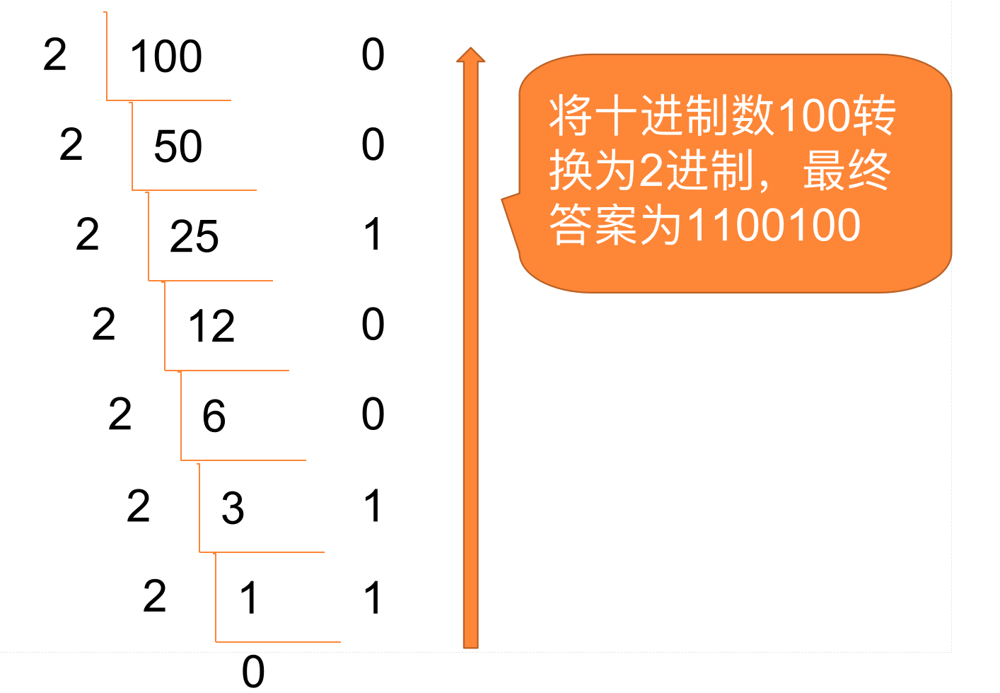
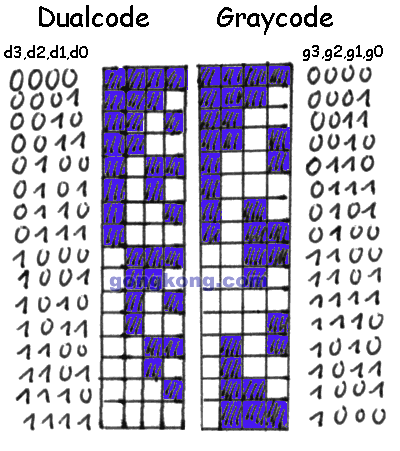

# 1.1 数制与编码

## 一、数制定义

- **数制（进位制）**：用有限的符号按“位值”与“基数”表示数值的系统。  
- **基数 r**：每一位可取的符号个数。  
- **位权**：第 k 位权重 = rᵏ（k 从 0 开始）。

## 二、四种常见数制

| 进制     | 基数 | 符号     | 前缀/后缀  | 典型场景                |
| :------- | :--- | :------- | :--------- | :---------------------- |
| 二进制   | 2    | 0, 1     | `0b` / `%` | 数字逻辑、机器码        |
| 八进制   | 8    | 0–7      | `0o`       | Unix 权限、早期体系结构 |
| 十进制   | 10   | 0–9      | 无         | 人类日常、金融          |
| 十六进制 | 16   | 0–9, A–F | `0x`       | 内存地址、颜色代码      |

## 三、进制转换方法

### 3.1 任意进制 → 十进制

**公式**：  
$$
  \sum_{i=0}^{n} d_i \times r^{\,n-i}
$$

- **d**（digit）：每一位上的“数字”本身。  
  
- **r**（radix）：进制（或叫“基数”）。
  
- **示例**：
  0x1A3 = 1×16² + 10×16¹ + 3×16⁰ = **419₁₀**

### 3.2 十进制 → 任意进制

- |         |
  | :----------------------------------------------------------: |
  |      图一：十进制转二进制示意图     |

  **整数部分**：除基取余（逆序）  
- **小数部分**：乘基取整（顺序）
- **示例**：  
  **100₁₀ → 二进制**  
  
  100 ÷ 2 = 50 余 **0**  
  50  ÷ 2 = 25 余 **0**  
  25  ÷ 2 = 12 余 **1**  
  12  ÷ 2 = 6  余 **0**  
  6   ÷ 2 = 3  余 **0**  
  3   ÷ 2 = 1  余 **1**  
  1   ÷ 2 = 0  余 **1**  
  
  从下往上读余数 → **0b1100100**

### 3.3 2 ↔ 8 ↔ 16 快速互换

| 源进制 | 目标进制    | 分组规则              | 示例 |
| :----- | :---------- | :-------------------- | :--- |
| 2 → 8  | 每 3 位     | 0b101 001 101 = 0o515 |      |
| 2 → 16 | 每 4 位     | 0b1010 0110 = 0xA6    |      |
| 8 → 2  | 1 位变 3 位 | 0o17 = 0b001 111      |      |
| 16 → 2 | 1 位变 4 位 | 0xF = 0b1111          |      |

## 四、速查表

| 十进制 | 二进制   | 八进制 | 十六进制 |
| :----- | :------- | :----- | :------- |
| 0      | 0        | 0o0    | 0x0      |
| 7      | 111      | 0o7    | 0x7      |
| 15     | 1111     | 0o17   | 0xF      |
| 255    | 11111111 | 0o377  | 0xFF     |

## 五、典型应用

- **IPv4 地址**：点分十进制 `192.168.0.1`  
- **IPv6 地址**：冒分十六进制 `2001:0db8::1`  
- **颜色代码**：`#RRGGBB` 如 `#FF0000` 红色  
- **Unix 权限**：`rwxr-xr-x` → 二进制 111 101 101 → 八进制 `0o755`  
- **调试器/反汇编**：查看内存 `0x004005B0` 处的机器码 `48 89 e5…`（十六进制字节）

## 六、延伸阅读

- **BCD 码**、**格雷码**、**IEEE-754 浮点**  
- **位运算**：AND、OR、XOR、Shift 与掩码技术  
- **字符编码**：ASCII（7 位）、UTF-8（可变字节）、Base64（6 位→可打印）

## 七、编码与数制的关系

- **编码**：把“信息→数值→二进制”的二次映射，需兼顾人类可读性与机器高效性。  
- **数制**决定符号集与位权；**编码**决定符号排列规则与检错/容错特性。  

### 7.1 BCD 码（Binary-Coded Decimal）

| 项目           | 说明                                                         |
| :------------- | :----------------------------------------------------------- |
| 定义           | 每 1 位十进制数用 **4 位二进制**（即 1 个十六进制位）独立表示。 |
| 权值           | 8-4-2-1（纯二进制权），又称 8421-BCD。                       |
| 示例           | `59₁₀` → 0101 1001（BCD），而非 0011 1011₂。                 |
| 与十六进制区别 | 十六进制用满 4 位 0–F；BCD 仅使用 0–9，冗余 6 个状态（A–F）。 |
| 压缩 BCD       | 每字节存 2 位十进制，高 4 位+低 4 位。                       |
| 优点           | 直接与人读十进制对齐，便于显示/键盘输入。                    |
| 缺点           | 冗余、运算需“加 6 校正” → 效率低。                           |
| 典型应用       | 早期计算器、数字仪表、金融终端、ISO-8583 报文。              |

### 7.2 格雷码（Gray Code）

|  |
| :----------------------------------------------------------: |
|                      图二：格雷码示意图                      |

| 项目        | 说明                                                         |
| :---------- | :----------------------------------------------------------- |
| 定义        | 相邻两个数仅 **1 位** 变化；是一种 **无权码**（位权不固定）。 |
| 二进制→格雷 | 最高位保留，其余位：`G[i] = B[i] XOR B[i+1]`，XOR的意思是**异或** |
| 格雷→二进制 | `B[i] = G[i] XOR B[i+1]`（从最高位向下递推）                 |
| 示例        | 3 位格雷码序列：000→001→011→010→110→111→101→100              |
| 与数制关系  | 仍用二进制符号，但 **重新排列顺序** 以消除多位同时翻转。     |
| 优点        | 消除瞬态毛刺，提高可靠性；旋转编码器一圈对应单比特跳变。     |
| 缺点        | 运算不便，需与二进制互转。                                   |
| 典型应用    | 旋转编码器、ADC 比较器、FIFO 指针跨时钟域、K-map 卡诺图。    |

## 八、小结：数制 ↔ 编码对照

| 操作   | 数制         | 编码                      | 关注点    |
| :----- | :----------- | :------------------------ | :-------- |
| 符号集 | 0–(r-1)      | 0,1 重组                  | 冗余/检错 |
| 位权   | 固定 rᵏ      | 可固定（BCD）或无（格雷） | 运算/映射 |
| 人读性 | 十进制最友好 | BCD 直接映射十进制        | 显示/输入 |
| 机器性 | 二进制最简洁 | 格雷抗翻转                | 传感/同步 |

clh,

25.8.7
