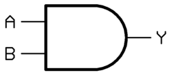
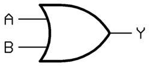
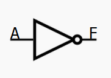

# 1.2 逻辑代数与化简

## 一、逻辑代数定义

- **逻辑代数（布尔代数 Boolean Algebra）**：用符号 0/1 表示“假/真”，以有限个基本运算描述命题真假关系的代数系统。  
- **真值**：只有两个离散值——0（False）、1（True）。  
- **变量**：逻辑变量用大写字母 A、B、C… 表示，取值为 0 或 1。  
- **函数**：逻辑函数 F(A,B,…) 通过基本运算组合而成，其输出也为 0 或 1。

## 二、基本逻辑运算

| 运算         | 记号        | 真值表                 | 逻辑门符号                                                   | 读法     | 记忆口诀    |
| :----------- | :---------- | :--------------------- | :----------------------------------------------------------- | :------- | :---------- |
| **与** (AND) | A · B 或 AB | 00→0, 01→0, 10→0, 11→1 |  | “A 与 B” | “全 1 才 1” |
| **或** (OR)  | A + B       | 00→0, 01→1, 10→1, 11→1 |  | “A 或 B” | “有 1 就 1” |
| **非** (NOT) | ¬A 或 Ā     | 0→1, 1→0               |  | “非 A”   | “取反”      |

## 三、复合逻辑运算

| 运算             | 定义式       | 记号     | 真值表（A,B→输出）                         | 逻辑门符号（图片）                                           | 真值特征 |
| :--------------- | :----------- | :------- | :----------------------------------------- | :----------------------------------------------------------- | :------- |
| **与非** (NAND)  | ¬(A·B)       | A ↑ B    | 00→1, 01→1, 10→1, 11→0                     |  | 先与后非 |
| **或非** (NOR)   | ¬(A+B)       | A ↓ B    | 00→1, 01→0, 10→0, 11→0                     |  | 先或后非 |
| **与或非** (AOI) | 先与再或再非 | ¬(AB+CD) | 0000→1, 0001→1, 0010→1, 0011→0, …（16 行） | 无标准单门符号，可用 NAND/NOR 组合实现                       | 复杂组合 |
| **异或** (XOR)   | A·¬B + ¬A·B  | A ⊕ B    | 00→0, 01→1, 10→1, 11→0                     |  | 不同为 1 |
| **同或** (XNOR)  | ¬(A ⊕ B)     | A ⊙ B    | 00→1, 01→0, 10→0, 11→1                     |  | 相同为 1 |

## 四、逻辑表达式化简与转换

### 4.1 基本定律

| 类别     | 名称   | 公式                      |
| :------- | :----- | :------------------------ |
| 恒等律   | 与恒等 | A·1 = A                   |
|          | 或恒等 | A+0 = A                   |
| 零一律   | 与零   | A·0 = 0                   |
|          | 或一   | A+1 = 1                   |
| 互补律   | 自补   | A·¬A = 0, A+¬A = 1        |
| 重叠律   | 与重叠 | A·A = A                   |
|          | 或重叠 | A+A = A                   |
| 吸收律   | 吸收   | A+AB = A, A(A+B)=A        |
| 分配律   | 与分配 | A(B+C)=AB+AC              |
|          | 或分配 | A+BC=(A+B)(A+C)           |
| 德摩根律 | 反演   | ¬(AB)=¬A+¬B, ¬(A+B)=¬A·¬B |

### 4.2 化简方法

| 方法                         | 步骤                                                         | 示例                                                         | 结果             |
| :--------------------------- | :----------------------------------------------------------- | :----------------------------------------------------------- | :--------------- |
| **代数法**                   | 套用定律、吸收、合并                                         | F = AB + A¬B + ¬AB                                           | 吸收后 F = A + B |
| **卡诺图**                   | 1. 列出真值表 → 2. 填 K-map → 3. 圈 1 得最小项 → 4. 写出最简式 |  | 如左图所示       |
| **列表法** (Quine-McCluskey) | 系统化找最小项 → 合并素项 → 选最小覆盖                       | 适合变量>4                                                   | 同上             |

## 五、离散数学基础：逻辑与集合

| 概念     | 逻辑对应 | 集合对应 | 记号             |
| :------- | :------- | :------- | :--------------- |
| **命题** | 逻辑变量 | 元素属性 | p, q             |
| **合取** | AND      | 交集     | p∧q, A∩B         |
| **析取** | OR       | 并集     | p∨q, A∪B         |
| **否定** | NOT      | 补集     | ¬p, Aᶜ           |
| **蕴含** | IMPLIES  | 子集     | p⇒q, A⊆B         |
| **等价** | ↔        | 相等     | p↔q, A=B         |
| **量词** | —        | —        | ∀x P(x), ∃x P(x) |

> 德摩根律在集合中的镜像：¬(A∩B)=¬A∪¬B，¬(A∪B)=¬A∩¬B

## 六、速查表：常用等价式

| 原式        | 最简式    |
| :---------- | :-------- |
| AB + A¬B    | A         |
| A + ¬AB     | A + B     |
| (A+B)(¬A+C) | AC + ¬AB  |
| A⊕B         | A¬B + ¬AB |
| ¬(A⊕B)      | AB + ¬A¬B |

## 七、小结：运算 ↔ 化简对照

| 关注点 | 基本运算       | 化简方法           | 工具          |
| :----- | :------------- | :----------------- | :------------ |
| 符号集 | 0,1            | 0,1                | 真值表、K-map |
| 运算律 | 与、或、非     | 吸收、分配、德摩根 | 代数系统      |
| 人读性 | XOR、XNOR 直观 | 最简与或式         | 卡诺图        |
| 机器性 | 门级实现       | 门级统一           | 门阵列        |

clh,

25.8.7
