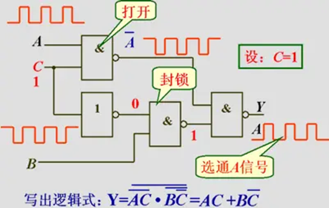

# 1.3 组合电路与时序电路

| 维度           | 组合逻辑 (Combinational)                                     | 时序逻辑 (Sequential)                                        |
| -------------- | ------------------------------------------------------------ | ------------------------------------------------------------ |
| **记忆能力**   | ❌ 无状态                                                     | ✅ 有状态                                                     |
| **依赖关系**   | 仅依赖当前输入                                               | 依赖当前输入 + 历史状态                                      |
| **数学模型**   | `Z = f(X)`                                                   | `Z(t) = g(X(t), S(t))` `S(t+1) = h(X(t), S(t))`              |
| **信号特征**   | 无时钟、无反馈                                               | 需时钟、存在反馈回路                                         |
| **核心元件**   | 与、或、非门 加法器、译码器、MUX                             | 触发器（DFF / JKFF） 寄存器、计数器、FSM                     |
| **典型时序图** |  |  |
| **类比**       | 计算器：输入→立即结果                                        | 计步器：按键→累加记忆                                        |

> **一句话区分**：  
> 组合逻辑像“函数求值”，时序逻辑像“迭代更新”。

clh,
25,8,9
