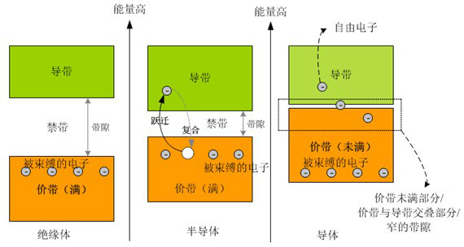
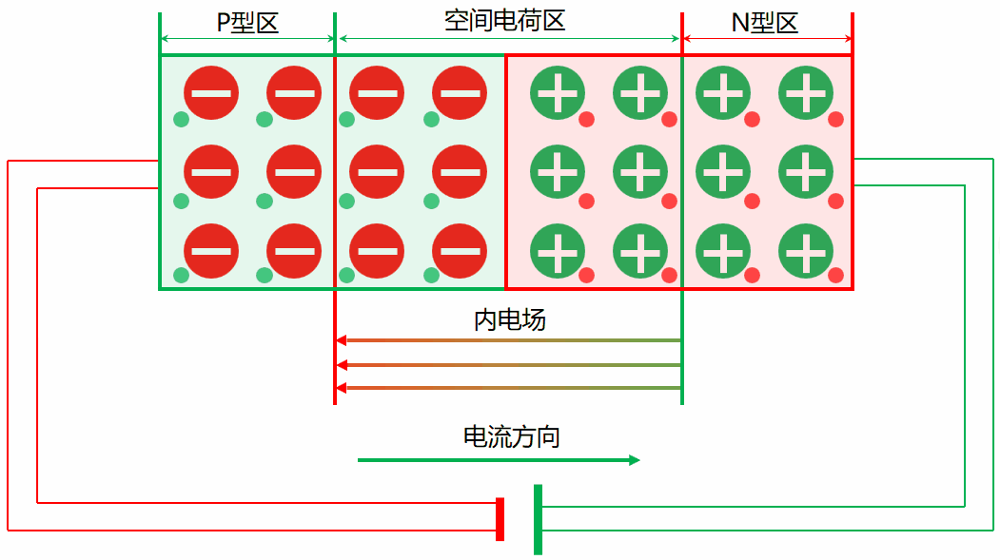

# 2.1 半导体与PN结

## 一、能带理论

- 基本假设：固体中的原子呈周期性排列(产生周期性势场)，其中的电子可穿梭在整个固体之间。

- 核心概念：
  - **电子离域**：电子不被束缚在某个原子附近，而是能够在整个固体中自由移动。

  - **能带**：能带是晶体中所有原子提供的周期性势场共同作用下，电子集体在整个空间中运动时，其能量状态形成的连续（或准连续）的‘能量带’状分布。

   |  |
   | :----------------------------------------------------------: |
   |                       图一：能带示意图                       |

    - 允带：允带是在某个能量范围内的能带，其能够使得电子自由通过。
    - 禁带：禁带是在某个能量范围内的能带，是电子无法越过的深沟。
    - 价带：晶体中**能量最高且被电子完全填满的允带**（绝对零度时）。
    - 导带：紧邻价带上方、**未被电子占据的允带**（绝对零度时）。

  - **费米能级**：费米能级是绝对零度时，电子所能占据的最高能量位置（最高被占满的能级）
    - 一般情况下，晶体处于绝对零度以上，此时处于费米能级以下但靠近费米能级的电子会被激发到费米能级以上，会形成导带。
    - 费米能级的位置决定了晶体的导电性。

- 导体、绝缘体和半导体：
  - 导体：
    - 导体的费米能级位于允带中间，在导带中由于有大量空位，其中的电子很容易受外部电场作用而产生电流。
  - 绝缘体：
    - 绝缘体的费米能级位于禁带中间，电子几乎全部分布在价带，而难以跃迁到导带，故难以导电。
  - 半导体：
    - 半导体的费米能级位于禁带中间，但禁带较窄，电子可跨过禁带而到达导带，则导带产生电子，价带产生空穴。

## 二、半导体

- 本征半导体：高纯度，几乎无杂质且无晶格缺陷的半导体
  - 本征激发：当半导体的温度T>0K时，有电子从价带激发到导带去，同时价带中产生了空穴，这就是所谓的本征激发。
- 半导体掺杂：
  - N型掺杂：
    - 杂质引入更多电子，增强导电性，形成N型半导体。
  - P型掺杂：
    - 杂质引入更多空穴，增强导电性，形成P型半导体。

## 三、PN结

|  |
| :----------------------------------------------------------: |
|                       图二：PN结示意图                       |

- 两块半导体，分别是N型半导体和P型半导体结合在一起形成的半导体器件。
- 由于N型半导体富含自由电子，P型半导体富含空穴，故电子会向P型半导体迁移，空穴会向N型半导体迁移。电子-空穴的迁移使得电场分布不均，形成由N型半导体指向P型半导体的内建电场，该电场抑制了电子和空穴的移动，使得PN结内形成一个平衡状态。
- 若施加反向电压，则会增强该内建电场，从而阻止电流流动。
- 若施加正向电压，则会削弱该内建电场，当达到某个电压阈值(约0.6v左右)之后，才能导通PN结，形成电流。
- PN结实现了单向导通的功能，二极管就是由PN结制作的。

Starly
2025/7/6
