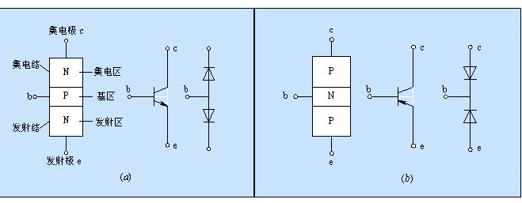
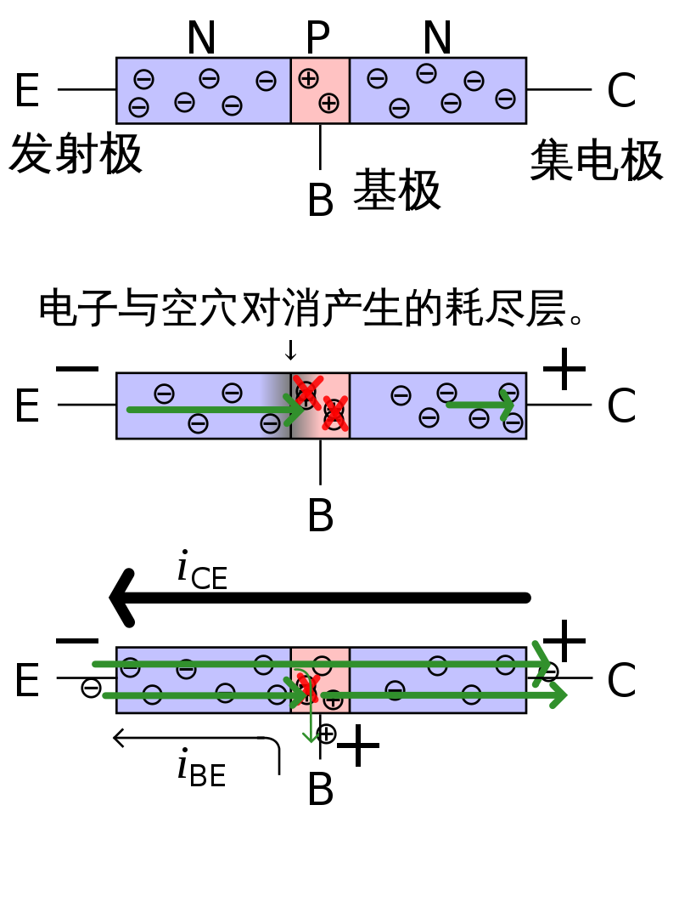
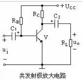

# 2.2 二极管、三极管特性及应用  

*原理 → 符号 → 曲线 → 公式 → 典型电路*

## 1 原理详解  

### 1.1 PN 结的形成与二极管单向导电  

在 P 型与 N 型半导体接触面，由于载流子浓度差异，空穴与电子相互扩散，形成**空间电荷区（耗尽层）**。该层内几乎没有自由载流子，呈现高阻特性（具体可见2.1）。  

|  |  |
| :----------------------------------------------------------: | :----------------------------------------------------------: |
|                   图一：二极管电压电流曲线                   |                     图二：二极管简要介绍                     |

- **正向偏置**：外加电压削弱内建电场，耗尽层变窄，载流子大量复合→电流呈指数级上升。  
- **反向偏置**：电场增强，耗尽层加宽，仅有极小漂移电流；当反向电压超过**击穿电压 V_BR**，雪崩/齐纳击穿发生，电流骤增。

### 1.2 三极管（BJT）电流放大机理  

|  |
| :----------------------------------------------------------: |
|                      图三：三极管示意图                      |

NPN 结构由**发射极(E)**-**基极(B)**-**集电极(C)** 组成，基区极薄且掺杂低。

|  |
| :----------------------------------------------------------: |
|                   图四：放大电路机理示意图                   |

- **放大区**：微小基极电流 IB 控制大量集电极电流 IC，比例由共射电流增益 β 决定（β≈50–300）。  
- **饱和区**：VEC < VEB，集电结正偏，β 下降，器件压降最小，作开关“导通”。  
- **截止区**：VEB < 0.6 V，基区无注入，IC ≈ 0，开关“关断”。

PNP 与 NPN 三极管的核心区别一览

  | 对比维度             | NPN                                              | PNP                                              |
  | -------------------- | ------------------------------------------------ | ------------------------------------------------ |
  | **结构顺序**         | N→P→N                                            | P→N→P                                            |
  | **掺杂主载流子**     | 电子                                             | 空穴                                             |
  | **箭头方向**（符号） | 指向外（E→B）                                    | 指向内（B→E）                                    |
  | **电源极性**         | 正电源接集电极                                   | 负电源接集电极                                   |
  | **偏置电压**         | VBE ≈ +0.6 V                          | VEB ≈ +0.6 V                          |
  | **电流方向**         | IB 流入基极，IC 流入集电极 | IB 流出基极，IC 流出集电极 |
  | **开关逻辑**         | 高电平导通                                       | 低电平导通                                       |
  | **典型电路**         | 共射放大、低边开关                               | 共射放大、高边开关                               |

  一句话总结：  

  **NPN 用“正”电平驱动，电流自上而下；PNP 用“负”电平驱动，电流自下而上。**

## 2 二极管特性与电路

| 特性             | 文字 & 曲线示意                           | 公式/参数                     | 典型电路                | 应用示例                |
| ---------------- | ----------------------------------------- | ----------------------------- | ----------------------- | ----------------------- |
| **单向导电**     | 正向指数上升，反向饱和微安级              | ID ≈ IS(eVD/nVT – 1) | 半波/桥式整流           | 1N4007 220 V → 310 V DC |
| **稳压击穿**     | 反向击穿区陡峭，动态电阻小                | VZ = 5.1 V (1N4733)  | 并联稳压                | 5 V 参考源              |
| **肖特基低压降** | 金属-半导体结，Vf≈0.3 V，开关 ns 级 | trr < 10 ns        | 续流二极管              | SS14 开关电源           |
| **发光二极管**   | 电子-空穴复合发光，光谱窄                 | Vf ≈ 1.8-3.3 V @ 20 mA | 限流电阻                | LED 指示灯              |

## 3 三极管（BJT）工作区与电路

| 区域       | 条件与转移特性曲线                        | 公式/关键参数                 | 典型电路                | 电路示意图     | 应用示例                |
| ---------- | ----------------------------------------- | ----------------------------- | ----------------------- | ----------------------- | ----------------------- |
| **放大区** | 0 < IB < IC/β，曲线平直，VCE > 0.2 V | IC = β·IB；ro = VA/IC | 共射放大                |  | 音频前置放大            |
| **饱和区** | IB ≥ IC/βsat，曲线压平，VCE ≈ 0.2 V | VCE(sat) ≈ 0.1-0.3 V | 低边开关                |  | 继电器驱动              |
| **截止区** | VBE < 0.6 V，曲线贴横轴          | IC ≈ ICEO (μA 级) | 高阻关断                |  | MCU 电平转换            |

## 4 选型速算

- **二极管**：  
  VRRM ≥ 1.5 × 工作电压，IF ≥ 1.5 × 负载电流，trr 按开关频率选。  
  
- **三极管**：  
  VCEO ≥ Vsupply + 余量，IC(max) ≥ Iload × 1.5，β ≥ 需求值 × 2，Ptot ≥ IC2 × RCE(sat)。
  
clh,

25.8.9
