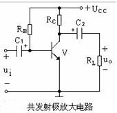

# 2.3 放大电路三拓扑（CE / CC / CB）

在模拟电子学中，**共射极（CE）、共集极（CC）、共基极（CB）** 是晶体管放大电路的三种基本组态。它们因“公共端”不同而得名，分别对应不同的输入/输出阻抗、增益与频响特性，被广泛应用于音频、射频、传感器接口等领域。

## 1 共射极放大器（CE）  

**Common-Emitter Amplifier**  

- **公共端**：发射极  
- **电压增益**：高（约 10²–10³，符号反相）  
- **输入阻抗**：中等（kΩ 级）  
- **输出阻抗**：高（数十 kΩ）  
- **典型用途**：音频前置放大、传感器信号放大  

### 1.1 工作原理  

输入信号加在基极-发射极之间，集电极电流受控于
$$
\beta \cdot I_B
$$

$$
集电极电阻R_C 将电流变化转化为电压变化，实现电压放大。
$$

### 1.2 基本电路  

|  |
| :----------------------------------------------------------: |
|                      图一：共射极放大器                      |

### 1.3 关键公式  

- 电压增益：
  $$
  A_V \approx -\frac{R_C \parallel r_o}{r_e + R_E}
  $$
- 输入阻抗：  
  $$
  Z_{in} \approx R_B \parallel (\beta + 1)(r_e + R_E)
  $$

## 2 共集极放大器（CC）  

**Common-Collector Amplifier**（又称**射极跟随器**）  

- **公共端**：集电极  
- **电压增益**：≈ 1（无反相）  
- **输入阻抗**：极高（>100 kΩ）  
- **输出阻抗**：极低（<100 Ω）  
- **典型用途**：阻抗匹配、缓冲级、功率驱动  

### 2.1 工作原理  

输入信号加在基极，输出取自发射极。由于发射极电压跟随基极电压变化，故称“跟随器”。电流增益高，但电压增益接近 1。

### 2.2 基本电路  

|  |
| :----------------------------------------------------------: |
|                      图二：共集极放大器                      |

### 2.3 关键公式  

- 电压增益：  
  $$
  A_V \approx \frac{R_E}{R_E + r_e}
  $$
- 输入阻抗：
  $$
  Z_{in} \approx R_B \parallel (\beta + 1) R_E
  $$
  
## 3 共基极放大器（CB）  

**Common-Base Amplifier**  

- **公共端**：基极  
- **电压增益**：高（同相）  
- **输入阻抗**：极低（几十 Ω）  
- **输出阻抗**：高（数十 kΩ）  
- **典型用途**：高频放大、射频前端  

### 3.1 工作原理  

输入信号加在发射极，输出取自集电极。由于基极接地，输入阻抗低，适合驱动低阻负载（如天线）。  

### 3.2 基本电路  

```
           Vcc
            |
           R_C
            |-----> 输出
           /
          Q
         / \
     R_E   |
        |  |
        |  GND
```

### 3.3 关键公式  

- 电压增益：  
  $$
  A_V \approx \frac{R_C}{r_e}
  $$

## 4 对比表

| 特性      | CE         | CC         | CB         |
| --------- | ---------- | ---------- | ---------- |
| **增益**  | 高（反相） | ≈1（同相） | 高（同相） |
| **Z_in**  | 中等       | 高         | 低         |
| **Z_out** | 高         | 低         | 高         |
| **频响**  | 中等       | 宽         | 最宽       |
| **用途**  | 通用放大   | 缓冲/驱动  | 高频放大   |

clh,

25.8.9
