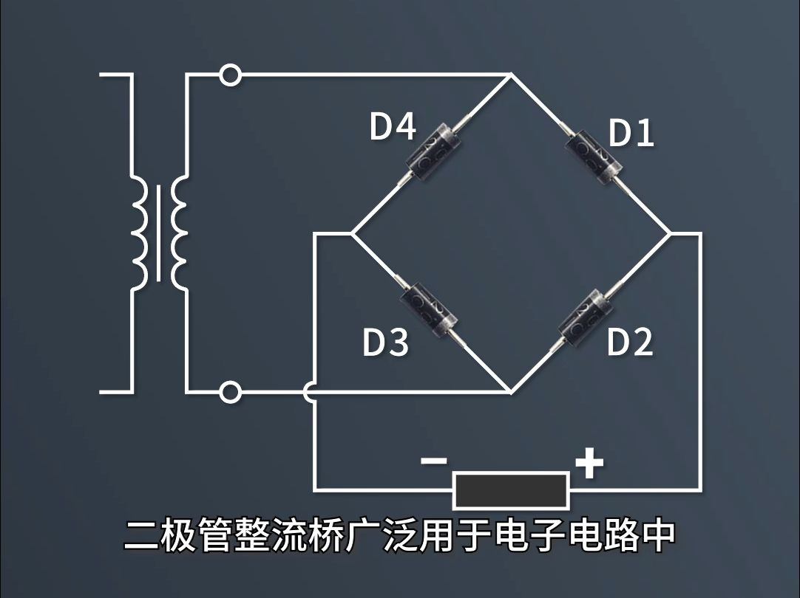

# 2.4 直流电源：整流–滤波–稳压  
>
> 把市电 AC 220 V/50 Hz 转换成纹波极小、电压几乎不随负载或电网波动而变化的直流电压。经典结构永远是三步：**整流 → 滤波 → 稳压**。下面按 **原理–电路–关键公式–典型器件–实测案例–常见变体** 六个维度展开。

## 1 整流（Rectification）

- **目的**：把双向交流变成单向脉动直流。  
- **公共端**：变压器次级中心抽头或桥堆负端。  

### 1.1 主流拓扑  

| 名称 | 器件数量 | 利用率 | 纹波频率 | 反向耐压 | 适用场景 |
| --- | --- | --- | --- | --- | --- |
| 半波 | 1 二极管 | 50 % | 50 Hz | √2 V₂ | 超低成本、小电流 |
| 全波中心抽头 | 2 二极管 | 100 % | 100 Hz | 2√2 V₂ | 需中心抽头变压器 |
| 桥式（Graetz） | 4 二极管 | 100 % | 100 Hz | √2 V₂ | 最通用 |

### 1.2 关键公式（桥式）  

|  |
| :----------------------------------------------------------: |
|                     图一：桥式整流电路图                     |

- 平均输出电压：  
  $$
  U_{\text{AV}} \approx 0.9\,V_2  
  $$
- 二极管平均电流：  
  $$
  I_D = \frac{I_L}{2}  
  $$
- 峰值反向电压：  
  $$
  \text{PIV} = \sqrt{2}\,V_2  
  $$

### 1.3 典型器件  

| 电流 | 器件 | 封装 | 备注 |
| --- | --- | --- | --- |
| 1 A | 1N4007 | DO-41 | 1000 V/1 A 通用 |
| 3 A | 1N5408 | DO-201 | 整流桥后级 |
| 1 A 贴片 | MB6S | SMD-4 | 桥堆一体化 |

## 2 滤波（Filtering）

- **目的**：削低纹波，使脉动直流趋近平滑直流。  

### 2.1 常用结构  

| 结构 | 元件 | 特点 | 适用场景 |
| --- | --- | --- | --- |
| 电容滤波 | 并联电解 C | 简单、成本低 | < 200 mA |
| LC-π | C–L–C | 抑制高频尖峰 | 中功率 |
| RC-π | C–R–C | 低成本、带载弱 | 信号级 |
| 同步整流+固态电解 | MOSFET+固态电容 | 高频低 ESR | 开关电源次级 |

### 2.2 关键公式（桥式+电容滤波）  

- 经验时间常数：  
  $$
  R_LC \ge (3\sim5)\frac{T}{2}, \quad T = 20\ \text{ms (50 Hz)}  
  $$
- 空载峰值：  
  $$
  U_{\text{peak}} = \sqrt{2}\,V_2  
  $$
- 带载平均：  
  $$
  U_{\text{AV}} \approx 1.2\,V_2 \quad (\text{含二极管压降})  
  $$

### 2.3 实测案例  

需求：+15 V / 100 mA  

- 变压器：双 12 V → 整流后峰值 ≈ 17 V  
- 负载 R_L = 150 Ω  
- 计算：C ≥ (3×10 ms)/150 Ω ≈ 200 µF  
- 实际：470 µF/25 V 电解 + 100 nF 陶瓷并联  
- 结果：纹波由 5 Vpp 降至 0.3 Vpp

## 3 稳压（Regulation）

- **目的**：在电网 ±10 %、负载 0–100 % 变化时，输出电压变化 < 1 %。

### 3.1 线性稳压  

| 结构 | 器件 | 输出 | 压差 | 效率 | 应用 |
| --- | --- | --- | --- | --- | --- |
| 齐纳并联 | R+Zener | 固定 | ≥ 2 V | 低 | 基准源 |
| 三端固定 | 78xx/79xx | 5/12/15 V | 2–3 V | 40–60 % | 通用 |
| 三端可调 | LM317/LM337 | 1.25–37 V | 2–3 V | 40–60 % | 实验电源 |
| LDO | AMS1117-3.3 | 3.3 V | 1.1 V | 55–70 % | MCU 供电 |

### 3.2 开关稳压（DC-DC）  

| 拓扑 | 芯片示例 | 效率 | 纹波 | 特点 |
| --- | --- | --- | --- | --- |
| Buck | LM2596-5.0 | 90 % | 50 mVpp | 降压 |
| Boost | XL6009 | 92 % | 60 mVpp | 升压 |
| Buck-Boost | TPS63070 | 90 % | 40 mVpp | 升降压 |

### 3.3 关键公式（线性）  

- 功耗：  
  $$
  P_{\text{loss}} = (U_{\text{in}}-U_{\text{out}})\,I_{\text{load}}  
  $$
- 效率：  
  $$
  \eta = \frac{U_{\text{out}}}{U_{\text{in}}} \quad (\text{线性}<100\%)  
  $$

### 3.4 案例：±15 V 实验室电源  

- 前级：18 V-0-18 V 变压器 → 桥式整流 → 4700 µF 滤波  
- 稳压：W7815 + W7915 对称固定  
- 后级：10 µF + 100 nF 并联  
- 实测：空载 15.02 V，满载 0.5 A 时 14.96 V，纹波 1 mVpp

## 4 全流程案例（12 V→5 V/2 A USB 充电口）

| 步骤 | 元件/参数 | 说明 |
| --- | --- | --- |
| 1 变压器 | 220 V → 12 V AC | 2 A 额定 |
| 2 整流 | MB6S 桥堆 | 1 A/600 V，加散热片 |
| 3 滤波 | 2200 µF/25 V + 100 nF | 纹波 0.8 Vpp |
| 4 稳压 | LM2596-5.0 Buck | 150 kHz，效率 92 % |
| 5 保护 | TVS 5 V6 + PPTC 2 A | 防浪涌、过流 |
| 6 指标 | 输入 10–14 V | 输出 5.02 V，纹波 40 mVpp |

## 5 常见变体与新技术

- **无变压器 AC-DC**：iW1700，<5 W IoT 供电  
- **同步整流**：MOSFET 替代肖特基，效率 +5–8 %  
- **GaN 高频**：>100 kHz，65 W USB-PD 充电器体积减半  
- **数字稳压**：I²C 可编程 0.8–5 V，DVS 节能

## 6 故障排查速查表

| 现象 | 可能原因 | 快速验证 |
| --- | --- | --- |
| 无输出 | 保险丝断、整流桥击穿 | 万用表二极管档 |
| 纹波大 | 滤波电容干涸 | 示波器 Vpp + 温升 |
| 稳压过热 | 散热片不足 | 红外测温 >90 °C |
| Buck 啸叫 | 电感饱和 | 听声音 + 电流波形 |

clh,

 25.8.9
