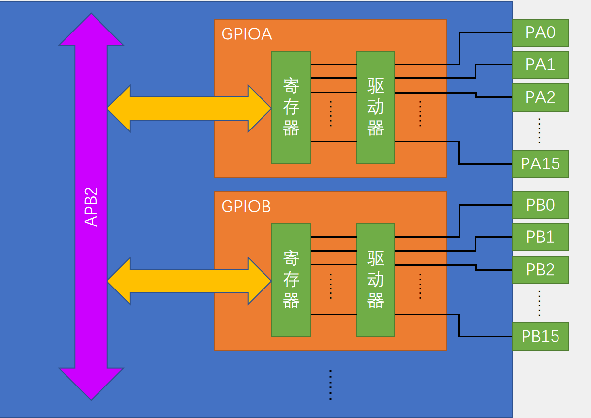

# GPIO基础

> Author：余生

## 一、GPIO基础概念

### 1. 什么是GPIO？

- 全称：General Purpose Input/Output（通用输入输出）  
- 作用：STM32通过GPIO引脚与外部设备交互（如点亮LED、读取按键）。  
- 特点：每个引脚可独立配置为输入/输出模式，支持多种工作方式。

### 2.STM32 引脚分类

| 引脚类型 | 颜色标记 | 功能说明                    | 示例引脚     |
| -------- | -------- | --------------------------- | ------------ |
| 电源引脚 | 红色     | 供电（VBAT, VDD, GND）      | VBAT, VDD_1  |
| 系统引脚 | 蓝色     | 复位/晶振/下载（NRST, OSC） | NRST, OSC_IN |
| GPIO引脚 | 绿色     | 数据输入输出（PA0-PC15）    | PA0, PC13    |

### 3.GPIO的基本结构

GPIO通常包括以下部分：

- 寄存器：用于配置GPIO的工作模式和读写电平。
- 驱动器：增强GPIO引脚的驱动能力。
- APB2总线接口：通过此接口，内核可对寄存器进行读写操作。



#### GPIOA/GPIOB

“万能插线板”，每个引脚都能变身！

想象这是一块“万能插线板”（芯片上的引脚模块），分A、B两块，每块有16个孔（PA0~PA15、PB0~PB15）。

- 每个孔（引脚）能干啥？
  - 当它是“电源插孔”：输出高电平（比如3.3V），相当于“通电”；输出低电平（0V），相当于“断电”。
  - 当它是“信号插孔”：外部设备（比如传感器）按一下按钮，插孔就会有电平变化，你就能“读”到这个信号。
  - 关键：每个孔的功能（输入/输出/特殊功能）由“寄存器”提前设置好，就像给插孔贴标签：“这个孔今天当电源口，那个孔当信号接收口”。

#### 寄存器

“插线板的说明书+开关总控”

每个GPIO模块（A/B）里有一堆绿色小盒子（寄存器），分3类最常用的：

1. 配置寄存器（CRH/ CRL）—— 给引脚贴标签
   1. 比如你想让PA0当“输出口”（能控制它输出高低电平），就在配置寄存器里找到PA0对应的“开关位”，拨到“输出档”。
   2. 如果拨到“输入档”，PA0就变成“信号耳朵”，能监听外部有没有电平变化。
2. 数据寄存器（ODR/IDR）—— 直接控制/读取引脚状态
   1. 输出时：往ODR寄存器里写“1”，对应的引脚（比如PA0）就会输出高电平；写“0”就输出低电平。 （ODR就像一个“总开关面板”，每个二进制位对应一个引脚的开关状态）
   2. 输入时：直接从IDR寄存器里“看”对应位是1还是0，就知道外部有没有给信号。
3. 其他寄存器（比如BSRR、BRR）—— 细节操作
   1. 比如BSRR寄存器可以单独把某个引脚置1或清0（比直接操作ODR更方便），BRR专门用来清0（关灯更快）。

#### 驱动器

“电信号的快递员”

寄存器下了命令，但引脚离得远，需要“快递员”把信号送到家门口——这就是驱动器。

- 工作原理：寄存器输出的“小电流信号”太弱，驱动器就像一个“信号放大器”，把“微弱的小电平”变成足够强的电信号，让引脚能稳定输出或接收。
- 为什么需要？：如果直接让寄存器连引脚，信号会被“拖垮”（类似用细电线带大功率电器会跳闸），驱动器就是加粗的“电线”，保证信号不失真。

#### APB2总线

“小区的主干道，连接管理中心和插线板”

整个GPIOA/B模块不是独立存在的，它们通过一条紫色“主干道”（APB2总线）连接到CPU（或芯片的核心部分）。

- CPU怎么控制GPIO？
  - CPU通过APB2总线找到GPIOA/B模块（就像开车上高速，先走APB2这条路）。
  - 到达后，往对应的寄存器（说明书+开关）写命令（比如“让PA5输出1”）。
  - 驱动器收到命令，把信号送到PA5引脚，完成操作。
- APB2 vs 其他总线： 不同的总线（比如APB1、AHB）相当于小区里的不同主干道，速度和带宽不同。APB2通常负责高速外设（如GPIO、定时器），APB1负责低速外设（如UART、I2C）。

#### 实际应用举例

“让LED灯亮起来”

假设你想让PA0引脚接的LED灯亮：

1. 第一步：配置PA0为输出口
   1. 往GPIOA的配置寄存器（CRH/CRL）里找到PA0对应的位，设置为“输出模式”。
2. 第二步：让PA0输出高电平
   1. 往GPIOA的数据寄存器（ODR）的第0位写1（二进制0000 0000 0000 0001）。
3. 结果：驱动器把高电平信号送到PA0，LED灯亮。

#### 总结

整个流程就是“**写指令→放大信号→控制引脚**”

1. 软件层面：你通过代码往寄存器写0或1（比如`GPIOA->ODR |= 1<<0;`）。
2. 硬件层面：寄存器的命令→驱动器放大→引脚真的输出高/低电平。
3. 核心思想：所有对硬件的操作，最终都是通过“改寄存器的值”实现的，寄存器就是你和硬件对话的唯一语言。

记住这个逻辑，以后学任何单片机（STM32/Arduino/51单片机），都是这套“寄存器控制引脚”的套路，只是寄存器的名字和地址可能不同，但本质完全一样

**关键点**：  

- 一个引脚可能有多个功能（复用功能），通过寄存器配置切换（如PA9可以是普通IO或串口TX）。

## 二、GPIO工作模式

### **8种模式详解**

```C
typedef enum {
    GPIO_Mode_AIN = 0x0,           // 模拟输入（用于ADC）
    GPIO_Mode_IN_FLOATING = 0x04,  // 浮空输入（按键检测）
    GPIO_Mode_IPD = 0x28,          // 下拉输入（默认低电平）
    GPIO_Mode_IPU = 0x48,          // 上拉输入（默认高电平）
    GPIO_Mode_Out_OD = 0x14,       // 开漏输出（需外部上拉）
    GPIO_Mode_Out_PP = 0x10,       // 推挽输出（直接驱动LED）
    GPIO_Mode_AF_OD = 0x1C,        // 复用开漏（I2C）
    GPIO_Mode_AF_PP = 0x18         // 复用推挽（串口、SPI）
} GPIOMode_TypeDef;
```

### **模式选择场景**  

| **模式名称** | **性质** | **特征**                                           |
| ------------ | -------- | -------------------------------------------------- |
| 浮空输入     | 数字输入 | 可读取引脚电平，若引脚悬空，则电平不确定           |
| 上拉输入     | 数字输入 | 可读取引脚电平，内部连接上拉电阻，悬空时默认高电平 |
| 下拉输入     | 数字输入 | 可读取引脚电平，内部连接下拉电阻，悬空时默认低电平 |
| 模拟输入     | 模拟输入 | GPIO无效，引脚直接接入内部ADC                      |
| 开漏输出     | 数字输出 | 可输出引脚电平，高电平为高阻态，低电平接VSS        |
| 推挽输出     | 数字输出 | 可输出引脚电平，高电平接VDD，低电平接VSS           |
| 复用开漏输出 | 数字输出 | 由片上外设控制，高电平为高阻态，低电平接VSS        |
| 复用推挽输出 | 数字输出 | 由片上外设控制，高电平接VDD，低电平接VSS           |
