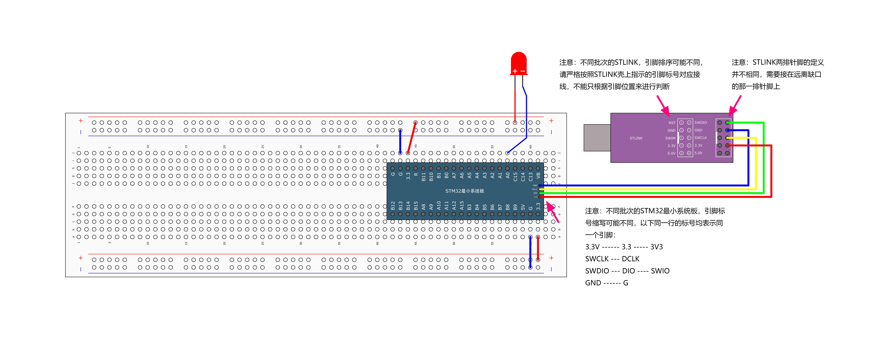
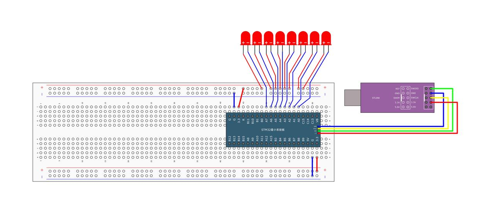

# GPIO应用

> Author：余生

## 一、硬件连接



## 二、GPIO基本代码编写

### STM32 GPIO配置步骤

#### 1.使能时钟

在使用任何外设之前，需要先开启其对应的时钟。例如，如果要使用GPIOC，则需要开启GPIOC的时钟。

```cpp
RCC_APB2PeriphClockCmd(RCC_APB2Periph_GPIOC, ENABLE);
```

#### 2.配置GPIO模式

根据应用需求选择GPIO的工作模式（输入或输出）。这里以设置GPIOC的第13号引脚为例，将其配置为推挽输出模式，速度为50MHz。

```cpp
GPIO_InitTypeDef GPIO_InitStructure;
GPIO_InitStructure.GPIO_Mode = GPIO_Mode_Out_PP; // 推挽输出模式
GPIO_InitStructure.GPIO_Pin = GPIO_Pin_13;       // 指定使用的引脚
GPIO_InitStructure.GPIO_Speed = GPIO_Speed_50MHz;// 设置输出速度
GPIO_Init(GPIOC, &GPIO_InitStructure);           // 初始化GPIOC
```

#### 3.控制GPIO电平

##### 设置高电平

使用`GPIO_SetBits()`函数将指定引脚置为高电平。

```cpp
GPIO_SetBits(GPIOC, GPIO_Pin_13); // 将PC13置为高电平
```

##### 设置低电平

 使用`GPIO_ResetBits()`函数将指定引脚置为低电平。

```cpp
GPIO_ResetBits(GPIOC, GPIO_Pin_13); // 将PC13置为低电平
```

#### 4.读取GPIO电平

使用`GPIO_ReadInputDataBit()`函数读取指定引脚的电平状态。

```cpp
uint8_t pinState = GPIO_ReadInputDataBit(GPIOC, GPIO_Pin_13);  // 读取PC13的状态
if (pinState == Bit_SET) {
    // PC13处于高电平
} else {
    // PC13处于低电平
}
```

### 完整示例代码

下面是一个完整的例子，演示如何点亮一个连接到STM32开发板上GPIOA第0号引脚的LED灯并使其闪烁：

```cpp
#include "Delay.h"
#include "stm32f10x.h"  // Device header

int main(void) {
    RCC_APB2PeriphClockCmd(RCC_APB2Periph_GPIOA, ENABLE);

    GPIO_InitTypeDef GPIO_InitStructure;
    GPIO_InitStructure.GPIO_Mode = GPIO_Mode_Out_PP;
    GPIO_InitStructure.GPIO_Pin = GPIO_Pin_0;
    GPIO_InitStructure.GPIO_Speed = GPIO_Speed_50MHz;
    GPIO_Init(GPIOA, &GPIO_InitStructure);

    while (1) {
        GPIO_ResetBits(GPIOA, GPIO_Pin_0);
        Delay_ms(500);
        GPIO_SetBits(GPIOA, GPIO_Pin_0);
        Delay_ms(500);

        GPIO_WriteBit(GPIOA, GPIO_Pin_0, Bit_RESET);
        Delay_ms(500);
        GPIO_WriteBit(GPIOA, GPIO_Pin_0, Bit_SET);
        Delay_ms(500);

        GPIO_WriteBit(GPIOA, GPIO_Pin_0, (BitAction)0);
        Delay_ms(500);
        GPIO_WriteBit(GPIOA, GPIO_Pin_0, (BitAction)1);
        Delay_ms(500);
    }
}
```

## 三、练习：流水灯

根据上面知识，实现用多个led灯交替闪烁

### 答案如下，仅作参考



```cpp
#include "Delay.h"
#include "stm32f10x.h"  // Device header

int main(void) {
    RCC_APB2PeriphClockCmd(RCC_APB2Periph_GPIOA, ENABLE);

    GPIO_InitTypeDef GPIO_InitStructure;
    GPIO_InitStructure.GPIO_Mode = GPIO_Mode_Out_PP;
    GPIO_InitStructure.GPIO_Pin = GPIO_Pin_All;
    GPIO_InitStructure.GPIO_Speed = GPIO_Speed_50MHz;
    GPIO_Init(GPIOA, &GPIO_InitStructure);

    while (1) {
        GPIO_Write(GPIOA, ~0x0001);  // 0000 0000 0000 0001
        Delay_ms(100);
        GPIO_Write(GPIOA, ~0x0002);  // 0000 0000 0000 0010
        Delay_ms(100);
        GPIO_Write(GPIOA, ~0x0004);  // 0000 0000 0000 0100
        Delay_ms(100);
        GPIO_Write(GPIOA, ~0x0008);  // 0000 0000 0000 1000
        Delay_ms(100);
        GPIO_Write(GPIOA, ~0x0010);  // 0000 0000 0001 0000
        Delay_ms(100);
        GPIO_Write(GPIOA, ~0x0020);  // 0000 0000 0010 0000
        Delay_ms(100);
        GPIO_Write(GPIOA, ~0x0040);  // 0000 0000 0100 0000
        Delay_ms(100);
        GPIO_Write(GPIOA, ~0x0080);  // 0000 0000 1000 0000
        Delay_ms(100);
    }
}
```
