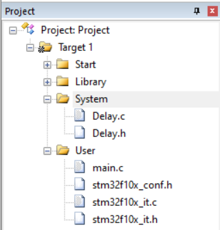
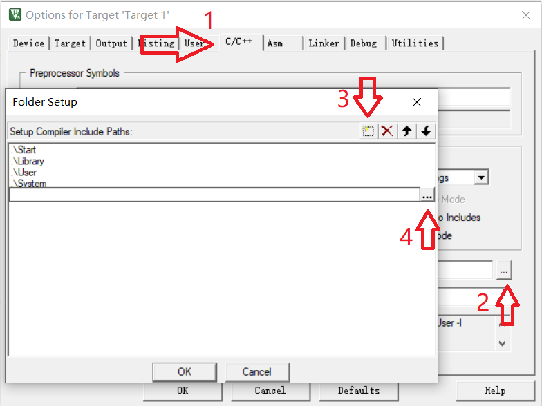
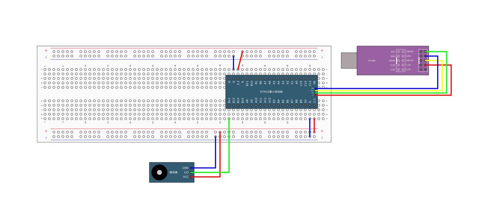

# 蜂鸣器应用

> Author：余生

## 一、准备

### 新建文件夹及文件

类似形式



### 配置工程包含路径

为了让编译器找到头文件：

1. 点击 `Options for Target`（小魔术棒图标）
2. 在 `C/C++` 选项卡 → `Include Paths` → 点击 `...` 添加路径



## 二、硬件图



## 三、代码编写及解读

## delay.h

```cpp
#ifndef __DELAY_H
#define __DELAY_H

void Delay_us(uint32_t us);
void Delay_ms(uint32_t ms);
void Delay_s(uint32_t s);

#endif
```

我们接下来具体解析这些代码 ：

### 1.头文件保护（防止重复包含）

```cpp
#ifndef __DELAY_H
#define __DELAY_H

// 函数声明...

#endif
```

#### 为什么需要头文件保护？

- 避免重复定义：在大型项目中，一个 `.h` 文件可能会被多个 `.c` 文件包含。如果直接包含而没有保护机制，编译器会多次看到相同的定义，导致“重复定义”错误。
- 提高编译效率：一旦某个 `.h` 文件被包含过一次，后续再包含时编译器可以跳过其内容，减少编译时间。

#### 如何工作？

- `#ifndef __DELAY_H`：检查宏 `__DELAY_H` 是否已定义。如果未定义，则继续执行下面的代码。
- `#define __DELAY_H`：定义宏 `__DELAY_H`，表示这个头文件已经被包含过了。
- `#endif`：结束条件编译块。

### 2. 延时函数声明

```cpp
void Delay_us(uint32_t us);
void Delay_ms(uint32_t ms);
void Delay_s(uint32_t s);
```

#### 为什么需要多种延时函数？

- 满足不同需求：程序中可能需要微秒级、毫秒级或秒级的延时，提供多种函数可以更灵活地控制延时精度。
- 代码复用：虽然内部实现可能基于同一个原理（如SysTick定时器），但通过封装成不同的函数，可以让调用者更直观地选择合适的延时单位。

#### 参数类型 `uint32_t` 的选择

- 无符号整数：延时值不可能为负数，因此使用 `unsigned int` 类型。
- 32位宽度：保证足够大的范围，例如 `uint32_t` 可以表示0到4294967295之间的值，足以覆盖大多数延时需求。

## delay.c

```cpp
#include "stm32f10x.h"

/**
 * @brief  微秒级延时
 * @param  xus 延时时长，范围：0~233015
 * @retval 无
 */
void Delay_us(uint32_t xus) {
    SysTick->LOAD = 72 * xus;    // 设置定时器重装值
    SysTick->VAL = 0x00;         // 清空当前计数值
    SysTick->CTRL = 0x00000005;  // 设置时钟源为HCLK，启动定时器
    while (!(SysTick->CTRL & 0x00010000));  // 等待计数到0
    SysTick->CTRL = 0x00000004;             // 关闭定时器
}

/**
 * @brief  毫秒级延时
 * @param  xms 延时时长，范围：0~4294967295
 * @retval 无
 */
void Delay_ms(uint32_t xms) {
    while (xms--) {
        Delay_us(1000);
    }
}

/**
 * @brief  秒级延时
 * @param  xs 延时时长，范围：0~4294967295
 * @retval 无
 */
void Delay_s(uint32_t xs) {
    while (xs--) {
        Delay_ms(1000);
    }
}
```

我们接下来具体解析这些代码 ：

### SysTick 定时器

在 STM32 芯片内部，有一个叫 SysTick（系统滴答）定时器 的小工具，它就像一个倒计时的闹钟。

- 它是一个 24 位的倒计数器，最大能数到 16,777,215（2²⁴ - 1）。
- 每过一个“滴答”（tick），它就减 1，减到 0 时会“响铃”（置位标志位），我们可以检测这个“响铃”来判断时间到了。

我们就是用这个“小闹钟”来实现精确延时的！

### `Delay_us(uint32_t xus)`

```cpp
void Delay_us(uint32_t xus) {
    SysTick->LOAD = 72 * xus;               // 设置倒计时的初始值
    SysTick->VAL = 0x00;                    // 当前计数值清零
    SysTick->CTRL = 0x00000005;             // 启动定时器，使用 HCLK 时钟
    while (!(SysTick->CTRL & 0x00010000));  // 等待它数到 0
    SysTick->CTRL = 0x00000004;             // 关闭定时器
}
```

### 逐行讲解

#### 1. `SysTick->LOAD = 72 * xus;`

- `LOAD` 寄存器：设置“小闹钟”一开始从多少开始倒数。
- 为什么是 `72 * xus`？
- 因为我们的 STM32F103 主频是 72MHz，也就是每秒 72,000,000 个时钟周期。
  - 1 微秒（μs） = 1/1,000,000 秒
  - 在 72MHz 下，1 微秒内有 `72,000,000 / 1,000,000 = 72` 个时钟周期。
- 所以，要延时 1 微秒，就让 SysTick 数 72 下。
- 要延时 `xus` 微秒，就数 `72 * xus` 下。
- 举例：
  - `Delay_us(10)` → 数 `72 × 10 = 720` 下
  - `Delay_us(50)` → 数 `72 × 50 = 3600` 下

> 注意：`LOAD` 最大只能写 16,777,215，所以 `72 * xus ≤ 16,777,215` → `xus ≤ 233,015` 微秒 ≈ 233 毫秒

#### 2. `SysTick->VAL = 0x00;`

- `VAL` 是当前计数值。
- 清零是为了确保从 0 开始倒数，避免上次延时残留的数值影响。

#### 3. `SysTick->CTRL = 0x00000005;`

- `CTRL` 是控制寄存器，用来启动和配置 SysTick。
- `0x00000005` 的二进制是：`0000 ... 0000 0101`
  - 第 0 位（ENABLE）= 1 → 启动定时器
  - 第 2 位（CLKSOURCE）= 1 → 使用 HCLK（72MHz）作为时钟源
  - 第 1 位（TICKINT）= 0 → 不开启中断（我们只用轮询）

> 简单记：`0x5` = 开启定时器 + 使用主时钟

#### 4. `while(!(SysTick->CTRL & 0x00010000));`

- `0x00010000` 是第 16 位（COUNTFLAG），表示“是否数到 0 了”。
- `!(...)` 表示“还没数到 0”，就一直等。
- 一旦数到 0，这一位变成 1，条件不成立，跳出循环。

 相当于：“闹钟没响，我就一直等”

#### 5. `SysTick->CTRL = 0x00000004;`

- 把 ENABLE 位（第 0 位）关掉，停止定时器。
- 避免它继续运行，影响下一次延时。

> `0x4` = 只保留时钟源，关闭使能

## 3.main.c

```cpp
#include "Delay.h"
#include "stm32f10x.h"  // Device header

int main(void) {
    RCC_APB2PeriphClockCmd(RCC_APB2Periph_GPIOB, ENABLE);

    GPIO_InitTypeDef GPIO_InitStructure;
    GPIO_InitStructure.GPIO_Mode = GPIO_Mode_Out_PP;
    GPIO_InitStructure.GPIO_Pin = GPIO_Pin_12;
    GPIO_InitStructure.GPIO_Speed = GPIO_Speed_50MHz;
    GPIO_Init(GPIOB, &GPIO_InitStructure);

    while (1) {
        GPIO_ResetBits(GPIOB, GPIO_Pin_12);
        Delay_ms(100);
        GPIO_SetBits(GPIOB, GPIO_Pin_12);
        Delay_ms(100);
        GPIO_ResetBits(GPIOB, GPIO_Pin_12);
        Delay_ms(100);
        GPIO_SetBits(GPIOB, GPIO_Pin_12);
        Delay_ms(700);
    }
}
```
