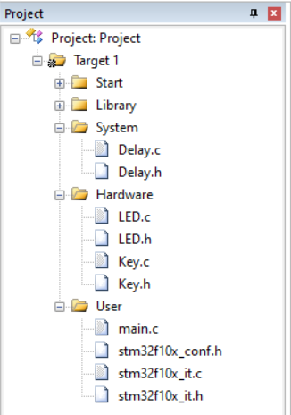
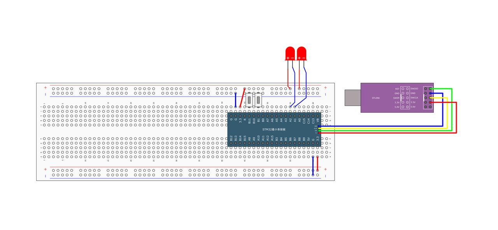

# 按键控制LED

> Author：余生

## 一、准备

### 新建文件及文件夹



## 配置工程包含路径

不再赘述， [看这里](./10.3.2.3.2.3%20蜂鸣器应用.md)

## 二、硬件连接



## 三、代码编写及解读

## LED.h

```cpp
#ifndef __LED_H
#define __LED_H

void LED_Init(void);
void LED1_ON(void);
void LED1_OFF(void);
void LED1_Turn(void);
void LED2_ON(void);
void LED2_OFF(void);
void LED2_Turn(void);

#endif
```

## LED.c

```cpp
#include "stm32f10x.h"  // Device header

void LED_Init(void)  // 初始化两个LED用的引脚（PA1 和 PA2）
{
    RCC_APB2PeriphClockCmd(RCC_APB2Periph_GPIOA, ENABLE);

    GPIO_InitTypeDef GPIO_InitStructure;
    GPIO_InitStructure.GPIO_Mode = GPIO_Mode_Out_PP;
    GPIO_InitStructure.GPIO_Pin = GPIO_Pin_1 | GPIO_Pin_2;
    GPIO_InitStructure.GPIO_Speed = GPIO_Speed_50MHz;
    GPIO_Init(GPIOA, &GPIO_InitStructure);

    GPIO_SetBits(GPIOA, GPIO_Pin_1 | GPIO_Pin_2);
}

void LED1_ON(void)  // 把 PA1 引脚拉低,点亮 LED1
{
    GPIO_ResetBits(GPIOA, GPIO_Pin_1);
}

void LED1_OFF(void)  // 把 PA1 引脚拉高,两端电压差消失
{
    GPIO_SetBits(GPIOA, GPIO_Pin_1);
}

void LED1_Turn(void)  // 翻转 LED1 的状态
{
    if (GPIO_ReadOutputDataBit(GPIOA, GPIO_Pin_1) == 0) {
        GPIO_SetBits(GPIOA, GPIO_Pin_1);
    } else {
        GPIO_ResetBits(GPIOA, GPIO_Pin_1);
    }
}

void LED2_ON(void)  // 点亮 LED2
{
    GPIO_ResetBits(GPIOA, GPIO_Pin_2);
}

void LED2_OFF(void)  // 熄灭 LED2
{
    GPIO_SetBits(GPIOA, GPIO_Pin_2);
}

void LED2_Turn(void)  // 翻转 LED2 的状态
{
    if (GPIO_ReadOutputDataBit(GPIOA, GPIO_Pin_2) == 0) {
        GPIO_SetBits(GPIOA, GPIO_Pin_2);
    } else {
        GPIO_ResetBits(GPIOA, GPIO_Pin_2);
    }
}
```

## Key.h

```cpp
#ifndef __KEY_H
#define __KEY_H

void Key_Init(void);
uint8_t Key_GetNum(void);

#endif
```

## Key.c

```cpp
#include "Delay.h"
#include "stm32f10x.h"  // Device header

void Key_Init(void) {
    RCC_APB2PeriphClockCmd(RCC_APB2Periph_GPIOB, ENABLE);

    GPIO_InitTypeDef GPIO_InitStructure;
    GPIO_InitStructure.GPIO_Mode = GPIO_Mode_IPU;
    GPIO_InitStructure.GPIO_Pin = GPIO_Pin_1 | GPIO_Pin_11;
    GPIO_InitStructure.GPIO_Speed = GPIO_Speed_50MHz;
    GPIO_Init(GPIOB, &GPIO_InitStructure);
}

uint8_t Key_GetNum(void) {
    uint8_t KeyNum = 0;
    if (GPIO_ReadInputDataBit(GPIOB, GPIO_Pin_1) == 0) {
        Delay_ms(20);
        while (GPIO_ReadInputDataBit(GPIOB, GPIO_Pin_1) == 0);
        Delay_ms(20);
        KeyNum = 1;
    }
    if (GPIO_ReadInputDataBit(GPIOB, GPIO_Pin_11) == 0) {
        Delay_ms(20);
        while (GPIO_ReadInputDataBit(GPIOB, GPIO_Pin_11) == 0);
        Delay_ms(20);
        KeyNum = 2;
    }

    return KeyNum;
}
```

### 1. `Key_Init()` —— 按键引脚初始化

作用：

- 给 GPIOB 开电源（时钟使能），因为按键接在PB1和PB11上
- 设置这两个引脚为 输入模式 + 上拉电阻（IPU）

 为什么用“上拉输入”？

- 上拉 = 内部接一个“小弹簧”，把引脚默认拉到高电平（1）
- 按下按键时，引脚接地 → 变成低电平（0）
- 所以：没按 = 1，按下 = 0

 类比：就像门有个弹簧，不推它就自动关上（高电平），一推就开（低电平）

### 2. `Key_GetNum()` —— 获取哪个按键被按了

作用：

检查两个按键是否被按下，如果按了，返回对应编号：

- 按下 PB1 → 返回 1
- 按下 PB11 → 返回 2
- 都没按 → 返回 0

它是怎么判断的？分四步：

#### 第一步：读引脚状态

看 PB1 或 PB11 是不是变成了 0（说明可能被按下了）

#### 第二步：延时20ms（防抖）

 按键机械抖动问题：

你按一下按钮，看起来是一次接通，但内部金属片会“弹几下”，产生多个高低电平跳动（可能被误判为按了多次）。

解决办法：发现按键按下后，先等 20毫秒，让抖动结束。

#### 第三步：持续等待松手

```cpp
while (GPIO_ReadInputDataBit(...) == 0);
```

这句的意思是：一直卡在这里，直到按键松开为止。

相当于：你按完按钮，必须松手后程序才能继续，防止一直返回“1”。

#### 第四步：再延时20ms（稳定）

松手后可能还有抖动，再等20ms，确保完全稳定。

最后设置 KeyNum = 1 或 2

> 🔁 注意：两个按键是用 `if` 单独判断的，不是 `else if`，所以理论上可以同时检测两个都按（但这里后一个会覆盖前一个）

### 思考

如果两个按键同时按下，最终只返回 2，因为第二个 `if` 覆盖了前面的结果。

如果你想支持多键同时识别，应该怎么做呢？

## 总结一句话

> 这段代码是用来初始化两个按键，并检测哪个被按下的。它通过设置输入上拉模式读取电平，加入延时防抖和等待松手机制，确保每次按下只识别一次，稳定可靠。

## main.c

```cpp
#include "Delay.h"
#include "Key.h"
#include "LED.h"
#include "stm32f10x.h"  // Device header

uint8_t KeyNum;  // 注意！！！

int main(void) {
    LED_Init();
    Key_Init();

    while (1) {
        KeyNum = Key_GetNum();
        if (KeyNum == 1) {
            LED1_Turn();
        }
        if (KeyNum == 2) {
            LED2_Turn();
        }
    }
}
```
