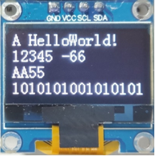
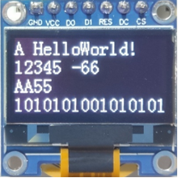
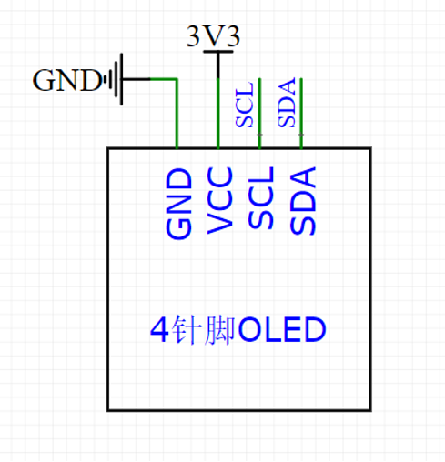
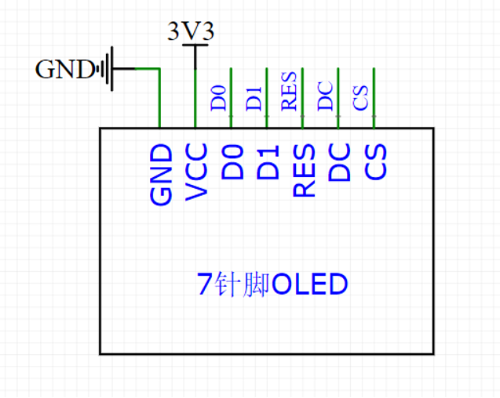

# OLED基础

> Author：余生

## 一、什么是OLED

图为I2c通信

图为spi通信

### 一句话回答

OLED 是一种可以显示文字、数字、图形的小屏幕，特别适合单片机项目用来显示信息。

比如：显示温度、时间、菜单、动画，甚至小图标！

### 拆开讲：OLED 是什么？

OLED = Organic Light-Emitting Diode

中文叫：有机发光二极管

听起来很高大上？其实你可以把它想象成：

> 一块“会自己发光的像素点阵板”

### 它有什么特点？（为什么在STM32里常用）

| 特点     | 解释（小白版）                                        |
| -------- | ----------------------------------------------------- |
| 自己发光 | 不像手机LCD要背光，OLED每个小点都能自己亮，所以更省电 |
| 对比度高 | 黑的就是真黑（不亮），白的很亮，看起来很清楚          |
| 很薄     | 可以做到像纸一样薄（常见模块也就硬币大小）            |
| 接口简单 | 常用 I2C 或 SPI 通信，接线少，STM32很容易驱动         |
| 功耗低   | 特别适合电池供电的项目                                |

###

### 常见的OLED屏幕长什么样？

- 最常见的是：0.96寸蓝色或白色屏幕
- 分辨率：128×64 个像素点
- 引脚一般有6个：VCC、GND、SCL、SDA（I2C模式），有时还有RES和DC

接到STM32上，通常只需要 4根线 就能工作！

### 它能干啥？（STM32项目中常见用途）

- 显示温度、湿度（比如用DHT11传感器）
- 显示菜单界面（比如设置选项）
- 显示倒计时、秒表
- 显示电池电量、信号强度
- 甚至显示小图标、Logo、动画！

### 类比理解

你可以把 OLED 想象成：

> 一个由 128×64 个小LED灯组成的“大拼图板”， 你想让哪几个亮就让哪几个亮，拼出文字或图案。

STM32 就是那个“指挥官”，告诉它：“第10行第20列这个点，给我点亮！”

### 总结

> OLED 是个小屏幕，黑白（或蓝黄）分明看得清。 接线简单功耗低，STM32项目好帮手！

## 二、电路示意图

具体原理目前先不了解，感兴趣的话可以跳到 通信协议 I2C 部分

想了解的可以跳到 通信协议 spi 部分

接下来我们将会用I2C的OLED板子来学习
