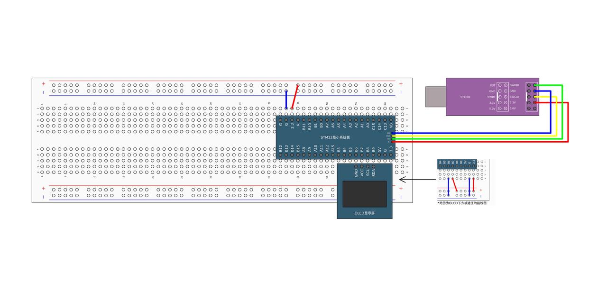
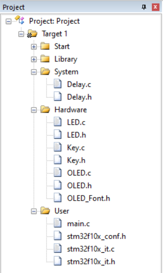

# OLED运用

> Author：余生

## 一、电路连接



## 二、预备代码

目前我们先不管该OLED的原理，感兴趣的话可以先行跳转[I2C](https://ycna0ikpc5v0.feishu.cn/wiki/T6gcwsugTihNPzkcBptcfoBLnrd)

由于缺少前置知识，我们直接使用该已经写好的库

<Download url="./OLED.c"/>

<Download url="./OLED.h"/>

<Download url="./OLED_Font.h"/>

按照这个样子来放置在文件上



之后，我们就可以直接使以下函数了

|                                       |                      |
| ------------------------------------- | -------------------- |
| OLED_Init();                          | 初始化               |
| OLED_Clear();                         | 清屏                 |
| OLED_ShowChar(1, 1, 'A');             | 显示一个字符         |
| OLED_ShowString(1, 3, "HelloWorld!"); | 显示字符串           |
| OLED_ShowNum(2, 1, 12345, 5);         | 显示十进制数字       |
| OLED_ShowSignedNum(2, 7, -66, 2);     | 显示有符号十进制数字 |
| OLED_ShowHexNum(3, 1, 0xAA55, 4);     | 显示十六进制数字     |
| OLED_ShowBinNum(4, 1, 0xAA55, 16);    | 显示二进制数字       |

## 三、代码编写

```cpp
#include "Delay.h"
#include "OLED.h"
#include "stm32f10x.h"  // Device header

int main(void) {
    OLED_Init();

    OLED_ShowChar(1, 1, 'A');
    OLED_ShowString(1, 3, "HelloWorld!");
    OLED_ShowNum(2, 1, 12345, 5);
    OLED_ShowSignedNum(2, 7, -66, 2);
    OLED_ShowHexNum(3, 1, 0xAA55, 4);
    OLED_ShowBinNum(4, 1, 0xAA55, 16);

    while (1) {
    }
}
```

1.初始化OLED

```cpp
OLED_Init();
```

作用：开机！点亮屏幕！

- 让STM32和OLED建立通信（通常是I2C）
- 初始化屏幕设置，清屏，准备显示内容

类比：打开电视电源，等它进入待播放状态。

2.开始往屏幕上“写东西”

下面这些函数，都是在“指定位置”显示“指定内容”。

我们一个一个说：

### `OLED_ShowChar(1, 1, 'A');`

> 在第 1行、第 1列 显示一个字符：A

- 行和列是从1开始数的（不是0）
- `'A'` 是单引号，表示一个字符

就像在表格里填一个格子：第1行第1格，写个“A”

### `OLED_ShowString(1, 3, "HelloWorld!");`

> 在第 1行、第 3列 显示一串文字：HelloWorld!

- `"HelloWorld!"` 是双引号，表示字符串（多个字符）
- 从第3列开始，一个一个字母排下去

注意：OLED屏幕宽度有限（128列），太长会显示不下

### `OLED_ShowNum(2, 1, 12345, 5);`

> 在第 2行、第 1列 显示一个 正整数：12345，总共显示 5位

- `12345` 是要显示的数字
- `5` 是显示几位数（不够前面补空格）

比如你写 `OLED_ShowNum(2,1,7,3)` → 显示 `7`（前面两个空格）

### `OLED_ShowSignedNum(2, 7, -66, 2);`

> 在第 2行、第 7列 显示一个 有正负号的数：-66，显示 2位

- 可以显示负数！比如 -66、-1
- `2` 表示最多显示2位数字（含符号也算位置）

注意：如果数字太大（比如 -100），会显示不全或变成 ??，要小心

### `OLED_ShowHexNum(3, 1, 0xAA55, 4);`

> 在第 3行、第 1列 显示一个 十六进制数：AA55，显示 4位

- `0xAA55` 是十六进制写法
- 显示出来就是：`AA55`

单片机调试时常用十六进制看数据（比如寄存器值）

### `OLED_ShowBinNum(4, 1, 0xAA55, 16);`

> 在第 4行、第 1列 显示一个 二进制数：把 `0xAA55` 转成二进制，显示 16位

- `0xAA55` 的二进制是：`1010101001010101`
- 显示16位，刚好占满一整行

二进制适合看每一位是0还是1，对理解寄存器很有帮助！

### 最后：进入无限循环

```cpp
while (1)
{
    // 啥也不干，就让程序一直运行
}
```

因为显示内容已经全部写好了，不需要再更新，所以程序到这里就“挂起”，保持屏幕一直亮着。

## 屏幕最终显示效果大概是这样

```txt
第1行：AHelloWorld!
第2行：12345 -66
第3行：AA55
第4行：1010101001010101
```
