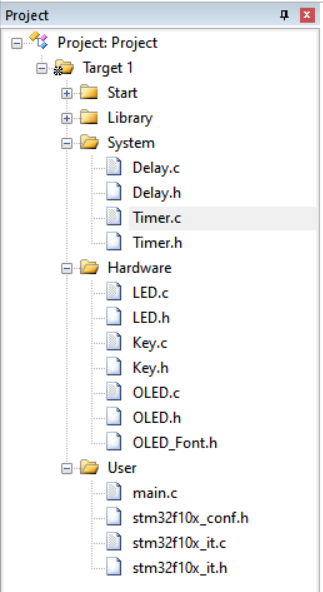

# 定时器应用

> Author：余生

## 一、硬件连接


## 二、新建文件

如图：



## 三、代码编写

### Timer.h

```cpp
#ifndef __TIMER_H
#define __TIMER_H

void Timer_Init(void);

#endif
```

### Timer.c

```cpp
#include "stm32f10x.h"  // Device header

void Timer_Init(void) {
    RCC_APB1PeriphClockCmd(RCC_APB1Periph_TIM2, ENABLE);

    TIM_InternalClockConfig(TIM2);

    TIM_TimeBaseInitTypeDef TIM_TimeBaseInitStructure;
    TIM_TimeBaseInitStructure.TIM_ClockDivision = TIM_CKD_DIV1;
    TIM_TimeBaseInitStructure.TIM_CounterMode = TIM_CounterMode_Up;
    TIM_TimeBaseInitStructure.TIM_Period = 10000 - 1;
    TIM_TimeBaseInitStructure.TIM_Prescaler = 7200 - 1;
    TIM_TimeBaseInitStructure.TIM_RepetitionCounter = 0;
    TIM_TimeBaseInit(TIM2, &TIM_TimeBaseInitStructure);

    TIM_ClearFlag(TIM2, TIM_FLAG_Update);
    TIM_ITConfig(TIM2, TIM_IT_Update, ENABLE);

    NVIC_PriorityGroupConfig(NVIC_PriorityGroup_2);

    NVIC_InitTypeDef NVIC_InitStructure;
    NVIC_InitStructure.NVIC_IRQChannel = TIM2_IRQn;
    NVIC_InitStructure.NVIC_IRQChannelCmd = ENABLE;
    NVIC_InitStructure.NVIC_IRQChannelPreemptionPriority = 2;
    NVIC_InitStructure.NVIC_IRQChannelSubPriority = 1;
    NVIC_Init(&NVIC_InitStructure);

    TIM_Cmd(TIM2, ENABLE);
}

// void TIM2_IRQHandler(void)
// {
//     if (TIM_GetITStatus(TIM2, TIM_IT_Update) == SET)
//     {
//         // 这里写你想做的事，比如：LED1_Turn();
//         TIM_ClearITPendingBit(TIM2, TIM_IT_Update);
//     }
// }
```

#### 函数：`Timer_Init()` 详解

#### 第1步：打开TIM2的电源

```cpp
RCC_APB1PeriphClockCmd(RCC_APB1Periph_TIM2, ENABLE);
```

类比：  

> “我要用定时器TIM2了，请给它通电！”

注意：TIM2属于APB1总线（低速外设），和GPIO不一样，所以要开APB1的时钟。

#### 第2步：使用内部时钟

```cpp
TIM_InternalClockConfig(TIM2);
```

意思是：

> “TIM2你用自己内部的时钟来计数，别等外部信号。”

默认就是内部时钟，这句其实可以省略，但写上更清晰。

#### 第3步：配置定时器的“计数规则”

```cpp
TIM_TimeBaseInitTypeDef TIM_TimeBaseInitStructure;
```

这是一个“配置表”，我们要填几个关键参数：

##### 填表开始

```cpp
TIM_TimeBaseInitStructure.TIM_CounterMode = TIM_CounterMode_Up;
```

> 计数方式：**向上计数**从0开始加，一直加到一个数，然后“溢出”，产生中断，再回到0重新开始。

 就像秒表：0 → 1 → 2 → … → 99，然后“叮！”归零。

```C
TIM_TimeBaseInitStructure.TIM_Prescaler = 7200 - 1;
```

> **预****分频器****（PSC）：把时钟变慢**

- STM32主频是72MHz
- 我们想让定时器每1ms计一次数，就要先“减速”
- `7200 - 1` 表示：每7200个时钟周期，计数器才+1

计算：

```txt
72MHz / 7200 = 10,000Hz → 每0.1ms计一次数
```

> 为什么减1？因为硬件设计就是“加1后才用”，所以填7199实际就是分频7200。

```cpp
TIM_TimeBaseInitStructure.TIM_Period = 10000 - 1;
```

> **自动重装载值（****ARR****）：数到多少会“叮”？**

- 计数器从0开始往上加，加到 `10000 - 1 = 9999` 时，就“溢出”，产生中断
- 然后回到0重新开始

计算：

```txt
每0.1ms加1 → 加10000次 = 1秒
```

所以：**每1秒产生一次中断！**

> 为什么减1？同上，硬件从0开始数，数到9999刚好是10000步。

```cpp
TIM_TimeBaseInitStructure.TIM_ClockDivision = TIM_CKD_DIV1;
```

> 时钟分频，一般用不到，设为1就行（不额外分频）

```cpp
TIM_TimeBaseInitStructure.TIM_RepetitionCounter = 0;
```

> 重复计数器，高级定时器用得多，这里设为0（不用）

#### 第4步：初始化定时器

```cpp
TIM_TimeBaseInit(TIM2, &TIM_TimeBaseInitStructure);
```

意思是：

> “把上面填好的配置表交给TIM2，开始生效！”

#### 第5步：清除中断标志，开启中断

```cpp
TIM_ClearFlag(TIM2, TIM_FLAG_Update);
TIM_ITConfig(TIM2, TIM_IT_Update, ENABLE);
```

- `ClearFlag`：先把“已经溢出”的标志清掉（防止一上来就进中断）
- `ITConfig`：允许“更新中断”（即溢出时触发中断）

就像：先把闹钟铃声关掉，再打开闹钟功能。

#### 第6步：配置中断优先级（NVIC）

```cpp
NVIC_PriorityGroupConfig(NVIC_PriorityGroup_2);
```

> 设置中断优先级分组：**2位抢占优先级，2位子优先级**

 我们现在只用一个中断，知道这句是“设置中断规则”就行。

```cpp
NVIC_InitStructure.NVIC_IRQChannel = TIM2_IRQn;
NVIC_InitStructure.NVIC_IRQChannelCmd = ENABLE;
NVIC_InitStructure.NVIC_IRQChannelPreemptionPriority = 2;
NVIC_InitStructure.NVIC_IRQChannelSubPriority = 1;
NVIC_Init(&NVIC_InitStructure);
```

意思是：

> “TIM2的中断我要用，优先级设为2（抢占）和1（子），请注册到中断系统中”

就像：把闹钟的“响铃通道”打开，并设置它响的时候能不能打断别的任务。

#### 第7步：启动定时器

```cpp
TIM_Cmd(TIM2, ENABLE);
```

**启动！开始计数！**

从现在开始，TIM2就开始工作了：每1秒“溢出”一次，触发中断。

#### 被注释掉的中断服务函数

```cpp
// void TIM2_IRQHandler(void)
// {
//     if (TIM_GetITStatus(TIM2, TIM_IT_Update) == SET)
//     {
//         // 这里写你想做的事，比如：LED1_Turn();
//         TIM_ClearITPendingBit(TIM2, TIM_IT_Update);
//     }
// }
```

这是“闹钟响了之后要做的事”

- `TIM2_IRQHandler` 是中断函数名，固定写法
- `TIM_GetITStatus` 判断是不是更新中断
- `TIM_ClearITPendingBit` 清除中断标志，不然会一直进中断

你必须在这里写上你想执行的任务，比如翻转LED、刷新屏幕等。

#### 总结

> 定时器就像一个自动闹钟，  
>
> 先设置多久响一次（PSC + ARR），  
>
> 再打开中断，告诉CPU“到时间叫我”，  
>
> 最后在 `TIM2_IRQHandler` 里写“响了之后做什么”。

#### 本例定时时间计算（重点！）

```txt
主频：72MHz
分频：7200 → 72MHz / 7200 = 10kHz → 每0.1ms计一次数
计数：10000次 → 0.1ms × 10000 = 1000ms = 1秒
```

所以：**每1秒产生一次中断**

如果你想改成 500ms，就把 `Period` 改成 `5000 - 1`

#### 注意

- 定时器中断适合做“周期性任务”，比 `Delay_ms()` 更高效
- `Delay_ms()` 会卡住CPU，而中断是“后台悄悄数”，CPU可以干别的事
- 中断里不要写太多代码，尽量只做标记（比如设置一个flag），在主循环里处理

### main.c

```cpp
#include "Delay.h"
#include "OLED.h"
#include "Timer.h"
#include "stm32f10x.h"  // Device header

uint16_t Num;

int main(void) {
    OLED_Init();
    Timer_Init();

    OLED_ShowString(1, 1, "Num:");

    while (1) {
        OLED_ShowNum(1, 5, Num, 5);
    }
}

void TIM2_IRQHandler(void) {
    if (TIM_GetITStatus(TIM2, TIM_IT_Update) == SET) {
        Num++;
        TIM_ClearITPendingBit(TIM2, TIM_IT_Update);
    }
}
```

#### 这个程序是干啥的？

> **让OLED屏幕上的一个数字（Num）每1秒自动加1！**

就像一个计时器：0 → 1 → 2 → 3 → … 一直往上数，显示在屏幕上。

#### 程序结构解析

#### 第一步：包含头文件

```cpp
#include "stm32f10x.h"
#include "Delay.h"
#include "OLED.h"
#include "Timer.h"
```

意思是：

> “我要用STM32、延时、OLED屏幕、定时器功能，请把它们都准备好。”

尤其是 `Timer.h`，它包含了你之前写的 `Timer_Init()` 函数。

#### 第二步：定义一个全局变量

```cpp
uint16_t Num;
```

这是一个“计数器”，用来存当前的数字，初始值是 0。

- `uint16_t` 表示无符号16位整数（0 ~ 65535）
- 每过1秒，它就会 +1

#### 第三步：主函数 `main()`

##### 1. 初始化

```cpp
OLED_Init();
Timer_Init();
```

- 初始化OLED屏幕（点亮）
- 初始化定时器TIM2（设好1秒中断）

就像：打开显示器 + 设置好闹钟

##### 2. 显示提示文字

```cpp
OLED_ShowString(1, 1, "Num:");
```

> 在第1行第1列显示：`Num:`

提示用户：后面这个数字是计数值。

##### 3. 进入主循环

```cpp
while (1)
{
    OLED_ShowNum(1, 5, Num, 5);
}
```

意思是：

> “一直重复做一件事：把当前的 `Num` 值显示在屏幕第1行第5列，显示5位数”

注意：这里没有 `Delay_ms()`，因为OLED刷新不需要延时，CPU跑得很快。

#### 第四步：中断函数 `TIM2_IRQHandler`

```cpp
void TIM2_IRQHandler(void)
{
    if (TIM_GetITStatus(TIM2, TIM_IT_Update) == SET)
    {
        Num ++;
        TIM_ClearITPendingBit(TIM2, TIM_IT_Update);
    }
}
```

这是“闹钟响了之后要做的事”：

1. 判断是不是TIM2的“溢出中断”（也就是1秒到了）
2. 如果是，就把 `Num` 加1
3. 清除中断标志，准备下一次中断

关键点：这个函数是“自动被调用”的，不需要你在 `main()` 里写。

#### 主循环 vs 中断：谁在干活？

| 主循环（while(1)）              | 中断函数（TIM2_IRQHandler）    |
| ------------------------------- | ------------------------------ |
| 不停刷新屏幕，显示当前 Num 的值 | 每隔1秒自动执行一次，让 Num +1 |
| 负责“显示”                      | 负责“计时+计数”                |
| CPU大部分时间在这里             | 只在1秒到时“插进来”执行一下    |

类比：

> 你一边看电视（主循环），  
>
> 一边等着闹钟响（中断）。  
>
> 闹钟一响，你就按一下计数器按钮（Num++），  
>
> 然后继续看电视。

#### 屏幕显示效果

```txt
Num:    0
```

1秒后：

```txt
Num:    1
```

再1秒后：

```txt
Num:    2
```

……一直往上数，直到65535后回到0（因为是16位）

#### 注意

- 中断里不要放延时，否则会卡住整个系统
- 中断里不要频繁刷新OLED，因为OLED刷新较慢，会影响其他任务
- 正确做法：中断只做“标记”或“加减”，主循环负责“显示”
