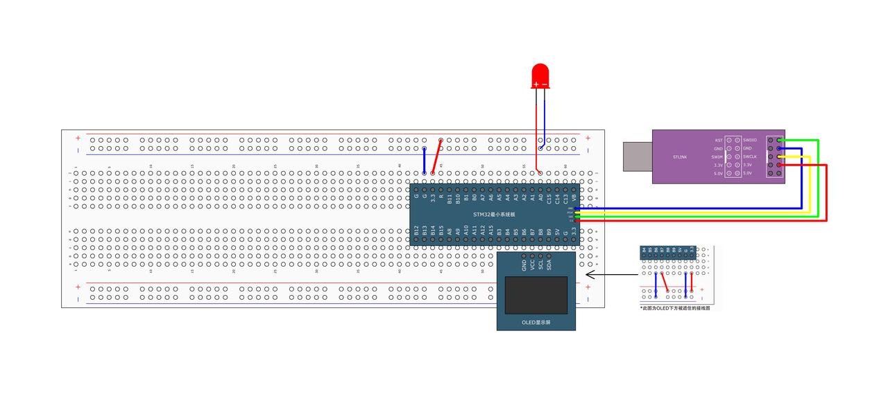
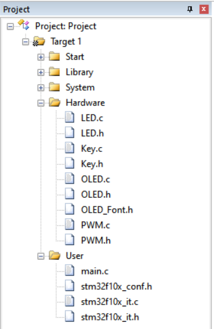

# PWM驱动LED

> Author：余生

## 一、基本原理

### PWM基本原理

想象一下，你有一个灯，只能通过“快速开关”来控制它的亮度。你开一秒、关一秒，灯看起来就是半亮的。如果你开的时间更短，关的时间更长，灯看起来就更暗。

**PWM**（Pulse Width Modulation，脉冲宽度调制）就是这个“快速开关”的技术。

#### 它是怎么工作的？

PWM输出的是一个方波信号，也就是电压在高（比如3.3V）和低（0V）之间来回切换。

它有两个关键参数：

1. **频率（Frequency）**：每秒开关多少次。  
   1. 比如频率是1kHz，就是每秒开关1000次，人眼根本看不出来闪烁。
   2. 频率一般固定不变。
2. **占空比****（****Duty Cycle****）**：在一个周期里，“高电平”占的时间比例。  
   1. 比如占空比50%：一半时间开，一半时间关 → 灯半亮。
   2. 占空比80%：80%时间开，20%时间关 → 灯很亮。
   3. 占空比20%：灯就比较暗。

> 简单记：占空比越大，平均电压越高，灯越亮（或电机越快）。

#### 举个生活例子

你用花洒 watering 花，不能调水量，只能“开一秒、关一秒”来控制浇水量。

- 开1秒、关1秒 → 平均浇了一半的水（50%占空比）
- 开3秒、关1秒 → 浇得多（75%占空比）
- 开得越久，花得到的水越多。

PWM就是这个道理，只不过开关速度非常非常快！

#### 在STM32里怎么用？

STM32的定时器（Timer）可以生成PWM信号。你只需要：

1. 设置好频率（比如1kHz）
2. 设置占空比（比如50%）
3. STM32就会自动从某个引脚输出PWM波

比如控制LED亮度、电机转速、舵机角度等，都靠它！

## 二、硬件连接



## 三、代码编写

先新建文件



## PWM.h

```cpp
#ifndef __PWM_H
#define __PWM_H

void PWM_Init(void);
void PWM_SetCompare1(uint16_t Compare);

#endif
```

## PWM.c

```cpp
#include "stm32f10x.h"  // Device header

void PWM_Init(void) {
    RCC_APB1PeriphClockCmd(RCC_APB1Periph_TIM2, ENABLE);
    RCC_APB2PeriphClockCmd(RCC_APB2Periph_GPIOA, ENABLE);

    //        RCC_APB2PeriphClockCmd(RCC_APB2Periph_AFIO, ENABLE);
    //        GPIO_PinRemapConfig(GPIO_PartialRemap1_TIM2, ENABLE);
    //        GPIO_PinRemapConfig(GPIO_Remap_SWJ_JTAGDisable, ENABLE);

    GPIO_InitTypeDef GPIO_InitStructure;
    GPIO_InitStructure.GPIO_Mode = GPIO_Mode_AF_PP;
    GPIO_InitStructure.GPIO_Pin = GPIO_Pin_0;  // GPIO_Pin_15;
    GPIO_InitStructure.GPIO_Speed = GPIO_Speed_50MHz;
    GPIO_Init(GPIOA, &GPIO_InitStructure);

    TIM_InternalClockConfig(TIM2);

    TIM_TimeBaseInitTypeDef TIM_TimeBaseInitStructure;
    TIM_TimeBaseInitStructure.TIM_ClockDivision = TIM_CKD_DIV1;
    TIM_TimeBaseInitStructure.TIM_CounterMode = TIM_CounterMode_Up;
    TIM_TimeBaseInitStructure.TIM_Period = 100 - 1;     // ARR
    TIM_TimeBaseInitStructure.TIM_Prescaler = 720 - 1;  // PSC
    TIM_TimeBaseInitStructure.TIM_RepetitionCounter = 0;
    TIM_TimeBaseInit(TIM2, &TIM_TimeBaseInitStructure);

    TIM_OCInitTypeDef TIM_OCInitStructure;
    TIM_OCStructInit(&TIM_OCInitStructure);
    TIM_OCInitStructure.TIM_OCMode = TIM_OCMode_PWM1;
    TIM_OCInitStructure.TIM_OCPolarity = TIM_OCPolarity_High;
    TIM_OCInitStructure.TIM_OutputState = TIM_OutputState_Enable;
    TIM_OCInitStructure.TIM_Pulse = 0;  // CCR
    TIM_OC1Init(TIM2, &TIM_OCInitStructure);

    TIM_Cmd(TIM2, ENABLE);
}

void PWM_SetCompare1(uint16_t Compare) { TIM_SetCompare1(TIM2, Compare); }
```

### 这个函数是干啥的？

> 配置一个定时器（TIM2），让它产生一个PWM信号，从PA0引脚输出。

这个PWM信号可以用来控制一些外部设备，比如调节LED的亮度、电机的速度等。

### 详细解析

#### 1.打开时钟电源

```cpp
RCC_APB1PeriphClockCmd(RCC_APB1Periph_TIM2, ENABLE);
RCC_APB2PeriphClockCmd(RCC_APB2Periph_GPIOA, ENABLE);
```

类比：

> “我要用TIM2定时器和GPIOA，请给它们通电！”

- `RCC_APB1Periph_TIM2` 是TIM2定时器的时钟
- `RCC_APB2Periph_GPIOA` 是GPIOA端口的时钟

#### 2.配置GPIOA的PA0为复用推挽输出模式

```cpp
GPIO_InitTypeDef GPIO_InitStructure;
GPIO_InitStructure.GPIO_Mode = GPIO_Mode_AF_PP; // 复用推挽输出
GPIO_InitStructure.GPIO_Pin = GPIO_Pin_0;       // 使用PA0引脚
GPIO_InitStructure.GPIO_Speed = GPIO_Speed_50MHz;
GPIO_Init(GPIOA, &GPIO_InitStructure);
```

意思是：

> 把PA0引脚设置为“复用推挽输出”，专门用来输出TIM2产生的PWM信号。

复用推挽输出：允许定时器控制该引脚的高低电平。

#### 3.初始化定时器TIM2的基本参数

```cpp
TIM_TimeBaseInitTypeDef TIM_TimeBaseInitStructure;
TIM_TimeBaseInitStructure.TIM_ClockDivision = TIM_CKD_DIV1;
TIM_TimeBaseInitStructure.TIM_CounterMode = TIM_CounterMode_Up;
TIM_TimeBaseInitStructure.TIM_Period = 100 - 1;   // ARR = 99
TIM_TimeBaseInitStructure.TIM_Prescaler = 720 - 1; // PSC = 719
TIM_TimeBaseInitStructure.TIM_RepetitionCounter = 0;
TIM_TimeBaseInit(TIM2, &TIM_TimeBaseInitStructure);
```

计算定时器频率：

- STM32主频：72MHz
- 分频器（PSC）：719 → 72MHz / (719 + 1) = 100kHz
- 自动重装载值（ARR）：99 → 100kHz / (99 + 1) = 1kHz

这意味着 定时器每1ms溢出一次，也就是PWM信号的周期是1ms。

#### 4.配置PWM模式

```cpp
TIM_OCInitTypeDef TIM_OCInitStructure;
TIM_OCStructInit(&TIM_OCInitStructure);
TIM_OCInitStructure.TIM_OCMode = TIM_OCMode_PWM1;
TIM_OCInitStructure.TIM_OCPolarity = TIM_OCPolarity_High;
TIM_OCInitStructure.TIM_OutputState = TIM_OutputState_Enable;
TIM_OCInitStructure.TIM_Pulse = 0;  // CCR = 0
TIM_OC1Init(TIM2, &TIM_OCInitStructure);
```

关键参数解释：

- `TIM_OCMode_PWM1`：选择PWM模式1（上升沿对齐）
- `TIM_OCPolarity_High`：输出极性为高电平有效
- `TIM_OutputState_Enable`：使能输出
- `TIM_Pulse = 0`：初始占空比为0%

PWM模式1：在每个周期开始时输出低电平，到达CCR值时切换为高电平，直到周期结束。

#### 5.启动定时器

```cpp
TIM_Cmd(TIM2, ENABLE);
```

意思是：

> “启动定时器TIM2，开始计数！”

#### 6.设置占空比的函数

```cpp
void PWM_SetCompare1(uint16_t Compare)
{
    TIM_SetCompare1(TIM2, Compare);
}
```

这是一个方便的函数，用来动态调整PWM的占空比。

- `Compare` 值决定了高电平持续的时间。
- 最大值为ARR（99），所以占空比 = `Compare / ARR * 100%`

例如：

- 如果 `Compare = 50`，则占空比为 50/99 ≈ 50%
- 如果 `Compare = 99`，则占空比为 99/99 = 100%

### 总结

> 定时器+PWM就像一个自动开关灯的装置：
>
> 1. 定时器决定灯亮灭的周期（比如1ms）
> 2. PWM决定每次亮多久（占空比）
> 3. 通过改变CCR值，你可以调整灯亮的时间比例

### 实际效果

假设你调用了 `PWM_SetCompare1(50);`，那么：

- 周期：1ms（由ARR=99决定）
- 占空比：50/99 ≈ 50%
- 实际输出：PA0引脚上会有50%时间是高电平，50%时间是低电平

如果你把 `Compare` 改成其他值，比如 `25` 或 `75`，就能看到不同的占空比效果。

### 注意

- 占空比 = `CCR / ARR * 100%`
- 周期 = `(PSC + 1) * (ARR + 1) / fclk`，其中 `fclk` 是定时器的输入频率（这里是72MHz）
- 注意：如果想控制LED亮度或电机速度，可以通过改变 `Compare` 值来实现平滑调节

如果你想继续做：

- 用按键调节PWM占空比
- 结合ADC读取传感器值控制PWM输出
- 显示当前占空比到OLED屏幕上

## main.c

```cpp
#include "Delay.h"
#include "OLED.h"
#include "PWM.h"
#include "stm32f10x.h"  // Device header

uint8_t i;

int main(void) {
    OLED_Init();
    PWM_Init();

    while (1) {
        for (i = 0; i <= 100; i++) {
            PWM_SetCompare1(i);
            Delay_ms(10);
        }
        for (i = 0; i <= 100; i++) {
            PWM_SetCompare1(100 - i);
            Delay_ms(10);
        }
    }
}
```
