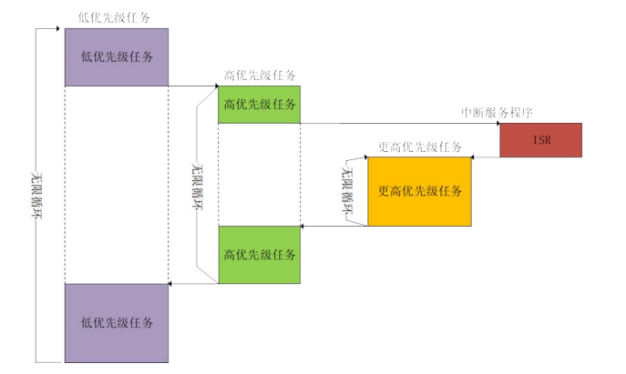

# 第二章：嵌入式操作系统核心概念

> 嵌入式操作系统不是缩小版的 Windows，它是为“资源紧张型”设备量身定制的微型调度大师。它不能出错、不能拖延，还得在几十KB内存里井井有条地调度任务——可以说是极限打工了。本章，我们就来了解学习一些核心概念，如任务、内存和文件系统，理解操作系统是怎么协调一群任务，让它们既能各司其职，又能井然有序地工作的。

## **2.1 进程线程？任务调度！**

## 🧵 任务（Task）与线程/进程的区别

在操作系统中，**进程 (Process)** 和 **线程 (Thread)** 是并发执行的两种基本单位：

- **进程**：资源分配的基本单元，拥有独立的地址空间、文件描述符和系统资源。操作系统为每个进程分配受保护的内存区域。
- **线程**：CPU调度的基本单元，属于进程内的执行流。同一进程的所有线程共享代码段、数据段和系统资源，但各自拥有独立的栈空间、程序计数器和寄存器状态。

在桌面操作系统里，我们常常接触“进程（Process）”和“线程（Thread）”。但在嵌入式操作系统，尤其是 RTOS（Real-Time Operating System）中，我们讨论的通常是“任务（Task）”。

### ✅ 什么是 Task？

> Task 就是嵌入式 RTOS 中最基本的调度单位。可以把它理解成“轻量版线程”，只不过在资源紧张的设备上，它更加务实——共享内存，少动资源，说干就干。

### 🧠 它和进程/线程有啥不一样？

| 特性              | 桌面操作系统中的进程/线程          | 嵌入式 RTOS 中的 Task              |
|-------------------|----------------------------------|-------------------------------------|
| 名称(废话)              | Process / Thread                | Task                                |
| 地址空间隔离      | 有（通过 MMU）                  | 通常没有（大多 MCU 无 MMU）         |
| 创建开销          | 较大                            | 非常小，适合频繁创建/销毁           |
| 运行上下文        | 独立堆栈和寄存器状态              | 拥有独立堆栈，寄存器由 TCB 保存       |
| 通信方式          | 进程间需要 IPC，线程共享内存     | 任务之间共享全局内存 + 信号量/消息队列 |
| 适用场景          | 多任务桌面/服务器系统             | 实时控制、低功耗、资源有限的设备     |

> 🔍 小结：Task 类似线程，但设计更轻巧、更适合嵌入式。大多数 RTOS 并不支持“进程”这个概念，所有 Task 在同一个地址空间中协作完成工作。

## 🔁 Task 的生命周期与状态管理

嵌入式 RTOS 不需要“复杂的人生哲学”，但 Task 的“生命周期”依然精巧有序：

### 🔄 生命周期五态模型

1. **创建（Created）**  
   初始化堆栈、设置 TCB（任务控制块）、分配优先级，任务准备上线。

2. **就绪（Ready）**  
   任务已满足运行条件，正在等调度器分配 CPU 时间。

3. **运行（Running）**  
   任务获得 CPU 控制权，正在执行代码。

4. **阻塞（Blocked）**  
   任务在等待某个事件，例如信号量、消息队列或超时。

5. **终止（Terminated）**  
   任务退出，释放资源，TCB 被回收（有的 RTOS 支持任务删除）。

### 🧠 TCB（Task Control Block）存储哪些信息？

每个任务对应一个 TCB，RTOS 就靠它来调度任务：

- 当前任务状态
- 寄存器快照（用于上下文切换）
- 堆栈指针
- 任务优先级
- 延时计数器
- 等待资源指针（如信号量或队列）

### ⚙️ 上下文切换机制（Context Switch）

RTOS 在任务切换时，必须保存当前任务的“脑内状态”，以便下次还能从断点恢复。过程如下：

1. 保存当前任务的 CPU 寄存器状态到 TCB
2. 从新任务的 TCB 中恢复 CPU 寄存器
3. 更新堆栈指针，切换堆栈
4. 恢复程序计数器，继续执行新任务

> ⏱ 嵌入式中，任务切换速度非常关键，RTOS 常用汇编手动管理上下文，尽可能减少切换耗时。

## 🧮 调度算法与嵌入式系统中的应用

调度算法是 RTOS 的核心，它决定了“谁先执行、谁等一下”。RTOS的调度算法和普通单片机比如stm32常用的任务循环，使用中断和嵌套中断的单任务系统(前后台系统)不同，这里引用一张比较清晰但是不那么清晰的图来表示RTOS的任务调度：

*
图片来源：正点原子
*

### 1️⃣ 固定优先级抢占式调度（常见于 FreeRTOS）

每个任务创建时就指定一个优先级（通常是 0~N，数字越小优先级越低），RTOS 会始终运行优先级最高的 Ready 状态任务。

- 任务 A 优先级 3，任务 B 优先级 5，当 B 就绪时，立即抢占 A
- 如果多个任务优先级相同，使用时间片轮转
- 非常适合实时性强的控制场景

> 📌 **嵌入式重点是“抢占”**，低优先级任务不能阻塞高优先级任务，否则会出事！

### 2️⃣ 时间片轮转调度（Round Robin）

- 多个任务具有相同优先级
- 每个任务分配固定时间片（比如 5ms）
- 时间片耗尽后放入就绪队列尾部，等待下轮执行

适用于后台日志处理、UI 渲染等非关键任务，不能用于强实时控制逻辑。

### 3️⃣ 优先级继承机制（Priority Inheritance）

当高优先级任务需要的资源被低优先级任务占用时，低优先级任务会“临时升职”提升优先级直至释放锁，避免阻塞高优先级任务。

这是嵌入式 RTOS 的重要特性，用于防止“优先级反转”：

> 如果高优先级任务 A 被低优先级任务 B 持有的互斥锁阻塞，而 B 又因更低的任务 C 占用 CPU 无法释放锁，A 迟迟得不到执行，系统就宕机了。

### 4️⃣ 动态调度策略（较少见）

一些更强大的嵌入式 RTOS（如 RTEMS、Zephyr）支持：

- **EDF（Earliest Deadline First）**：谁的截止时间最早，谁先执行
- **RMS（Rate Monotonic Scheduling）**：周期短的任务优先级更高

这类调度适用于高端实时应用，如工业自动化、机器人系统等。

## 🧪 举个栗子：任务调度在实际项目中的体现

假设你在做一个智能风扇控制器，功能包括：

- 温度采集（采样任务，10ms周期）
- 电机控制（高优先级，实时调整转速）
- 显示更新（中优先级，每 100ms 一次）
- 云同步日志（低优先级，有空再处理）

调度设计可能如下：

| 任务              | 周期     | 优先级 | 说明                           |
|-------------------|----------|--------|--------------------------------|
| 电机控制任务      | 持续     | 高     | 必须立即响应温度变化           |
| 传感器读取任务    | 10ms     | 中高   | 周期精确，直接影响控制效果     |
| 显示更新任务      | 100ms    | 中     | 可延迟                         |
| 云日志上传任务    | 不定     | 低     | 系统空闲时才执行               |

调度器就会根据这个优先级体系，自动安排这些任务的执行先后，确保“关键的先做、次要的顺延”。

> 🧩 总结提醒：

- 嵌入式 RTOS 调度的是 **Task**，不是进程或线程
- 所有任务共享地址空间，调度轻量高效，但需要开发者小心资源同步
- 调度机制通常基于固定优先级 + 抢占，为的是及时响应
- 遇到资源冲突，优先级继承机制是必须掌握的调度防护手段
- 选什么调度策略，要看应用对“实时性”的硬性要求
