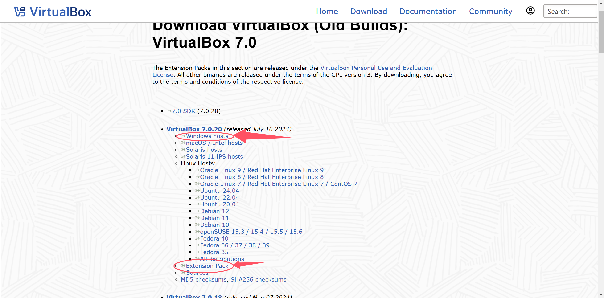
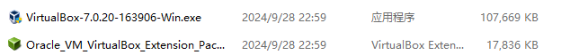
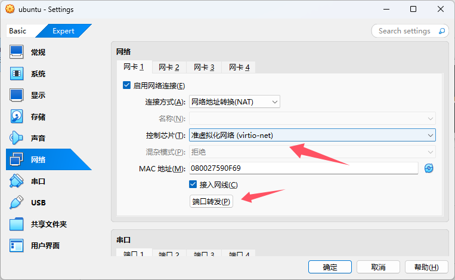

# VirtualBox 安装 Ubuntu22.04 与系统开发环境配置

::: info
如果使用VMWare，可以参考[旧版内容](/2023旧版内容/3.编程思维体系构建/3.Y.3VMware的安装与安装Ubuntu22.04系统.md)。
:::

## 0. 下载系统初始化工具和VSCode配置文件

请在[课程主页](/2.编程模块/2.1%20NekoBytes-TheMissing/2.1%20NekoBytes-TheMissing.md)下方“课程工具”中下载。

## 1. 下载安装 VirtualBox



点击[链接](https://www.virtualbox.org/wiki/Downloads)下载VirtuaBox windows 平台安装包和功能扩展包。



双击VirtualBox安装程序，完成VirtualBox本体安装； 双击扩展包安装程序，会自动打开VirtualBox，完成增强功能安装。

## 2. 下载 Ubuntu22.04 系统镜像


进入[清华大学开源软件镜像站](https://mirrors.tuna.tsinghua.edu.cn/)，点击"获取下载链接"，进入下载界面。


选择 Ubuntu 操作系统，下载 22.04.5(amd64， Desktop LiveDvD) 镜像。

## 3. 安装 Ubuntu22.04


启动 VirtualBox，在"工具"界面点击"新建(N)"。


输入虚拟机名称，选择对应的 Ubuntu22.04 系统镜像，勾选"跳过自动安装"。


根据计算机性能，调整虚拟机硬件设置。


选择虚拟硬盘文件位置，分配虚拟硬盘文件大小，建议"大于40GB"。


回到VirtualBox主界面，选择创建的虚拟机，点击“启动”。


进入系统镜像引导界面，选择第一项“Try or Install Ubuntu”。
注意此时如果鼠标被虚拟机捕获，可以按下键盘“右Ctrl”键脱离虚拟机。


建议安装过程中始终保持语言为English（英文显示），点击"Install Ubuntu"开始安装Ubuntu系统。


一路点击“Continue”，进入地区选择，选择“Shanghai”。


输入“用户名-密码”创建用户，等待系统安装完毕，等待虚拟机自动重启后，按下键盘“Enter”回车键启动系统，进入系统后先关闭虚拟机。


回到VirtualBox主界面，选择虚拟机，点击“设置”，在“常规”-“高级”中调整“共享粘贴板”为双向，方便后续操作。



在“网络”-“网卡1”中，确保连接方式选择为“网络地址转换(NAT)”，点击“端口转发”。


点击“右侧加号”，添加新规则，设置“子系统端口22”向主机端口（比如9090）的TCP协议转发，用于后续使用ssh服务连接虚拟机。


启动虚拟机，点击上方“设备”-“安装增强功能”，为虚拟机安装增强功能。


找到自动插入的"VBox_GAs"文件夹，右键“autorun.sh”选择“Run as a Program”运行脚本，完成增强功能安装。


退出虚拟机，进入虚拟机设置，选择“共享文件夹”，点击“右侧加号”，添加共享文件夹，选择“系统初始化工具”所在的路径，设置挂载点为“/mnt/share”，设置“只读分配”和“自动挂载”。


打开虚拟机，在文件浏览器右侧中点击“Other Locations”，进入“/mnt/share”目录，复制“系统初始化工具”到其他目录（比如Documents）。


右键复制的“系统初始化工具”所在的目录，点击“Open in Terminal”（在终端中打开）。


在终端中依次输入

```bash
tar xzf setup.tar.gz    # 解压工具
cd setup                # 进入工具目录
bash common.sh          # 运行初始化脚本
```

提示输入密码“[sudo] password for user:”，输入密码（此时终端禁止回显，不会显示输入的字符）后敲击回车，等待脚本运行完毕（运行期间可能需要再次输入密码）。

“系统初始化工具”运行结束后，在终端输入`reboot`重启系统。


点击系统右上角，点击“Settings”，进入系统设置。


右侧点击“Region & Language”，修改系统语言为“汉语（中国）”，完成后，下方将会提示重启，此时选择不重启，继续操作。


点击“Manage installed Languages”，等待弹窗，点击“install”，安装完毕后重启系统。


重启后会选择文件夹名的语言，请务必选择以英文形式保留。


按下键盘“Ctrl+Alt+t”快捷键，打开终端（或选择点击左下角的“显示应用程序”找到“终端”打开），此时会提示配置shell主题，按照提示自定义即可，安装完成。

## 4. 安装 Visual Studio Code


进入[VSCode官网](https://code.visualstudio.com/)，点击下载安装包，完成安装。

## 5. 导入 Visual Studio Code 配置


打开VSCode，点击左下角“齿轮”，选择“配置文件”，进入配置文件管理界面，点击“新建配置文件”下拉菜单，选择“导入文件”，导入C/C++配置文件，点击创建，然后点击“√”应用C/C++配置文件。


可选（不推荐禁用）：如果不想使用Vim键位，可在插件中找到Vim插件选择“禁用”。

## 6. 配置 VSCode SSH 连接虚拟机


点击左侧“远程资源管理器”，点击SSH的“新建连接”


在上方弹出的界面中输入“用户名@localhost:9090（上面端口转发配置的主机端口）”，如果“localhost”无法使用，可以用“127.0.0.1”代替（请检查系统的hosts配置），之后按照提示（指纹验证选择“继续”，平台选择“Linux”，输入用户密码）完成连接即可（第一次连接期间需要下载资源，请耐心等待）。

## 7. 使用Windows终端进行编程（可选）


在Windows中安装ssh，在终端中使用`ssh 用户名@localhost -p 主机端口`进行连接，系统已预安装`NeoVim`与`LunarVim`。


[](/2.编程模块/2.1%20NekoBytes-TheMissing/2.1.1%20Book/2.1.2%20开发环境配置.md)
