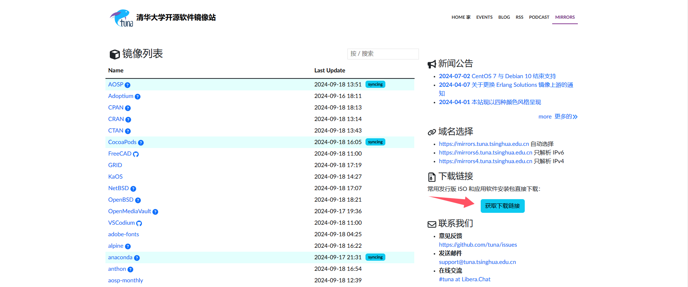
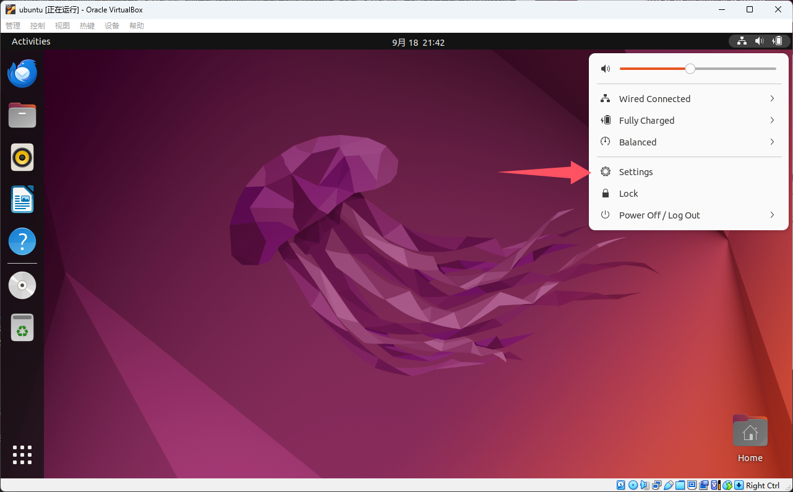
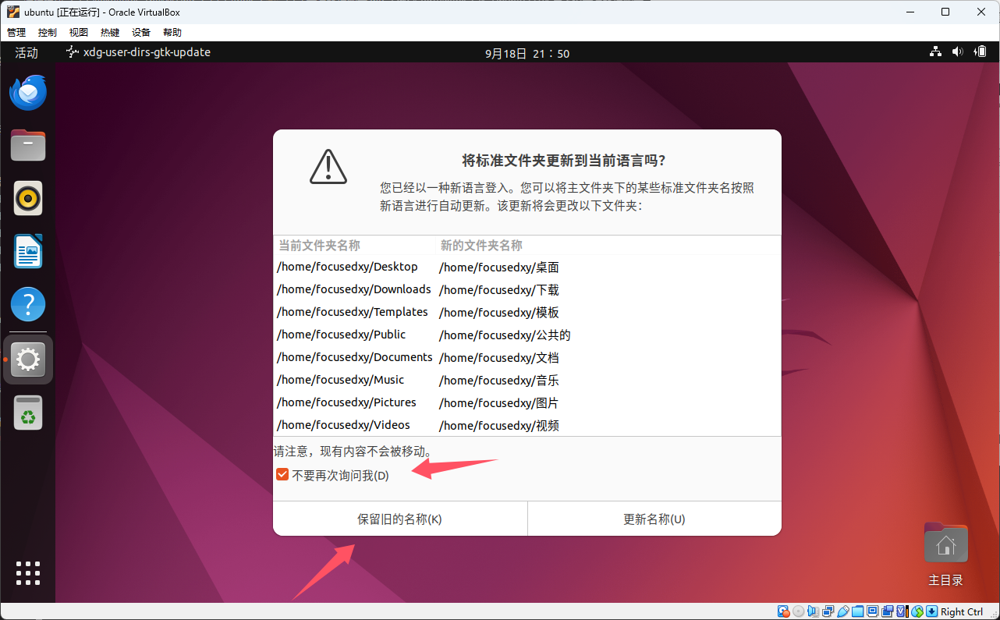
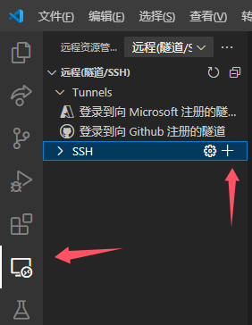

# VMware 安装 Ubuntu22.04 与系统开发环境配置

## 0.下载系统初始化工具和 VSCode 配置文件

请在[课程主页](/2.编程模块/2.1%20NekoBytes-TheMissing/2.1%20NekoBytes-TheMissin.md)下方 “课程工具” 中下载。

## 1.下载安装VMware

大家可以自行下载安装VMWare Pro（参考旧版Wiki[VMware 的安装与安装 Ubuntu22.04 系统](/2023旧版内容/3.编程思维体系构建/3.Y.3VMware的安装与安装Ubuntu22.04系统.md)），或者下载现在已经推出的对于个人用户免费的VMware Player（下载需要注册账户，较为麻烦）。

## 2.下载 Ubuntu22.04 系统镜像

这一步和VitrualBox安装一样，已经下载过的同学不用再次下载。



进入[清华大学开源软件镜像站](https://mirrors.tuna.tsinghua.edu.cn/)，点击"获取下载链接"，进入下载界面。


选择 Ubuntu 操作系统，下载 22.04.5(amd64， Desktop LiveDvD) 镜像。

## 3.安装Ubuntu22.04

启动VMware，选择创建新的虚拟机。


选择典型安装，并单击下一步。


点击浏览按钮，选择在前面下载的Ubuntu镜像iso文件，并单击下一步。


填写本页内容，其中用户名是Ubuntu系统的用户名，全名可以与用户名一样，密码是登录到Ubuntu的密码（这些信息后续还会使用到）。填写完成后，单击下一步。


输入虚拟机的名称，这个名称会显示在VMware的侧边栏，然后选择存储虚拟机文件的位置，推荐存储在较大的磁盘中。选择完毕后，单击下一步。


设置磁盘大小，推荐设置磁盘大小大于等于40GB，设置完成后，单击下一步。


单击自定义硬件，设置处理器个数为（至少）4个，单击关闭后，单击完成。


然后VMware会自动启动虚拟机，等待虚拟机启动，下面的几步可以全部单击continue。


到此选择Install now，并单击continue。


按如下选择（默认），并单击continue。


在`Your name`处填写最开始填写的全名，`Your computer'name`和`Pick a username`会自动补全（也可以自行修改）。在`Choose a password`填写开始设置的密码，在`Confirm your password`处确认密码，确认没有问题后点击下一步，随后等待系统安装。


下一步，单击`Restart Now`，等待系统重启。


重启完成后，点击自己的用户名，输入密码后进入系统。


弹出的窗口，一直单击`Skip、Next`，最后单击`Done`即可。同时这两个窗口单击`Don't Upgrade、OK`和`Remind Me Later`。


单击左下角`Show Application`图标，并选择`Terminal（终端）`打开。


在弹出的终端中输入

```shell
sudo apt install open-vm-tools open-vm-tools-desktop
```

回车后输入密码，注意此时输入的密码不会显示在屏幕上，输入完密码直接回车即可。


接下来点击右上角的电源键按钮，并单击`Power Off`关机。


接下来在VMware主页选择刚才的虚拟机，双击`编辑此虚拟机设置`，并选择添加共享文件夹。单击下一步后，点击浏览，选择一个要和虚拟机共享的文件夹，**将名称设置为share**，完成后，单击下一步，最后单击完成即可。完成设置后，单击确认。


	


**将在第0步下载的setup文件放到刚才设置的共享文件夹中。**重新启动虚拟机。


登录进入到虚拟机后，启动终端，输入：

```shell
sudo mkdir /mnt/hgfs
sudo /usr/bin/vmhgfs-fuse .host:/ /mnt/hgfs -o allow_other -o uid=0 -o gid=0 -o umask=022
cp /mnt/hgfs/share/setup.tar.gz ~/Desktop/
cd ./Desktop/
tar xzf setup.tar.gz
cd ./setup
bash ./common.sh
```

期间需要输入多次密码，然后等待命令执行完毕，输入`reboot`回车，重启虚拟机。


重启完毕后如图所示，修改语言为中文。




点击`Install`之后等待安装完成，重启系统。重启后请务必选择保留旧的名称。



接下来打开终端，按照提示设计自己喜欢的终端样式（后续可以更改）。

## 4.VSCode连接虚拟机

请参照2.1.1.2开发环境配置中的4、5两节，完成vscode配置。

打开终端，输入

```shell
ifconfig
```

找到`ens33`一项，记下`inet`后的IP地址，这里是`192.168.95.129`。


打开`vscode`，点击左侧 “远程资源管理器”，点击 `SSH` 的 “新建连接”。



**或者**，按下`Ctrl+Shift+P`，输入`ssh`，找到`Remote-SSH:将当前窗口连接到主机`一项，点击或回车。


选择`添加新的主机`，再输入`ssh+你的用户名@IP`，如我应该输入`ssh rache@192.168.95.129`。


接下来需要更新的配置文件推荐选择第一个，完成后右下角弹出提示，点击”连接“尝试连接到虚拟机。


接下来过程可以继续参照2.1.1.2开发环境配置的后续内容（包括在虚拟机中启用扩展）。