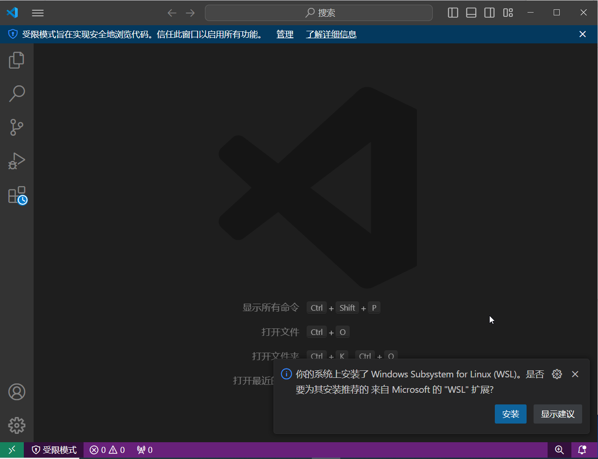
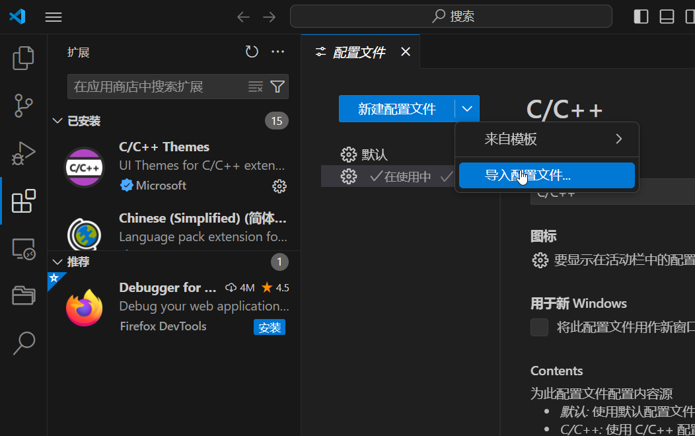
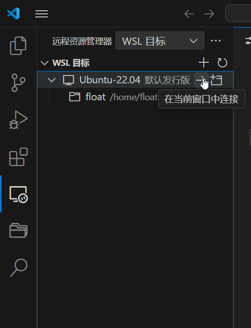
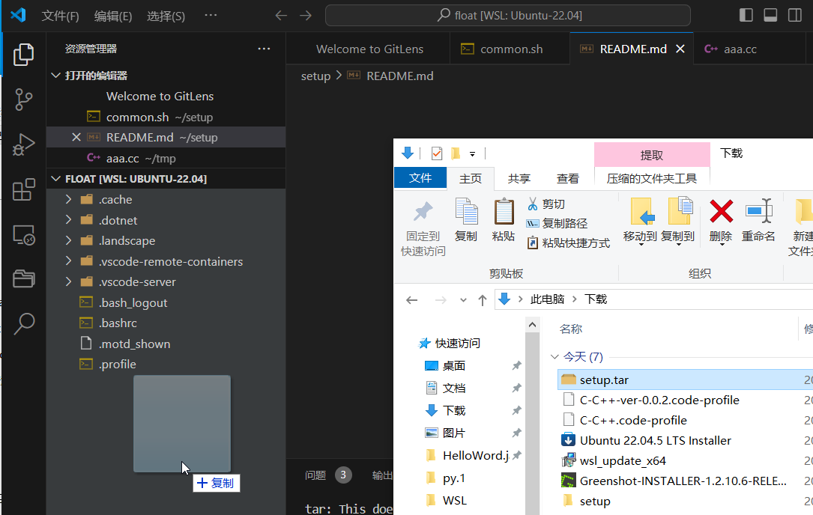

# WSL 安装 Ubuntu22.04 与系统开发环境配置

## 0.下载系统初始化工具和 VSCode 配置文件

请在[课程主页](/2.编程模块/2.1%20NekoBytes-TheMissing/2.1%20NekoBytes-TheMissing.md)下方 “课程工具” 中下载。

## 1.启用 WSL 并安装 Ubuntu

参考微软官方的 WSL 教程。

对于 Windows 10 版本 2004 及更高版本（内部版本 19041 及更高版本）或 Windows 11 ，使用以下教程：

[如何使用 WSL 在 Windows 上安装 Linux](https://learn.microsoft.com/zh-cn/windows/wsl/install)

默认安装的版本是 22.04 LTS 或者 24.04 LTS，经测试均适用我们的课程配置工具的 WSL 版本。

对于 Windows 10 的老版本，参考：

[旧版 WSL 的手动安装步骤](https://learn.microsoft.com/zh-cn/windows/wsl/install-manual)

选择 Ubuntu 22.04 即可

在跟随以上教程操作，并确保**安装 Ubuntu**并**设置好用户**之后，接下来可以回到我们的教程。

如果遇到问题，请查阅：

[排查适用于 Linux 的 Windows 子系统问题](https://learn.microsoft.com/zh-cn/windows/wsl/troubleshooting#installation-issues)

## 2.用 VSCode 连接 WSL 容器并进行配置

为了方便，我们使用 VSCode 来连接 WSL 容器。

安装 VSCode 并打开，安装 WSL 插件。这里应该自动弹出，如果没有，请自行在插件页面搜索安装：



接下来导入我们的配置。点击设置(左下角齿轮)，找到配置文件，点击打开配置文件设置页面：


导入之前（第 0 步）下载的 VSCode 配置文件



启用配置后，在插件中找到 Vim 插件并禁用，或者你也可以不禁用，在 VSCode 中使用 Vim 键位操作。

打开远程连接页面，连接 WSL 目标。注意此时应该选择一个文件夹，选择 `/home/<你的 WSL 用户名>` 即可：



此时应该会自动下载 VSCode server 到 WSL 容器。等待几分钟即可正常。

连上之后，把先前下载的 `setup.tar.gz` 拖入 VSCode 以传输到 WSL 容器内（可能需要一点时间）：



按下 `Ctrl+~`，呼出终端，同目录下依次输入命令来安装：

```bash
tar xzf setup.tar.gz    # 解压工具
cd setup                # 进入工具目录
bash common_wsl.sh      # 运行脚本的 WSL 版本，注意 common.sh 是虚拟机版本
```

提示输入密码 `[sudo] password for user:`，输入密码（此时终端禁止回显，不会显示输入的字符）后敲击回车，等待脚本运行完毕（运行期间可能需要再次输入密码）。

安装后，关闭终端，再次打开终端，即可看到类似页面，根据提示配置（需要基本的英语阅读能力）（这里引用了 Virtualbox 版本教程的图片，我们仅需关注终端内容）：


配置完成。

关于后续的环境配置，可以参考微软官方教程：

[设置 WSL 开发环境](https://learn.microsoft.com/zh-cn/windows/wsl/setup/environment)

## 已知问题

WSL 安装需要启用虚拟化，部分同学反映虚拟化会导致一些游戏出现运行错误，这里最好自行解决，或者考虑使用其他方案配置环境。
