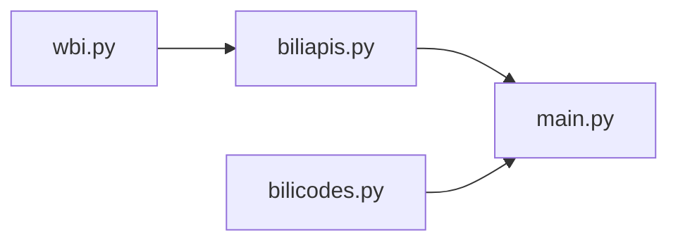

# Proj-02

Simple Video Downloader for Bilibili

> 简易B站视频下载器

## 背景

还在为自己不能随时随地离线~~溜冰~~观影吗，还在为心爱的视频被申鹤干掉而感到惋惜吗，还在坐视自己的收藏夹逐渐变得空旷吗，现在就将你喜欢的视频留存到硬盘中！~~（草~~

> 其实在GitHub上已经能找到很多写好的下载器，但是果然还是自己实现一个比较舒服（
>
> 你也可以去参考他们的代码看看他们是如何实现的。

在本节中我们要开始使用B站的API了。很巧(?)，有一个质量很高的进行B站API收集的仓库，本节中很多API参考都来自于它，它就是[Bilibili-API-Collect](https://github.com/SocialSisterYi/bilibili-API-collect)（简称`BAC`）。

## 准备

首先照例创建项目文件夹，创建虚拟环境，安装依赖，创建入口程序`main.py`。

```bash
pip install requests types-requests retry
```

> `retry`是一个小巧的用于自动重试的模块，提供一个装饰器用于装饰需要重试的函数。

为了能够调用B站的被加密的API，我们需要大佬们的帮助。从BAC的一个子页面获取到[WBI签名的Python实现](https://github.com/SocialSisterYi/bilibili-API-collect/blob/master/docs/misc/sign/wbi.md#python)，将它保存为`wbi.py`，「稍作修改」使它能作为模块被使用。

之后我们就可以更方便地使用B站的API了。

查阅BAC，得到[获取视频详情](https://github.com/SocialSisterYi/bilibili-API-collect/blob/master/docs/video/info.md)和[获取视频流](https://github.com/SocialSisterYi/bilibili-API-collect/blob/master/docs/video/videostream_url.md)的API，将它们封装成函数，保存为`biliapis.py`。

再整合BAC中收集的各种B站内部的标识码，保存为`bilicodes.py`

这样我们就获得了两个可使用的模块。它们之间的引用关系 be like:



此外我们还需要一个媒体处理工具，它就是大名鼎鼎的`FFmpeg`。安装它的命令行工具。

## 开写

先明确我们要做什么。我们要先根据用户的输入信息调用B站的API，然后从API返回的媒体流地址分别下载音频流与视频流，最后进行音视频合流。

> 现在B站媒体流已经全面采用DASH（确切地说，4年前就已经），这意味着服务端会将所有可用的质量的媒体流地址都返回，客户端再从中选择合适的质量。

下接[notebook](./2.2.2.3.2%20Do%20it%20yourself.md)

## 成型

我们已经在notebook中走了一遍流程，接下来要开始将它塑造成型了。

照例将它们按功能切成若干个函数：

- 从用户输入中提取id的
- 让用户做选择的
- 滤除对于文件名来说不合法的字符的
- 下载文件的
- 调用ffmpeg做音视频合流的
- 将上述统一起来的
- ~~*Ellipsis*~~

甚至可以将某些强关联的部分组合成一个类，省去一些不直观的数据传递。但是这种程度的函数应该就够了大概。

完成的代码见[source](https://github.com/NingmengLemon/hcw-pyproj/tree/main/src/Proj-02)

## 完成

这样我们就做出了一个最简易的B站视频下载器！恭喜！

下面是部分有待提高的内容，就交给你了（x

- 不能取流到480P以上的画质
  > 其实是没登录导致的。使用`qrcode`库配合[通过二维码登录](https://github.com/SocialSisterYi/bilibili-API-collect/blob/master/docs/login/login_action/QR.md)。然后保存好`session`在每个操作都传入，还可以想办法将登录会话持久化保存到本地。
- 不能批量处理视频
  > 简单套个循环就完事（了吗？）
- 不能断点续传下载
  > 利用[`Accept-Ranges`](https://developer.mozilla.org/zh-CN/docs/Web/HTTP/Headers/Accept-Ranges)和[`Range`](https://developer.mozilla.org/zh-CN/docs/Web/HTTP/Headers/Range)请求头和`ab+`写入模式
- 不能查看下载进度
  > 利用Python的默认引用，下载函数通过修改从调用者传入的一个可变的`hook`对象来汇报进度。或者，使用`yield`定期转交控制权给调用者来打印进度。再或者，干脆使用`tqdm`库？
- 错误处理机制仍然有待提高
  > 别惦记着你那`assert`了给我专门定义像`BiliError`这样的异常类
- 对于部分视频使用`biliapis`中封装的接口无法取到流（主要是番剧影视），再添加另一个接口当作后备？
  > 它们的请求参数和返回的流的数据大部分都是一样的 ~~所以能缝到一个函数里~~
- 取到的媒体流中还有后备链接`backup_url`，将它们利用起来？
  > 大概就是这个请求出错了就换下一个
- 不能只下载音频 ~~（什么B站音乐播放器）~~
  > 只下载音频流，再调用ffmpeg转换成mp3格式
- ~~做个GUI（x~~
  > `tkinter`、`PyQt5`，或者别的？
- 要不……试试多线程？~~（进度跳得太快了kora~~
  > 这时用类做个封装更方便？（大概
- 让程序能够接收命令行参数？
  > 使用[`sys.argv`变量](https://docs.python.org/zh-cn/3/library/sys.html#sys.argv)和[`argparse`库](https://docs.python.org/zh-cn/3/library/argparse.html)

不止这些。你还可以想出来更多。

记得看[补注](./2.2.2.3.3%20Notes.md)（逃
