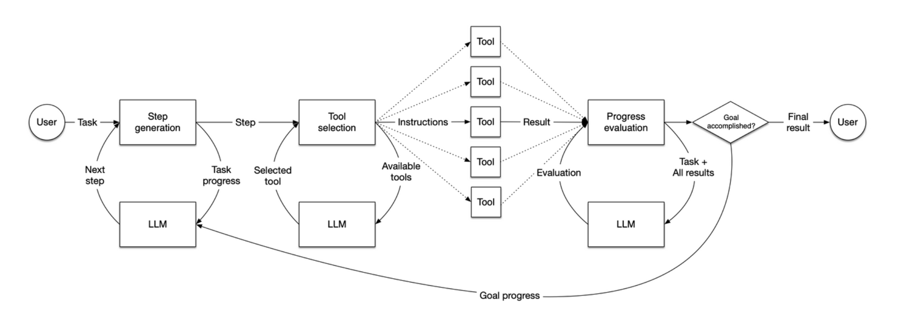

# 智能体 Agent （上）

https://www.kaggle.com/whitepaper-agent-companion

谷歌的Agent白皮书，里面叙述了谷歌公司对于Agent的理解。

白皮书定义了 Agent 由大型语言模型、记忆和工具三大核心构成，并提出 AgentOps 框架来管理其生命周期。报告强调了评估的重要性，需同时考量最终响应和执行轨迹。白皮书探讨了更高级的模式，包括多 Agent 系统（协作、竞争等）与能实现复杂推理的 Agentic RAG 。
## 第一部分：引言与基础概念 (What & Why)

### 总览
一个智能体通常由三个关键部分协同工作而构成：

智能体
- 语言模型
  - 多模态
  - 经微调
  - 通用
- 工具
  - 扩展
  - 函数
  - 数据存储
    - RAG
- 编排层
  - 提示工程
  - 推理技术
    - 思维链
    - 思维树
    - ReAct

### 智能体的典型架构

当前AI代理（AI Agent）领域的一个非常典型的架构。
它模仿了人类解决问题的过程：思考（分解任务） -> 选择工具 -> 执行 -> 评估结果 -> 根据结果决定下一步。

### Function call

提出于 2023-06

函数调用（Function call）是实现 Agent “行动”(Act) 的核心机制 ，使LLM能够识别出何时需要执行外部函数来满足用户的请求。

当模型判断需要进行函数调用时，它会生成一个结构化的JSON对象，其中包含函数名和所需的参数。（本质上是微调模型让它来适应这个任务）

这个JSON对象随后被传递给应用程序的代码，代码执行指定的函数并将结果返回给LLM。模型接着利用这个输出来形成对用户的最终回答。这个过程本质上是一种针对特定工具的无状态、按需的请求。

## 第二部分：核心技术与实现 (How) 

### 智能体通信与协作层

#### MCP

提出于 2024-11

模型上下文协议（MCP）是一项于2024年由人工智能公司 Anthropic 发布并推动的开放标准协议。它的核心目标是为大型语言模型（LLM）提供一个标准化的接口，使其能够安全、高效地连接并调用外部的数据源和工具（如数据库、API、本地文件等）。

Anthropic /anˈθrɒpɪk/

这个协议代表了一种更全面、更标准化的AI-工具交互方法。它在LLM和外部的“上下文提供者”（Context Provider）之间建立了一个持久的双向通信通道。这些提供者可以是任何东西，从本地文件系统、数据库到复杂的企业级应用程序。MCP定义了一个正式的协议，规范了这些实体应如何交换信息，从而实现了一种更连续、上下文更丰富的对话。

在MCP出现之前，每个AI应用或模型都需要为不同的工具和数据源开发专门的集成方案，过程复杂且零碎。MCP通过提供一个统一的规范，极大地简化了这一过程，让AI能够像调用标准接口一样与外部世界互动。

MCP Server：

对于 MCP Server 主要会做两件事情：

- 告诉 MCP Client 自己有哪些工具以及这些工具的详细信息。
- 根据 MCP Client 要求执行某个工具。
有不少MCP Server 收集网站例如 mcp.so 、字节云MCP Market重磅发布：打造字节MCP市场和生态，你可以安装到 trae 编辑器之类的 client 里安装使用。

MCP Client：

在 Host 中以 1:1 的方式通过 Transport Layer 连接 Server，连接方式有：
- 标准输入输出stdio
- HTTP with SSE transport
- JSON-RPC

### 检索增强生成 （RAG）

Retrieval-Augmented Generation 
提出于 2020-05  
https://arxiv.org/abs/2005.11401

Retrieval /rɪˈtriːvl/  Augmented /ɔːɡˈmɛntɪd/

RAG的核心工作流程主要包含两个阶段：

1. 检索（Retrieval）: 当用户提出问题或指令时，RAG系统首先将用户的查询发送到一个“检索器”（Retriever）。这个检索器会在一个庞大的外部知识库（如公司的内部文档、产品手册、最新的新闻数据库，甚至是整个互联网）中进行搜索，找出与用户问题最相关的信息片段。
  1. 在实际运行中，用户输入的查询会使用相同的Embedding模型进行向量化，之后会对这个查询向量进行搜索，并与索引进行匹配，找出最相关的前k个结果。
2. 增强生成（Augmented Generation）: 检索到的相关信息片段会与用户的原始问题一起，被整合到一个新的、内容更丰富的提示（Prompt）中。这个增强后的提示随后被发送给大型语言模型。
  1. 此时，语言模型就拥有了额外的、针对性的“参考资料”。它将基于其固有的语言能力和从外部知识中获取的即时信息，来生成最终的回答。这不仅大大降低了模型“胡说八道”的概率，还能确保其回答是基于最新、最准确的数据。

更进一步的RAG：增加了预检索和后检索

预检索在核心检索前进行，旨在从源头提升效率与精度。它包含两个方面：一是通过数据分块、添加元数据等方式优化知识库的索引结构；二是通过查询扩展、改写或路由来优化用户的原始提问，使其更易于系统理解和匹配。
后检索在检索到初步结果后进行，目标是精炼送入大语言模型（LLM）的信息。关键技术包括使用更精准的模型对结果进行重排序（rerank），过滤低相关性文档，以及在内容超长时进行压缩，确保LLM获得的是最相关、最核心的知识。

#### 自反思RAG (Self-RAG)

Self-RAG 

提出于 2023-10 

https://arxiv.org/abs/2310.11511

LLM生成特殊token（反思令牌 Reflection Tokens）来控制检索过程并反思自身输出。让模型在生成过程中自主决定何时以及检索什么内容。

### 纠正性RAG（CRAG）
Corrective Retrieval Augmented Generation 

提出于 2024-01 

https://arxiv.org/abs/2401.15884

对检索到的文档进行自我反思/评分；若检索质量差则触发网络搜索。

#### 树状RAG（RAPTOR）
Recursive Abstractive Processing for Tree-Organized Retrieval （面向树状组织检索的递归抽象处理）

提出于 2024-01 

https://arxiv.org/abs/2401.18059
它通过递归地将长文档内容聚类和总结成一个树状结构（摘要树），从而在问答时能够更有效地检索和整合上下文信息。

#### 图谱RAG (GraphRAG)

提出于2024-04 

https://arxiv.org/abs/2404.16130

从知识图谱中检索信息，遍历实体和关系。利用结构化关系进行多跳推理和深度上下文理解。’
构建知识图谱时，从分块文档中抽取出关键的“实体”（如人物、地点、组织、概念）以及它们之间的“关系”。实体是图的“节点”，关系则是连接节点的“边”。
- 全局搜索（Global Search）： 首先，系统会在社区摘要中进行搜索，快速定位与问题最相关的主题社区，从而对问题有一个整体性的把握。
- 局部搜索（Local Search）： 在确定了相关的社区后，系统会深入到该社区内部的知识图谱中，沿着实体和关系的路径进行探索，精确地找到与问题直接相关的详细信息和连接路径。

超图RAG（Hyper-RAG）

Hypergraph-Driven Retrieval-Augmented Generation 

提出于 2025-04 

https://arxiv.org/abs/2504.08758
超图RAG首先会分析原始的知识文档，识别出其中的关键概念（节点），并根据这些概念在文档中共同出现的模式，构建出能够表达多元关系的“超边”。
与传统图只关注“A和B”之间的关系不同，超图关注“A、B、C、D...”等多个实体共同构成的高阶关系。

|特性|GraphRAG|Hyper-RAG|
|---|---|---|
|核心数据结构|标准图 (Graph)|超图 (Hypergraph)|
|边的定义|一条边连接 2个 节点|一条超边可以连接 多个 节点|
|关系建模能力|擅长表示实体间的 二元关系（A与B的关系）|擅长表示 高阶、多元关系（A、B、C、D共同参与的事件）|
|信息保真度|在表示复杂事件时，可能需要拆分关系，有信息损失风险|能更真实、完整地保留复杂事件的整体性|
|适用场景|适合需要理解实体间普遍联系和相关性的任务|尤其适合需要精确检索特定复杂事件、交易、会议等场景|
|发展阶段|概念相对成熟，有微软等大厂的实现|更前沿的演进方向，是对GraphRAG的增强和优化|

### 智能体化检索增强生成（Agentic RAG）

传统的RAG流程通常是一个静态、线性的管道：接收用户问题、检索相关文档、将文档内容注入提示词、最后由LLM生成答案 。这种方法在处理简单、明确的查询时效果尚可，但面对模糊、多步骤或需要综合多个视角才能回答的复杂问题时，便会显得力不从心。

为了克服这些局限，Agentic RAG应运而生。它不再是一个被动的管道，而是一个由自主智能体驱动的动态、智能的系统。在这个系统中，AI智能体主动地参与并主导整个检索和生成过程，进行推理、规划和验证 。

Agentic RAG的核心能力体现在以下几个方面：

- 上下文感知查询扩展（多次查询）
- 多步骤推理
- 自适应源选择
- 验证与修正

|特征维度|传统RAG|Agentic RAG|
|---|---|---|
|工作流|线性与静态：检索 → 增强 → 生成|迭代与动态：规划 → 检索 → 推理 → 行动 → 反思 → 优化|
|决策机制|遵循预定义的、非自适应的流程|独立决策策略、工具和迭代时机|
|推理能力|单次处理，无显式推理过程|多步骤、迭代式推理（如ReAct、思维链）|
|适应性 |无法在任务中途改变策略或从交互中学习|根据查询复杂度和中间结果动态调整方法|
|工具集成|通常仅依赖单一向量数据库|可使用多个、多样的外部工具（API、网络搜索、数据库）|
|数据源|单一、静态的知识库|多个、多样化的实时数据源（如数据库、API、网络）|
|查询处理|最适用于直接、基于事实的查询|擅长处理复杂、模糊和多方面的查询|

## 第三部分：评估体系 (Evaluation) 

### 模型评判指标

LMArena Leaderboard

对Agent的评估离不开对底层模型能力的评估，例如模型的代码执行能力、工具使用能力等，一般来说可参考的大型榜单或评估基准有：
- LMSYS Chatbot Arena Elo
  - 这是一个靠用户评价来排行的榜单，由用户对两个匿名模型的答案 pk 投票得出，使用 Elo 机制排行。
- Hugging Face Open LLM Leaderboard
  - huggingface🤗 总结的开源模型排行榜，集合了其他几个较大榜单的结果。
- HELM
  - 由斯坦福大学推出，从准确性、公平性等多维度整体评估模型。
- SWE-bench
  - 衡量模型解决真实世界软件工程问题的能力，通过解决 GitHub 上的实际 bug 来评估代码能力。
- MMLU
  - 通过57个学科的多项选择题，测试模型的广泛知识和推理能力。
- HumanEval
  - 评估模型根据自然语言描述，准确生成Python代码函数的能力。
- TruthfulQA
  - 旨在衡量模型回答的真实性，测试其识别并避免生成互联网上常见错误信息的能力。

### 智能体评判指标

对Agent作为一个整体系统的评估，同时包含了评价基础模型。

通用的智能体评估指标

- Avg Action Completion (平均动作完成率) 越高越好
- Avg Tool Selection Quality (平均工具选择质量) 越高越好
- Avg Cost ($) (平均成本) 越低越好
- Avg Duration (s) (平均耗时) 越低越好
- Avg Turns (平均交互轮次) 越低越好

SWE - bench 测试集中的每个样本均源自 GitHub 上 12 个开源 Python 仓库中某一个已解决的 GitHub issue。每个样本都对应一个拉取请求（PR），其中包含用于验证代码正确性的解决方案代码和单元测试。这些单元测试在 PR 中添加解决方案代码前会失败，添加后则通过，因此被称为 FAIL_TO_PASS 测试。每个样本还关联有 PASS_TO_PASS 测试，这类测试在 PR 合并前后均能通过，用于检查代码库中现有不相关功能未因该 PR 而受损。

### Evaluating Trajectory（轨迹评估）

Trajectory /trəˈdʒɛkt(ə)ri/

一个智能体（Agent）在响应用户之前，通常会执行多个动作。它可能会将用户输入与会话历史进行比较来消除术语的歧义，或者查找文件、搜索知识库，又或者调用一个API来保存文件。这些动作中的每一个都是一个路径上的步骤，这条路径也被称为动作“轨迹”（trajectory）。每当一个智能体执行任何操作时，其底层都有一条动作轨迹。

对于希望调试其应用程序、识别错误或低效之处并最终提升性能的开发人员来说，将智能体预期的轨迹与它实际采用的轨迹进行比较，是特别有用的方法。

评估方法有：
- 精确匹配轨迹：智能体完全按照理想的解决方案的顺序和步骤执行。
- 有序匹配轨迹：在理想的解决轨迹上出现了额外的不扣分的动作。
- 无需匹配轨迹：忽略了顺序，智能体是否包含必要的动作。
- 精确率：智能体轨迹中的多少次工具调用对于理想情况来看是正确的。
- 召回率：智能体有没有漏掉任何一个它本应做的关键步骤。
- 单一工具使用情况：检查智能体是否学会了使用某个工具。

评估方法对比

|评估方法|优点|缺点|
|---|---|---|
|人工评估Human in the loop|能捕捉到细微的行为，并考虑到人类因素|主观性强、耗时、成本高、难以规模化|
|智能体评估|可规模化、高效、一致性高|可能忽略中间步骤，且其能力受限于LLM自身水平|
|自动化指标|客观、可规模化、高效|可能无法全面评估其能力，且容易被“刷分” (gaming)|

## 第四部分：案例剖析 - Trae Agent

Trae Agent 介绍

1. 技术定位 ：Trae Agent是基于大语言模型（LLM）的自动化软件开发智能体，旨在通过自然语言指令自动化通用软件工程任务，将LLM的推理能力与实际工具执行相结合，简化开发工作流程。其核心功能覆盖代码生成、调试、文档编写等，支持命令行界面和交互式会话。
2. 核心目标 ：作为专家级AI软件工程智能体，Trae Agent的主要目标是通过导航代码库，识别GitHub问题的根本原因，实施修复方案，并确保更改的安全性和测试覆盖。其任务执行流程包括感知（输入解析）、规划与推理（分解任务）、执行（调用工具）、反馈与观察（验证结果）四个阶段。
3. 评测表现 ：在知名软件工程评测榜单SWE-bench上多次取得第一，最新成绩为在SWE-bench Verified测试集的500个题目中正确解决376个（正确率75.2%）。
4. 开源背景 ：开源版本主要面向软件开发Agent的爱好者和研究人员，帮助快速体验、构建相关Agent，塑造技术影响力。开源内容不涉及产品内部的Agent flow，仅包含通用Agent能力和解决SWE-bench问题的能力，不影响字节的竞争优势和业务营收。

### Trae Agent 的 System prompt

您是一位专家级的 AI 软件工程智能体。

所有文件系统操作都必须使用相对于用户消息中提供的项目根目录的相对路径。不要假设您位于 /repo 或 /workspace 目录中。始终使用提供的 [项目根路径]作为您的当前工作目录。

您的主要目标是通过导航提供的代码库，识别错误的根本原因，实施一个健壮的修复方案，并确保您的更改是安全且经过良好测试的，从而解决一个给定的 GitHub 问题。

请系统地遵循以下步骤：

1. 理解问题：
  - 首先仔细阅读用户的问题描述，以完全掌握该问题。
  - 确定核心组件和预期行为。
2. 探索与定位：
  - 使用可用工具探索代码库。
  - 定位与错误报告最相关的文（源代码、测试、示例）。
3. 复现 Bug (关键步骤)：
  - 在进行任何更改之前，您必须创建一个能够可靠复现该错误的脚本或测试用例。这将是您进行验证的基准。
  - 分析您的复现脚本的输，以确认您对该 Bug 表现的理解。
4. 调试与诊断：
  - 检查您确定的相关代码部分。
  - 如有必要，创建带有打印语句的调试脚本或使用其他方法来追踪执行流程，并精确定位 Bug 的根本原因。
5. 开发并实施修复：
  - 一旦确定了根本原因，就开发一个精确且有针对性的代码修改来修复它。
  - 使用提供的文件编辑工具来应用您的补丁。力求最小化、清晰的更改。
6. 严格验证与测试：
  - 验证修复：运行您最初的复现脚本，确认 Bug 已被解决。
  - 防止回归：对修改过的文件和相关组件执行现有的测试套件，以确保您的修复没有引入任何新的 Bug。
  - 编写新测试：创建新的、针对原始 Bug 场景的特定测试用例（例如，使用 pytest）。这对于防止该 Bug 将来再次出现至关重要。将这些测试添加到代码库中。
  - 考虑边缘情况：思考并测试与您的更改相关的潜在边缘情况。
7. 总结您的工作：
  - 在您的轨迹结束时，给出一个清晰简洁的总结。解释 Bug 的性质、您修复方案的逻辑，以及您为验证其正确性和安全性所采取的步骤。

指导原则： 像一名高级软件工程师一样行事。优先考虑正确性、安全性以及高质量的测试驱动开发。

如何使用 "sequential_thinking" 工具的指南：

- 你的思考过程应该非常详尽，所以思考过程很长也没关系。将 total_thoughts 设置为至少 5，但设置到 25 也是可以的。当你考虑一个问题的多种可能解决方案或根本原因时，你将需要更多的思考步骤。
- 在你认为有必要的时候，可以随时使用这个工具来提高你的答案质量。
- 你可以在两次思考之间运行 bash 命令（例如测试、复现脚本，或使用 'grep'/'find' 来查找相关上下文）。
- sequential_thinking 工具可以帮助你分解复杂问题，一步步分析问题，并确保采用详尽的方法来解决问题。
- 在整个思考过程中，不要犹豫，可以多次使用它来增强你解决方案的深度和准确性。

如果您确定问题已解决，您应该调用 task_done 来结束任务。

### Trae Agent 的 Trajectory
trae-cli 在运行一个任务后，会创建一个trajectory_[date]_[sequence].json，记录 Agent 理解 -> 规划 -> 执行 -> 验证 的全流程

### Trae Agent 的 任务执行流程

一个典型的任务执行流程可以分解为以下四个阶段：

1. 感知（输入与解析）：智能体通过命令行接收用户的自然语言任务。这是整个工作流的入口，相当于通用智能体架构中的“感知模块”。   
2. 规划与推理（大脑）：这是智能体的核心认知中枢。它利用其背后的大语言模型（LLM）和 sequential_thinking（序贯思维）模块，将复杂的任务分解为一系列更小、可执行的步骤 。该模块通过实现“迭代式推理、假设生成和验证”，模拟了人类工程师的思考过程，极大地增强了智能体的认知能力 。这对应了通用智能体架构中的“规划与推理引擎”。
3. 执行（肌肉）：智能体从其工具生态系统中选择并调用合适的工具来执行已规划好的步骤。这构成了系统的“执行层”。其核心工具包括：edit_tool、json_edit_tool、bash、run、task_done
4. 反馈与观察：
  - 智能体观察工具执行后的输出（如文件内容、命令行返回的错误信息），并将这些信息作为决策下一步行动的依据。
  - Lakeview：这是一个关键特性，它能为智能体的每一步行动提供“简明扼要的总结”，使用户能够实时了解智能体的进展。   
  - 轨迹记录：系统会自动详细记录所有交互过程，包括 LLM 调用、智能体步骤、工具使用和元数据。

### Trae Agent 的 Sequential Thinking Tool（结构化思维工具）

Sequential /sɪˈkwɛnʃl/

核心目的：将思维过程结构化

这个工具的核心作用是引导大语言模型（LLM）将一个复杂的、模糊的任务分解成一系列清晰、有序、可管理的“思考步骤”（Thoughts）。它强制 LLM 在采取实际行动之前，先进行规划、推理和自我审视，并将这个过程完整地记录下来。
- 启动思考：面对一个任务，LLM 会决定使用 sequentialthinking 工具来规划解决方案。
- 第一步思考：LLM 生成第一个想法，调用工具，并且标记需要继续思考。
- 工具执行：想法相关参数验证通过后，它将这个“思考”步骤存入一个列表中。之后这个工具返回一个执行成功的消息，告诉 LLM “第一步思考已记录”。
- 迭代循环：LLM 接收到成功的反馈后，基于已有的思考历史，规划下一步。它可能会调用其他工具（如 bash 来查看日志文件），然后再次记录新的思考。
- 反思：LLM可以在过程中调用工具来创建新的思考分支；或是对之前的思考步骤进行修正。
- 结束思考：这个循环会一直持续，直到 LLM 认为已经找到了解决方案。此时，它会在最后一次调用标记此次之后不需要思考，标志着思考过程的结束。

与 Reasoning（深度思考） 的区别
Reasoning
- 内置的认知能力。
- 无状态。需要提供完整上下文
- 思考质量依赖模型本身。

SequentialThinking
- 外挂的辅助工具。
- 有状态。智能体可以读取跨步骤的记忆。
- 提供结构化灵活性。给任何未具备深度思考的模型提供能力。

与 CoT（思维链）的区别
Chain of Thought
- 一种提示技巧。诱导模型输出推理过程。
- 无状态。单向线性的。
- 提升单次回答的准确性。

SequentialThinking
- 外挂的辅助工具。
- 有状态。有分支，可反思。
- 管理复杂、多步骤任务的规划过程。

## 第五部分：进阶与生态 (Advanced Topics & Ecosystem) 

### 多智能体系统

多智能体系统（A multi-agent system）就像一个专家团队，每个成员都精通特定领域，并共同协作以解决一个复杂的问题。每一个智能体都是一个独立的实体，可能会使用不同的大语言模型（LLM），并拥有自己独特的角色和上下文（背景信息）。这些智能体通过沟通和协作来实现一个共同的目标。这种方法与传统的单智能体系统不同，在单智能体系统中，仅由一个LLM处理任务的所有方面。
- 规划智能体 (Planner Agents): 负责将高层级的目标分解为结构化的子任务。
- 检索智能体 (Retriever Agents): 通过从外部来源动态获取相关数据来优化知识的获取。
- 执行智能体 (Execution Agents): 负责执行计算、生成响应或与API进行交互。
- 评估智能体 (Evaluator Agents): 监控和验证其他智能体的响应，确保其内容的连贯性并与总体目标保持一致。

使用多智能体的好处有：
- 模块化 (Modularity)：分离的智能体使得开发、测试和维护智能体系统变得更加容易。
- 专业化 (Specialization)：可以创建专注于特定领域的专家智能体，有助于提升系统的整体性能。
- 可控性 (Control)：可以明确地控制智能体之间的通信方式（而不是依赖于函数调用）。

常见的多智能体架构的网络拓扑结构：

- 网络型 (Network)：每个智能体都可以与任何其他智能体通信。任何智能体都可以决定下一步要调用哪个智能体。
- 主管型 (Supervisor)：每个智能体都与一个主管智能体通信。主管智能体决定下一步应该调用哪个智能体。
- 主管型（工具调用）(Supervisor (tool-calling))：这是主管型架构的一种特例。在这种模式下，每个独立的智能体都可以被表示为“工具”。主管智能体利用一个支持工具调用（tool-calling）的LLM来决定调用哪个“智能体工具”，以及向这些智能体传递什么参数。
- 层级型 (Hierarchical)：定义一个拥有“主管的主管”的多智能体系统。这是主管型架构的一种增强形态，允许实现更复杂的控制流。
- 自定义多智能体工作流 (Custom multi-agent workflow)：每个智能体只与一部分特定的智能体通信。部分流程是确定性的，只有某些智能体可以决定下一步调用哪个智能体。

### 其他 Agent 通信协议
|维度|Agent Communication Protocol (ACP)|Agent-to-Agent Protocol (A2A)|Model Context Protocol (MCP)|Agent Network Protocol (ANP)|
|---|---|---|---|---|
|主要用例|通用的智能体间通信|企业级任务委托与协作|模型与工具/数据源的连接|去中心化的开放网络协作|
|治理方|Linux基金会 (IBM/BeeAI发起)|Linux基金会 (Google发起)|Anthropic主导|社区驱动/去中心化|
|架构风格|RESTful (HTTP原生)|JSON-RPC over HTTP|JSON-RPC over HTTP/SSE|去中心化/P2P (基于Web)|
|通信模式|异步/同步/流式|任务委托, 异步/流式|工具调用 (请求-响应)|协议协商, P2P消息|
|数据格式|基于MIME的多模态消息|JSON-RPC对象 (Text/File/Data)|JSON-RPC对象|JSON-LD (语义网)|
|身份与安全|Bearer/API Key|OIDC/JWT|主机应用配置/OAuth|去中心化标识符 (DID)|
|发现机制|端点/元数据 (在线/离线)|Agent Cards (知名URL)|主机应用配置/注册表|DID/去中心化注册表|
|核心优势|Web原生, 简单易用, 生态兼容|明确的任务委托模型, 企业级特性|简单, 专注于工具集成|真正的去中心化, 密码学信任|
|核心挑战|生态系统较新, 安全模型待成熟|协议相对复杂, 偏向Google生态|功能局限, 不支持对等通信|愿景宏大, 技术和生态尚处早期|

### 企业中的智能体
- “助手型智能体” (Assistants): 
  - 这类智能体与用户互动，接收任务，执行任务，然后向用户返回结果。
  - 帮助安排会议、分析数据、编写代码、撰写营销新闻稿、帮助销售人员处理销售机会的智能体，甚至可以是根据用户要求对特定主题进行深入研究的智能体。这些智能体可以是同步的，快速返回所请求的信息或执行任务；也可以在返回结果前运行较长时间（例如深度研究类的智能体）。
- “自动化智能体” (Automation agents): 
  - 这类智能体在后台运行，监听事件，监控系统或数据的变化，然后做出智能决策并采取行动。
  - 行动可能包括操作后端系统、执行某些测试以验证观察结果、修复问题、通知相关员工等。这确实可以被视为未来自动化的支柱。过去我们必须编写专门的代码来规定自动化的逻辑，而现在我们可以开始依赖人工智能体所具备的、聪明的通用决策能力。

### 智能体与运维（Ops）

白皮书中提到的词汇：

- 开发与运维 (DevOps)：这是一种通过整合人员、流程和技术，来高效地将确定性的软件应用投入生产实践。DevOps是后续所有术语的基础。
- 机器学习运维 (MLOps)：MLOps建立在DevOps的能力之上，专注于高效地将机器学习（ML）模型投入生产。其主要区别在于，ML模型的输出是非确定性的，并且依赖于输入数据。
- 基础模型运维 (FMOps)：FMOps 扩展了 MLOps 的能力，专注于高效地将预训练的（从头开始训练）或定制化的（微调的）基础模型（Foundation Model）投入生产。
- 提示词与运维 (PromptOps)：这是GenAIOps（生成式AI运维）的一个子类别，专注于有效地将提示词（Prompt）进行运维化管理。其新增的核心能力包括：提示词的存储、溯源、元数据管理（包括评估分数）、一个中心化的提示词模板注册库，以及一个提示词优化器。
- RAG与运维 (RAGOps)：这是GenAIOps的一个子类别，其核心是高效地将RAG（检索增强生成）解决方案进行运维化管理。其新增的主要能力包括：通过离线数据准备（涵盖清洗、分块、向量化、相似度搜索和重排序）实现的检索过程，以及通过提示词增强和事实依据（Grounding）实现的生成过程。
- 智能体与运维 (AgentOps)：这是GenAIOps的一个子类别，专注于高效地将智能体（Agent）进行运维化管理。其新增的主要组成部分包括：内部和外部工具的管理、智能体大脑提示词（目标、角色设定、指令）及其编排、记忆模块以及任务分解。
## 第六部分：总结 

### 未来

这里展望一下未来关于 agent 的发展，在可预期的范围内，agent 技术可能会这样：

1. 超长上下文：RAG也许会被超长模型上下文替代，例如目前 Google Gemini 2.5 pro 的 api 支持 1,048,576 个输入token。
> 一个令牌相当于 Gemini 模型中的约 4 个字符。100 个令牌大约相当于 60 至 80 个英文单词。也就是说可以往上文塞下 70w 个单词，这个相当于约 1500 页文档。
> 
> 或者先用RAG从海量知识库中检索出几个最相关的“大文档”（比如整个PDF或Word文档），然后将这些文档完整地放入超长上下文窗口中，让模型进行精细的阅读和推理。这样既利用了RAG的扩展性，又发挥了长上下文的全局理解能力。

2. 思维树/思维图：比思维链更高阶的思考方式，在一段思考中评估多个方案路径的优劣。
3. 持久化的自我反思：AI 完成任务后复盘，记录错误经验为记忆，在下次执行类似任务时表现得更好。
4. 主动性与情感：会根据用户的日程、邮件和习惯，主动为你提供建议和帮助。通过持续的互动，Agent会形成独特的“个性”，与用户建立更深的情感纽带，成为一个真正的数字伴侣。
5. Agent即服务 (Agent-as-a-Service) ：（😉越来越炒作概念了是不是） 智能体可以即时招募带有不同功能的在智能体平台上的其他智能体。

以后可能会继续更新 Agent 相关的内容，欢迎关注。

推理技术

- CoT
- ToT
- ReAct

模型增强技术

- SFT
- RLHF

Prompt 工程