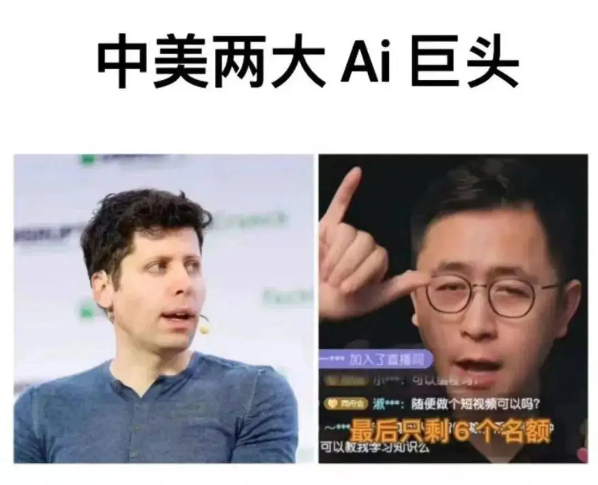
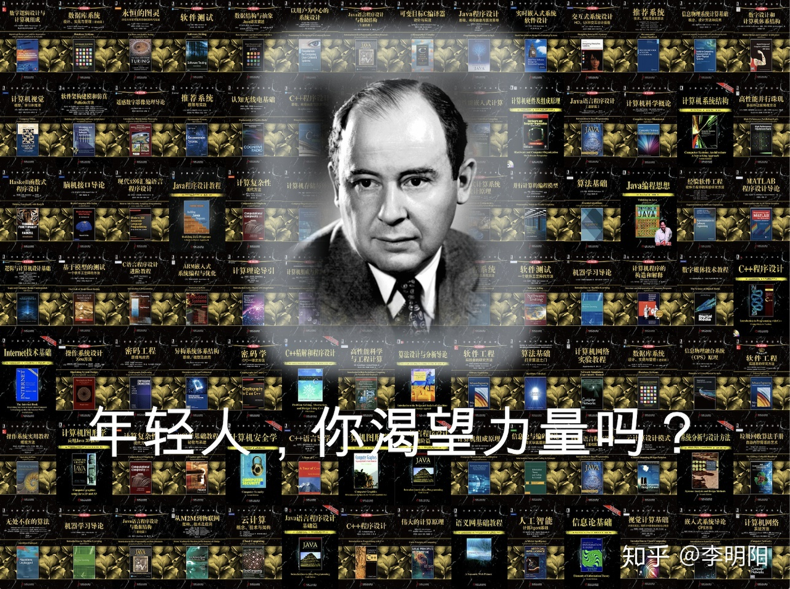
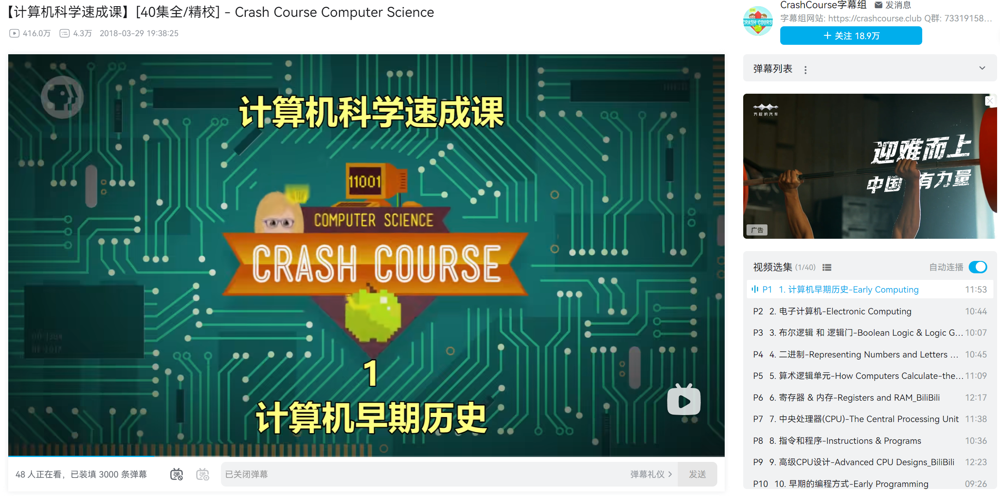
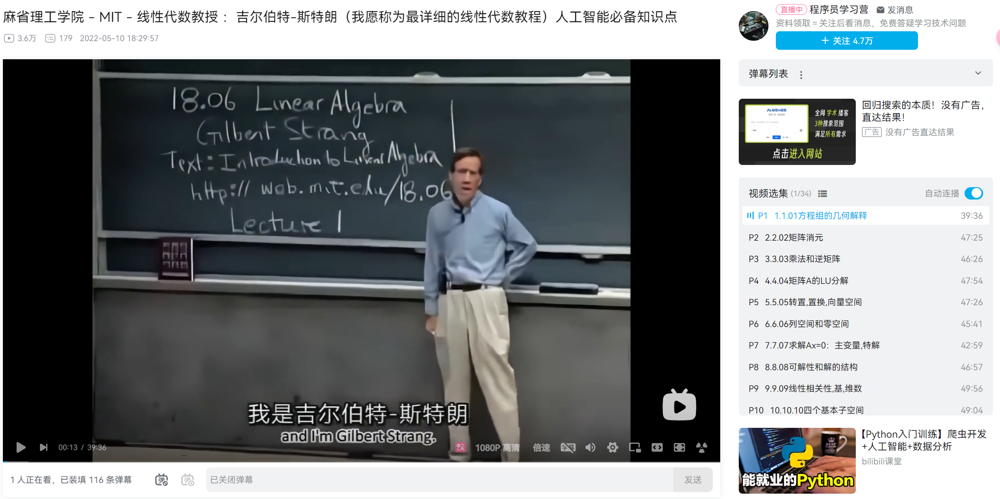
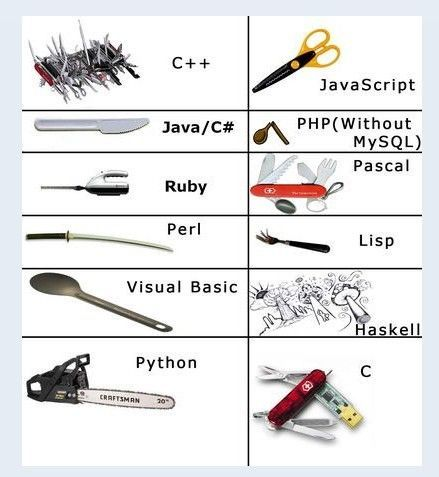

# 🥰开学前怎么学？

大学的培养体系目标，往往是奔着将学生培养成一个综合性人才去的，因此在课程设置中，会教我们高等数学、线性代数这类数学科目，以及计算机网络、数据结构这些基础学科。

- 有的人会质疑，他们认为：“我以后可能从事的就是很具体的开发工作，根本不需要学这些看似与实际工作脱节的课程。”但值得注意的点是，大学不是培训班，他所期望的是你能在你的职业道路上走得更远，具备更广阔的视野和更全面的能力，而不是化身为一个螺丝钉，局限于某个特定的角色或任务。

- 另外，还有些同学在入学前会尝试预先自学大学课程的内容，他们认为：“既然我要提前学内容，那就把要学的课本搞到，完完整整的都啃一遍。”一方面，过早地深入学习会让你很快感到枯燥，觉得自己啃起来很难受；另一方面，开学了还很容易全都忘了。

为了解决这样的问题，我们特别制作了这期内容来解答大家的疑惑😎👌

 

## 一、经典的误区

进入大学前，我们的评定标准非常简单——就是考个高分，考个好大学。

进入大学后，社会的海量信息向我们涌来，大有乱花渐欲迷人眼的趋势。

例如，我们在B站搜索“AI”关键词，你会发现各种各样、形形色色的内容，包括但不限于：AI工具汇总，AI抽象视频，Adobe Illustrator的教程，以及“清华大佬终于blabla讲清楚了！”，甚至有AI美女跳舞（？？？）

同时我们也看到有人会有这样的想法：“只要我好好学学校课本的内容，考个高分，卷个高绩点，考个好研究生，就能找个好工作”。

基于这种想法，他可能看到了学校要教高数，于是他买了一本小绿皮书，开始仔细研读；或者买了一本学校课本谭浩强C语言开始背诵语法。把编程和数学公式理解成了魔法书的一个个咒语，单纯的认为只要根据固定的顺序排列这些英文字母，电脑就会给我反馈出魔法的奥妙。

这种学习方式虽然可以短期内提高成绩，但往往忽略了**对概念本质的理解**。

> 下面是两本大恶头

 

更有甚者，感觉收费的就一定是优质的，坚定一分价钱一分货，于是买了一些所谓的AI课，抢到了“最后仅剩的六个名额”，“原价999现价199”的课程，结果看了半天连怎么“正确使用ChatGPT”都一头雾水，收获寥寥。

当然，还有一些人会去找书看看，但是与找视频同理，有大量的时间都被浪费到了啃自己看不懂的陌生文字上，书上每个字都认识，但是连起来就看不懂了。

这些书为了保证准确性和严谨性，往往会采用一些非日常使用的专业术语和技术性很强的语言来进行解释，最后导致的结果也就是你看起来“完全不像人话”。

即便优秀的同学会去互联网搜索这些词，最后的结果也是——当你试图理解一句话中的一个词汇，可能需要用到三个你依旧不懂的词汇去解释，而你去查这三个词汇的时候，又发现了五个你不懂的词汇，无限循环下去，读到最后身心俱疲。

> 比如底下这些黑书

这些方式无一例外，不可能让你真的掌握任何AI技术，甚至没有办法让你获得正反馈，你最后的结局很有可能就是学了一小段时间之后，道心破碎然后摆烂放弃。

 

## 二、切入点到底在哪？
**质胜文则野，文胜质则史。文质彬彬，然后君子**。

学AI也是同样的过程，质可以解释为实践，文可以解释为理论。

- 只学习理论学习，而不进行实践那就是空中楼阁，非常容易忘记而且理解不深，并且多数人很难只从看数学公式和逻辑推导中获得乐趣。
- 只尝试实践，而不学习理论容易让人止步不前。AI领域以月为单位发展，各种库、各种新项目层出不穷，可能你学的实践过一两个月就被湮灭在历史的尘埃中。

我们之前将AI的基础内容划分为了计算机基础、数学和编程三个部分，我们也可以从这三个角度去切入到底应该怎么学AI。

 

### 1. 计算机基础

我是来学AI的，为什么我要学计算机基础？

其实说白了，AI是计算机科学的一个分支。并且据我所知，非常多的人在大学之前都没碰过电脑，对电脑的操作非常陌生，如果在这种情况下开始学AI纯属是无稽之谈。

当然，我在这里不会详细的列举那些非常深的内容，例如操作系统或者计算机组成原理，这对新手来说仍然不是非常友好，我更为推荐的是，学习一些简单的导论课，了解计算机科学到底包括什么，过去做到了什么，未来还能做什么，这个对我们学习还是非常有帮助的。

#### 💻资源推荐

**【计算机科学速成课】[40集全/精校] - Crash Course Computer Science**
> 点击进入👉 [Yutube原视频](https://www.youtube.com/playlist?list=PL8dPuuaLjXtNlUrzyH5r6jN9ulI)/[Bilibili搬运](https://www.bilibili.com/video/BV1EW411u7th/?spm_id_from=333.1350.jump_directly&vd_source=2bdf248d15af2fad2f8c6828193b9bb7)

这个速成课我真的非常推荐，没有任何基础都可以去看。10分钟可以把我老师十几节讲的东西讲清楚，主要是为了搭建计算机知识框架。而且非常有意思，只要看了就有收获。

**【计算机导论课】哈佛大学CS50**
> 点击进入👉 [Bilibili搬运](https://www.bilibili.com/video/BV1HW4y1A7Yi/?spm_id_from=333.337.search-card.all.click&vd_source=2bdf248d15af2fad2f8c6828193b9bb7)

当然，在学习过Python之后也可以浏览学习,这是哈佛大学的计算机导论课，非常的有趣。内容包括基本的计算机知识以及基础算法，常见的编程语言等等，还会探讨最新的计算机科学领域的成果，课程发散性思维强。

 

### 2. 数学

为什么要学数学？

首先我需要声明的是：如果你只是想要做出一个可以玩的AI的demo，也许并不需要非常深厚的数学功底，甚至不需要数学知识，都可以用非常简短的几行代码跑出非常惊艳的效果。

::: tip
你可以通过复制粘贴代码来走得很远，而不必真正理解它；你只需要将代码块理解为完成你需要的任务的功能单元，将足够多的代码块粘合在一起，你就会得到一个解决你需要解决问题的程序。
:::

这种经验主义的把戏是个快速学习的好方法，但是这其实是个非常危险的事情。当你面对非常实际的项目，无论是科研方向还是工程方向，都会出现很大的问题——这种经验主义会让你完全不清楚自己的程序是干什么的，怎么运作的，怎么改进的。他就像是用积木建立起来的高楼一样，并不稳固。

那么学习数学的必要性就显而易见了，它可以帮助你理清楚这个学科的发展脉络，更为深入的理解算法的思想，并且在此基础上进行创新，同时如果你遇到了一些问题，研究数学可以帮你更确切的定位到问题出现的点。

#### 🤨具体怎么做？

学习数学有以下几点注意点

下面是根据您的要求整理的学习基本原则及相关建议，以Markdown格式呈现：

#### 😠学习的基本原则

- **不要为了考试而学习**
  - 如果你是为了打好数学基础，不要仅仅看那些高播放量的数学视频，因为它们往往是针对考试准备的，与实际应用有一定距离。
  - 从现在开始，不要仅仅为了考试而学习。

- **选择合适你的资源**
  - 资源的好坏取决于你自身的适配度：适配度越高越好，并不是难度越高越好。
  - 他人认为极好的书籍或课程，对你来说可能完全不适合——因为你可能完全学不懂，或者对其毫无兴趣。

- **请注意，适配度并不等于舒适度**
  - 有些课程虽然你学起来很轻松，但如果过度被动地获取知识而完全脱离自我思考，或者获取的知识密度过低，这样的资源就不适合你。

- **权衡时间安排**
  - 时间是极其宝贵的资源，不要浪费你的时间！
  - 对于大多数工科学生来说，数学更多是工具，需要的是数学的应用，而不是深入理解数学理论。
  - 深刻理解数学固然有助于更好地利用工具，甚至创造工具，但在大多数情况下，这样做的时间成本过高，性价比较低。

- **多样化学习资源**
  - 学习资源不仅仅是视频资源，随着专业知识的深入，视频资源会越来越少，书籍和文献会成为主要的学习路径。
  - 因此，在能够继续学习的前提下，多尝试直接阅读书籍，而不仅仅是观看视频。

- **多使用原资源**
  - 相信国外热门的资源都会有本土化版本，但在B站等平台上翻译的质量可能参差不齐。
  - 当你发现自己难以理解时，请尝试查看英文原著，问题可能不在你，而在翻译。

- **习惯英文阅读**
  - 不要拒绝英文资源，尽管开始时可能会觉得困难，但逐步接触英文资源会让你受益匪浅。
  - 这与你的高考英语成绩无关，别担心，你可以做到！

- **国内外教材的区别**
  - 国内和国外的教材有很大的区别。
  - 国内的多数教材更像是讲义，看似清晰明了，实则需要老师的引导才能理解。
  - 国外的经典教材则像是仙人指路，能够帮助你拨开迷雾。
  - 这里并不代表国外的教材一定好，国内的教材一定差，而是要选择经典教材，并考虑到国情的不同。

#### 💻资源推荐
**【各类AI学习资源】Datawhale精品教程**
> 点击进入👉 [南瓜书文档](https://datawhalechina.github.io/pumpkin-book/#/)

Datawhale是国内最大的AI开源社区，他产出相当多更符合中国宝宝体质的AI开源课程，后续也会推荐关于DW的各类课程。

他其中的南瓜书非常详细的讲了西瓜书《机器学习》里面公式的推到细节，并且有开源团队长期维护，有想从理论入手的学习的同学，使用Datawhale的课程肯定是没错的。

**【微积分/线性代数】3Blue1Brown 的微积分本质和线性代数的本质**

> 点击进入👉 [Bilibili搬运](https://www.bilibili.com/video/BV1qW411N7FU/?spm_id_from=333.337.search-card.all.click)

内容是英文的，但实际上不会怎么影响，若是过于难接受英文，可以自行搜索汉语翻译版。这部分内容和传统的高数教学不同，从直观的图形角度，讲解各个微积分中的重要概念由来和应用。

在学习学校的线代课程时，来看看3b1b的图形化教学吧，相信我，你会顿悟的。

- 学习时间：与传统网课无任何冲突，可以在任何时间观看，即传统网课的前、中、后三个阶段均可看，并且不同阶段看感受不同，建议反复观看。
- 学习难度：简单又不简单，简单在于讲解的方式非常通俗，图形化知识非常直观，不简单在于其本身内容是深刻的，彻底理解这些内容或许需要不断反复的看以及配合传统网课的学习，搭建完知识体系后顿悟。

**【线性代数】MIT18.06: Linear Algebra**

> 点击进入👉 [Bilibili搬运](https://www.bilibili.com/video/BV1SY4y1b7Ti/?spm_id_from=333.337.search-card.all.click&vd_source=2cb6252f9211ae9d29cf1f76f0aea8d7)

Gilbert Strang 都快90岁了，仍然在坚持教课，B站上有非常多的其授课内容，其经典教材 Introduction to Linear Algebra 已被清华采用为官方教材，也非常推荐。

https://www.bilibili.com/video/BV1SY4y1b7Ti/?spm_id_from=333.337.search-card.all.click&vd_source=2cb6252f9211ae9d29cf1f76f0aea8d7

 

**📚书籍**

我接下来会推荐一些我认为非常棒的书籍，但是这并不意味着你必须要看完他，他的内容会非常的多，你完全可以在后面感兴趣的时候让好奇心驱使你去阅读他们。

对书籍的盲目崇拜一定是高中思维给我们带来非常可怕的一件事

**【MATHs】Calculus**

詹姆斯·斯图尔特（James Stewart）的微积分（ Calculus）是一本相当棒的书籍，里面的图非常多，可以很好的帮助人理解。

但是值得一提的是，这本书的内容非常的多，强调实际应用，包括物理和工程问题的例子，但并不是所有的内容都和AI有强关联，我们可以只阅读其中的一部分，或者说只阅读自己在学习AI过程中概念比较模糊的部分，而不是逐字阅读，它需要消耗的精力实在是太大了。

当然，如果你真的非常喜欢数学，阅读这本书也是一个不错的选择，但是题不要做，实在是太费时间了。

**【线性代数】Interactive Linear Algebra**

Interactive Linear Algebra这本书，我打开网站真的觉得他好炫酷，从实际应用和数学的角度去描述线性代数这个学科，我们传统的教学方法更喜欢从行列式开始，有时候会让人一头雾水，不知道这到底有什么用，但实际上他的应用范围之广，实操性之强在整个AI领域无出其右。

而在这本书里面他是从本书利用现代技术提供了许多交互式元素，如动态图表和模拟，这些都可以帮助学生更直观地理解线性代数的概念和理论。用户可以通过操作这些交互元素来看到不同数学操作的实时效果，从而加深对材料的理解。

通过可视化的方法展示复杂的数学概念，使得抽象的线性代数理论变得更加容易理解。例如，矩阵运算和向量空间的概念通过图形和动画得到了清晰的展示。

 

#### 类似的资源还有吗？

当然有，我们可以推荐的内容非常非常多，但是过多的推荐会让你眼花缭乱，如果你还有额外的需求，欢迎你联系到我们，我们可以针对你的个人情况对你进行针对性推荐。

 

### 3. 编程

我得承认，非常多的人目前没法从编程中获得快乐，诚然编程也是一个让非常多的人头大的一个问题。

但无论怎么说，编程都是计算机科学不可或缺的一部分。

他的核心思想在于用将可量化的重复性劳作交给计算机来完成，以达成提高效率的目的。

> 这里引用一位老师的比喻就是，将编程形容为开车，你可以讨厌他，也可以喜欢他。但是，他作为一个交通工具，你不开你就得腿着去学校。想想如果你从杭电走到西湖只能走着去，那是多么恐怖的一件事。

当然，现在 GPT 的强大功能可以帮大伙解决相当多的工作，因此，我们可能需要掌握更多的逻辑思维能力和分解问题的能力，将问题简化之后用 GPT 解决也不失为一个选择

#### 🌅入门的要领

##### 1. 先 “run” 起来

无论是学一门语言，还是学一个工具，最基本的原则是：

“尽可能地先用最短的时间搞懂这个东西是做什么的，然后以最快的方式把它 “run” 起来。”

当你已经能跑起一个语言、一个工具的最简单的示例的时候，再去花时间慢慢了解背后的复杂的内容，再去拓展即可。先用起来，跑起来，带着问题去翻资料。

- 比如学写 C 语言，看到一行代码自己想学习，把代码复制到这个在线编译的网站里，点一下 "Run it" 看效果。能最快地上手，最快地运行看到效果，对于初学者来说是最好的。等你啃了一堆概念和道理，人家已经学完一堆了。当你已经会了简单的循环、判断、函数，已经建立了信心，就可以慢慢地去看那些让人头疼的东西了。

- 比如学 Linux，如果你电脑操作系统是 MacOS，直接打开 “终端”，可以勉强当 Linux 使；如果你是 Windows，直接跟着微软的 WSL 安装教程，一步步无脑地用鼠标点击然后装起来。这时候你就拥有一个 Linux 了，再对着教程去敲。等闲下来了就可以了解了解内核是什么，发行版是什么，去了解云服务器，去了解不同的装 Linux 的方式。

**🤔为什么要这样？**
- 第一，计算机是很重实操的东西，不要光看所谓的理论不动手。动手是王道。
- 第二，要尽可能多地、尽可能快地给自己找一些正反馈，学编程不是当苦行僧
- 第三，很多东西没必要学，学了也忘。用到了再去学，是最省事最容易记住最高效的。
- 第四，程序员这一辈子会接触无数的新的东西，如何快速上手一个东西，是非常重要的能力。

 

##### 2. 任务 / 项目驱动
任务 / 项目驱动的意思承接上文，意思就是不要瞎看文章，不要让阅读教程和学习课本成为你的驱动力，等你看完一本 C 语言的书，一行代码就没敲，你就寄了。

**那么该怎么学呢？**

- 先简单地会一样东西的最核心的部分，再去找一个实际的编程场景、编程任务、项目。你会在完成这个项目中遇到各种各样的问题，无论是遗漏了知识点还是压根没思路，这时候不断地用搜索引擎来学习。

**怎么去找一个实际的场景？**

- 办法多的是：自己拍拍脑门，或者去各大互联网站、博客，其中Github肯定是一个非常不错的选择，例如你要找一个有关于机器学习的项目练手，直接在GitHub搜索“Machine Leaning”，然后找几个Star多的项目看看感不感兴趣。

 

##### 3. 不同的知识媒介

这里主要讲讲我对不同媒介来学习编程知识的看法，目前主流的媒介就是**文字、图片和视频**。

很多的牛逼的人，一般都更喜欢通过看图文来学习，而不是视频。主要有以下几个原因：

1. 图文的信息密度最大：同样的时间内，看一篇图文获得的信息量比视频大很多。
2. 图文易定位、检索：你可以通过搜索功能非常迅速地在一个工具的官网内找到想要的内容。
3. 一些杂七杂八的原因：图文往往更新，因为视频制作耗时长，不容易更新；牛逼的人它不一定会做视频，或者说牛逼的人中有写博客习惯的远大于做视频习惯的。
当然，视频也有很大的好处，就是直观、简单，适合学习初期。也不必强行把自己往上套，结合自身特质，以什么的方式学习效率最高，就采用什么样的方式。

 

##### 4. 初学者学什么编程语言
下面是一张经典老图，形象地说明了各个语言的优势:

作为入门，我肯定推荐你学习C或者python作为自己的第一门入门语言（如果你高中已经有一定基础，或者信息课有可以继续学python）。

先学好 C 语言对你有以下帮助：

1. 掌握计算机底层知识：C 语言是一种高效的系统级语言，它的语法和数据结构设计直接映射到底层计算机硬件，通过学习 C 语言可以更深入地了解计算机底层运作原理，为理解更高级的编程语言和开发工具奠定基础。
2. 提高编程能力：C 语言的语法相对较为简单，但是它要求程序员手动管理内存，这需要编程者深入了解内存结构和指针的使用。通过学习 C 语言，可以锻炼编程能力，提高代码质量和效率。
3. 能够理解其他语言：C 语言是很多编程语言的基础，如 C++、Java、Python 等语言都从 C 语言继承了很多特性。因此，学好 C 语言可以帮助你更好地理解其他编程语言的设计思路和工作原理。

至于学习Python，推荐理由也许一条就够了，他足够的简单，很短的代码就可以写很多的东西

#### 💻资源推荐
**【C语言】C Primer Plus 第6版**

> 善，绝世好书

《C Primer Plus》对C语言的基本概念进行了逐步介绍，适合没有编程经验的读者，适合初学者。它从最基本的程序结构开始，逐步介绍如何使用变量、控制结构、函数等。

这本书非常适合初学者，覆盖了C语言的几乎所有重要方面。

同时书中包含大量的代码示例，这有助于我们理解抽象的概念并看到这些概念在实际程序中的应用。这些示例通常很实用，能够帮助学习者理解如何在真实世界中使用C语言。

但是这本书内容非常多，作业也非常多，一定要做，但是可以挑着做，选自己喜欢的。

如果感觉内容太多，可以考虑学到第十章，到第七百页左右，相当于全书的一半不到，一些看不懂的内容也可以不纠结，先了解一下然后跳过。

**【Python】Python手册**

> 点击进入👉 [官方文档](https://docs.python.org/zh-cn/3/tutorial/index.html)

其相比起C来说多了一些特性，变动了一些语法规则，总的来说写起来差距并不是特别大，如果想快速入门可以浏览一下Python手册，内容很少。

**【CS导论课/Python】CS61A**

> 善，绝世好课

伯克利大学的编程神课，见了人我都想推荐一下，真的很有趣，强调抽象，让学生掌握用程序来解决实际问题。 

独立搭建了课程网站以及可以本地使用的评测系统，并且有相当相当多非常有趣的作业，是在别人的代码框架基础上进行开发，开发完立马体验它的效果，特别有意思，作为一个刚刚接触计算机，连安装 Python 都磕磕绊绊的小白来说，这样完善的代码框架既可以让你专注于巩固课堂上学习到的核心知识点，特别容易让你有成就感！

而且他每年都更新，这么好的东西谁学谁知道！真的不要害怕他是英文的，真的好。

 

## 三、AI去哪了？
我们前面铺垫了这么久，讲了编程，数学和计算机基础的内容，有人可能会感到困惑：“我是来学AI的，为什么跟我讲这么多杂七杂八的？” 因为AI这个学科是高速发展的，如果直接以最为功利主义的方式去切入，一方面是很容易卡住我们学习的上限，在学到一定地步之后进步变得缓慢；另一方面是因为技术快速迭代的缘故，技术根本学不完。

在本科或者刚入门的阶段，还是把基础打好作为触类旁通的基本条件，更有利于我们后期的发展。

当然，如果你的目标非常明确，我的目标就是做出一个项目或者说已经进入了生产环境，现在就是迫切的想要学习；又或者说，你的目标只是跟上时代的发展趋势，而不是想进入AI行业，那么不用去管前面的内容也是完全可以的。

在这里，我不会涉及具体的技术细节，只会站在AI领域的角度上，给大家在选择学习方向上梳理出一些头绪

::: warning 🧐事先声明
我们的方法也未必就是最好的方法，大伙可以根据自己的情况进行调整。

大家对于学习AI的历史总是会有一个误区，认为“过去的AI已经是不再使用的过时产物，所以即便不了解也没关系”，然而事实是，人工智能技术的发展也是随着各种配套设施的进步一起发展的，我们学习AI的时候可以不用了解全部的历史上的算法或者思路，但是至少要稍作了解，有助于我们建立认知。任何一个学科在发展的过程中，人们会尝试非常多的方法去实现我们的既定目标，例如美国的曼哈顿计划中，科学家和工程师尝试了多种不同的方法来分离铀-235，离心法，电磁分离法等等，虽然都失败了，但这些尝试对后来核技术的发展有重要的启示和贡献。

与此同时，无论我们在任何一个领域深耕，都不可避免的会深入到一个非常狭小的领域。我们往往会粗略的将你的大方向划分为科研方向和工程方向，并且推荐一些可以帮助你建立整体性认识的课程。
:::

**【各类AI资源】Datawhale精品内容**

作为国内最大的AI开源学习社区，世界前100的Github仓库里面已经孕育出太多精彩的内容了，而且参与开源社区的组队学习活动还会让助教带着大家手把手的去学习相关的内容。

各式各样的教程和内容实在是太多了因此我在这里不做列举，可以等大伙有项目需求或者感到好奇的时候报名组队学习，逐步打开学习Datawhale开源项目的大门

 

**【人工智能导论】CS50-AI**

我们如果要学习一门学科，一个非常好的办法就是梳理其发展脉络，把前人的路再走一遍，我们在梳理那些之前人们如何思考，如何作为的时候，会有更为深刻的理解。

这门课叫人工智能导论，虽然是2020年的，非常有意思的一点就在于他会拆解出相当多虽然实际场景已经不多用了，但是也可以算作人工智能的算法，并且每一个教的点都有非常具体的有意思的项目，比如说和AI下井字棋之类的，还是很有意思的。

 

**【深度学习CV/NLP】CS224N/CS231N**

这两门在B站上都有视频，斯坦福入门深度学习CV和NLP两大方向的课程，讲解内容还是比较深入浅出的，并且他们的作业非常好（很难），如果有兴趣的话可以做一做。

如果害怕视频已经过时了，可以进入他们的官网去看他们的Note和PPT，顺便把作业做了，这些都是最新的。

 

**【机器学习】李宏毅课程**

李宏毅老师是国立台湾大学的教授，讲课非常有意思，而且他还会在课上穿插各种动漫元素，之前是很多宝可梦的内容，现在还有芙莉蓮!

我非常推荐大家可以有机会去浏览一下他的课程。

