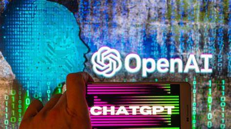
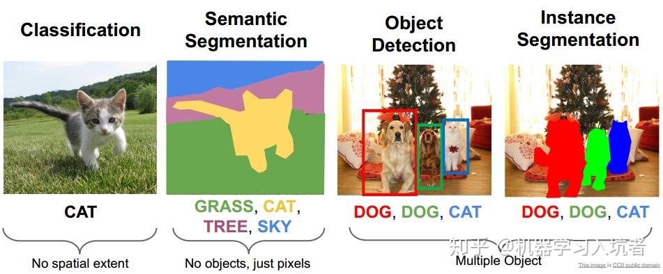
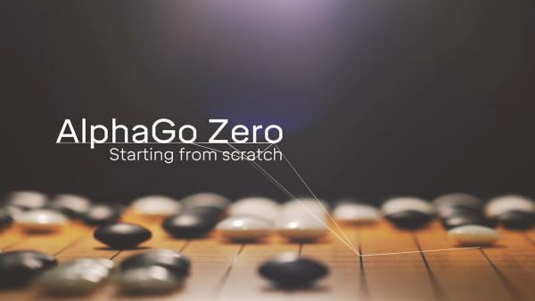
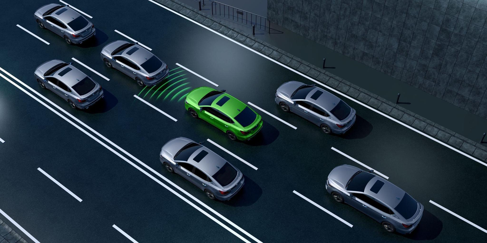
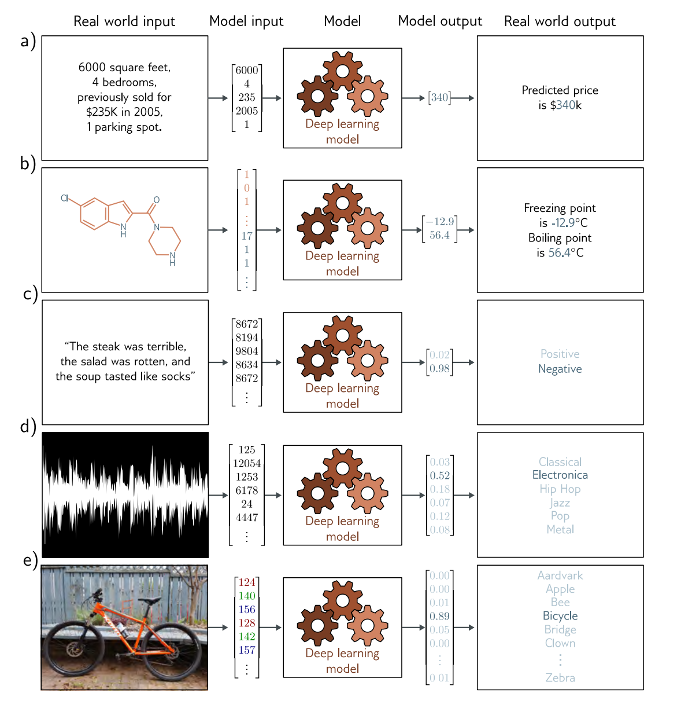
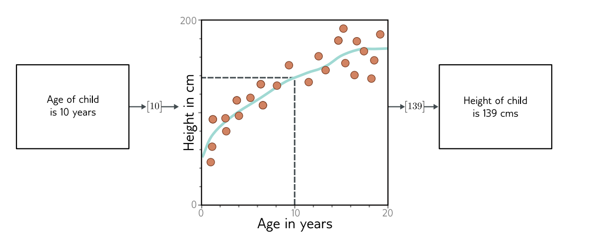
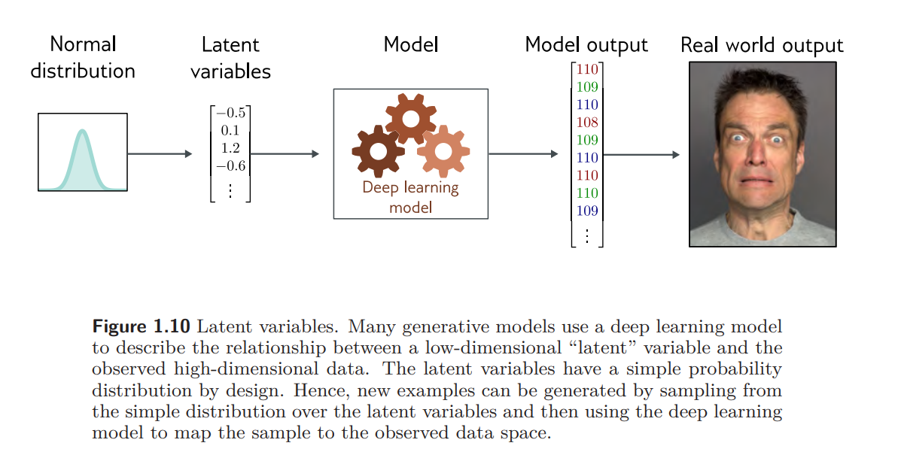
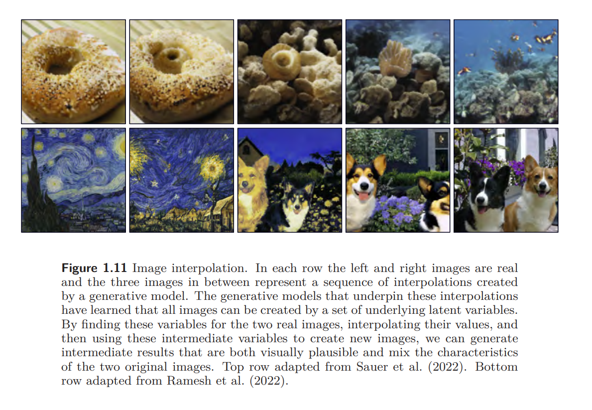

# 😆人工智能基础(Quick Start)

**“关于人工智能，你们是否误会了些什么？”**

你是否和我之前一样，对**人工智能，机器学习，深度学习以及大语言模型**之间的关系感到模糊不清？

这篇文章带大家梳理这几者之间的关联，并带大家梳理目前常见的几种深度学习的实现方法。

本文聚焦于概念解析，基本不涉及到具体实现。
::: tip **😇免责声明** 
本章内容需要你掌握一定的 Python 基础知识。

如果你是一个新人，想要快速了解机器学习，你可以先阅览本部分内容。

当然我需要承认一点，为了让大家都可以看懂，我做了很多抽象，具有了很多例子，某些内容不太准确，这是必然的，最为准确的往往是课本上精确到少一个字都不行的概念，这是难以理解的。

所以本篇内容只适合新手理解使用，所以不免会损失一些精度。
:::

## 一、人工智能
> 参考网站：[What is Artificial Intelligence (AI)? | IBM](https://www.ibm.com/topics/artificial-intelligence)

**人工智能（Artificial Intelligence）** 是一个概念，指的是 **“机器执行原本需要人类智能才能完成的任务的能力”**。这个概念自20世纪50年代以来就已存在，并随着数十年的研究和技术进步而不断演变。

人工智能经历了**多次高潮和低谷**，曾常常受到质疑，被认为是不切实际的。然而，**ChatGPT 的发布**标志着一个转折点，它不仅再次点燃了人们对 AI 的热情，而且也标志着**生成式人工智能**的重大突破。



**生成式人工智能（Generative Artificial Intelligence）** 是一类能够创造出全新内容的人工智能技术。与传统的任务驱动型AI不同，生成式AI能够生成新的文本、图像、音频、视频等多种形式的数据，甚至是代码和化学结构等。
这种能力便来自于接下来要介绍的**机器学习和深度学习**。

::: tip **🤔为什么说生成式AI改变了AI行业？**
生成式 AI 较为明显的整体优势是**效率更高**。生成式AI可以按需生成内容和答案，因此有可能加速或自动化劳动密集型任务、降低成本并让员工腾出时间从事更高价值的工作，比如说水课作业。

生成式AI正在深刻改变着AI行业，这种转变不仅仅体现在**技术层面**，还体现在**商业模式和社会影响上**。

在未来的接触中，你们会越来越明白“生成式”的优势所在。
:::

::: warning 😡WARNING
时至今日，人工智能依旧没有一个确切的定义——它所涉及的方面太广泛了。我现在反问你，人工智能是什么？你可能会说 **“这是一种技术”**，或者 **“这是机器所具有的一种能力系统”**，抑或 **“一个技术上的概念”**，为这样一个模糊不清的名词做一个绝对的定义是很不负责任的，所以这只能作为 **“方便你初次理解人工智能”** 的内容，相信在今后的学习中，你会对人工智能这个概念有更清晰的认知，特此声明。
:::

> 下面是《Understanding Deep Learning》中对于AI/ML/DL关系的解释


## 二、机器学习
> 参考文献：fast.ai系列课程文档_01_intro

**机器学习（Machine Learning）** 是AI的一个子领域，它能让机器从数据中学到东西，然后自己做决策。

::: tip **🤔Tip**
这个概念其实不需要那么多杂七杂八的专业术语去解释。

首先你要认识到他是**人工智能的一部分**，不需要写**任何与问题有关的特定代码**。你把数据输入相关的算法里面，他给你总结相应的规律。

甚至深度学习，也只是机器学习的一部分，不过使用了更多技巧和方法，增大了计算能力罢了。
:::

这么说可能有些抽象，我们来举个例子：

我现在需要让你做一件事——**识别一个单词是猫还是狗**

这件事情当然很简单，只要你学过任何一门编程语言一定都能做到

```python
word = "Cat"
if word=="Cat":
    print("The word is Cat")
else:
    print("The word is Dog")
```

非常好，下面我们来做下一个任务——**识别一个图片是猫还是狗**


你的大脑第一时间给出了答案，**上边是猫，下边是狗**。

但是如果让你用代码来实现这个功能，你会发现相当的棘手！当我们识别图片中的物体时，实际上并不清楚大脑内部具体发生了什么步骤。猫就是猫，狗就是狗，哪里需要什么理由呢？

早在计算机诞生之初，也就是1949年，IBM的研究员Arthur Samuel就开始研究一种让计算机完成任务的不同方式，他称之为**机器学习**。在他的经典文章《人工智能：自动化的新领域》中写道：

> 对计算机进行此类计算的编程是一项艰难的任务，这并非主要是因为计算机本身有任何固有的复杂性，而是因为需要以最令人沮丧的细节来详细说明过程中的每一个微小步骤。任何程序员都会告诉你，**计算机是巨大的傻瓜，而不是巨大的智慧体**。

对于解决这类问题，他的基本想法是这样的：

**“与其告诉计算机解决一个问题的确切步骤，不如给它展示一些要解决的问题的例子，让它自己找出解决问题的方法。”**

是的，赋予机器以真正的智能，教会它自主学习的能力，这就是机器学习！

太不可思议了，这样的概念其实很好理解，但究竟是如何做到的？我们在下面会慢慢讲解。

::: tip **🤔机器学习的局限性**
- 没有数据就无法创建模型。
- 模型只能学会操作在其训练数据中出现的模式。
- 这种学习方法仅能生成预测，而非推荐行动。
- 仅有输入数据的例子是不够的；我们也需要这些数据的标签（例如，仅有狗和猫的照片不足以训练模型；我们需要为每张图片加上标签，标明哪些是狗，哪些是猫）。
:::

## 三、深度学习
> 参考文献：《Understanding Deep Learning》

**深度学习（Deep Learning）** 是机器学习的一个子领域，专注于使用 **深度神经网络（DNN）** 来解决复杂的学习任务。

在撰写本文时，深度网络是最强大且实用的机器学习模型，并且在日常生活中经常遇到。

下面我们来介绍机器学习也是深度学习最主要的三大领域：**监督学习、无监督学习和强化学习**。

::: tip **🤔怎么突然扯到深度学习了？机器学习/深度学习之间有什么关联？**
- 我们在谈论这两者的时候，经常会说的模棱两可。因为机器学习主要领域的前沿方法都依赖于**深度学习**，所以我们在谈论机器学习方法的时候，基本上都会牵扯到深度学习，这两者是不可分割的。
- 所以我们说机器学习三大领域的时候，也常常会说成深度学习三大领域。
- 当然了，机器学习也不一定要用深度学习来实现，不过其他的也大都是一些旧时代的方案了
:::

### 抽象解释

在正式介绍这三种方法之前，让我先用通俗易懂的语言让你大致明白这三者之间的区别。

当然了，在实践中三种方法通常也会混合使用，他们不是独立的。


#### 1. 监督学习
::: tip **😎想象一下，你参加了新一届厨王争霸赛。**
在这个比赛中，你有一位经验丰富的导师，他会手把手教你怎么做菜，以及每道菜应该是什么味道。每次你完成一道菜后，导师都会尝一尝并告诉你做得怎么样，指出哪里好、哪里需要改进。然后你再根据导师的意见，对菜品继续改进，然后再交给导师尝，直到你烧出来的菜是最完美的。
:::

监督学习就像这个场景一样，它使用**已标记的数据**（即我们知道正确答案的数据集）来训练模型。模型通过比较预测结果与实际标签来调整自己的参数，逐渐学会如何做出正确的预测。导师的角色就像是标记的数据和反馈机制，帮助模型不断改进直到达到较高的准确度。

> 这在日常生活中其实很常见，比如图像识别，通过大量标记好的图像，算法学习每种类别的特征。



#### 2. 无监督学习
::: tip **😎恭喜你来到了厨王争霸赛的第二阶段！**
这次你没有导师，而是自己摸索。你有一堆食材，但不知道最终要做什么菜，也没有人告诉你哪种组合更好。你需要尝试不同的配料组合，靠自己去观察哪些搭配在一起味道不错，哪些则不行。
:::

无监督学习就是在这个情境下的学习过程。模型**没有事先知道正确答案，甚至不清楚规则**，它需要从数据中自行发现模式和结构。就像厨师通过尝试不同配料来了解食材之间的关联一样，无监督学习模型通过探索数据来找出有意义的特征或者类别。

> 当年AlphaGo Zero在并不知道围棋游戏规则的情况下，自学三天便碾压了旧版AlphaGo


#### 3. 强化学习
::: tip **😎厨王争霸赛的决赛阶段！**
这次比赛有点特别，你还是没有导师直接指导你每一步该怎么做，但你有一个裁判。你每做一道菜，裁判会根据你的表现给出评分。如果做得好，你会得到高分；如果做得不好，分数就会低。你的目标是通过不断尝试新的食谱，逐渐提高你的得分。
:::

强化学习就像这个比赛一样，它基于试错的过程。模型通过**与环境互动**（比如在烹饪比赛中制作不同的菜肴），并通过环境提供的**奖励信号**来学习最优策略。就像厨师根据裁判的评分来调整自己的烹饪方法一样，强化学习模型通过优化行为以最大化累积奖励来学习。

> 自动驾驶，通过传感器和摄像头获取环境信息，算法不断调整驾驶策略以获得最佳的驾驶效果（如避免碰撞、遵守交通规则）。每次成功的驾驶行为（如安全通过十字路口）都会被强化。



> 这里放一个我很喜欢的AI视频，主要讲的就是人工智能阿尔伯特的各种 **“无监督学习+强化学习”进化史** ——在不清楚游戏规则的情况下根据阿尔伯特的行为给他奖励或惩罚，直到他完全学会这种游戏规则。每集一个小游戏非常有意思。

> 点击进入👉 [阿尔伯特的进化：学习玩捉人游戏啦！](https://www.bilibili.com/video/BV1Sb421i7EZ/)

<Bilibili bvid="BV1Sb421i7EZ" />

::: warning 😡WARNING
接下来的内容将会不可避免的牵扯到一些专业名词，如果你有能力，可以预先观看李宏毅机器学习的课程前三节，对于机器学习的整体框架和专业名词有一定的了解后再来观看效果更佳😇
:::

### 监督学习（Supervised learning）

监督学习模型定义了 **“从输入数据到输出预测的映射”**。

什么意思呢？以ChatGPT为例，我现在想要预测我手上一套房目前的房价，那么我会输入一些信息给到GPT，这些信息经过模型的处理后，会输出一个价格，也就是GPT预估的房价。

我们来复盘一下这个过程中涉及到哪些部分：

- **输入：** 提供给模型的信息或数据，可以包括房子的大小、位置和房龄等特征。
- **模型：** 一个数学函数或算法，它根据输入数据来生成输出结果。
- **输出：** 模型根据输入数据做出的预测或决定，在这个例子中，输出就是模型预测的房子价格。

在接下来的部分中，我们将讨论输入、输出、模型本身以及“训练”模型的含义。

#### 1. 输入（Input）

输入数据通常是**一组特征**，这些特征描述了我们要解决的问题中的实例或样本。

根据不同的应用场景，输入的类型也会有所不同：

- **表格数据**
  - 在房价预测的例子中，输入是一个固定长度的向量，包含描述房产特征的值。这是一个表格数据的例子，因为它没有内部结构；如果我们改变输入的顺序并构建一个新的模型，我们期望模型的预测结果保持不变。
- **序列数据**
  - 相反，在餐厅评论的例子中，输入是一段文本。这段文本的长度可能因评论中单词的数量而不同，并且输入的顺序很重要；“我的妻子吃了鸡肉”和“鸡肉吃了我的妻子”含义完全不同。文本必须被编码为数值形式才能传递给模型。
  - 所以我们需要一些方法来表示文字的位置信息，例如使用了一个包含10,000个词的固定词汇表，并简单地将词的索引进行拼接。
- **高维数据**
  - 对于音乐分类的例子，输入向量可能是固定大小（比如一个10秒的片段），但维度非常高。数字音频通常以44.1 kHz的采样率和16位整数表示，因此一个10秒的音频片段包含了441,000个整数。
  - 图像分类例子中的输入（由每个像素的RGB值串联而成）也是巨大的。此外，它的结构本质上是二维的；上下相邻的两个像素虽然在输入向量中不是紧挨着的，但是它们之间有着密切的关系。
  - 显然，监督学习模型必须能够处理相当大的输入。



#### 2. 模型（Machine learning models）

到现在为止，我们将机器学习模型视为**一个黑箱**，它接收一个输入并返回一个输出。但这个黑箱里究竟有什么呢？

考虑一个用于根据年龄预测儿童身高的模型。机器学习模型是一个数学方程，描述了平均身高如何随年龄变化（青色曲线）。当我们把年龄代入这个方程时，它会返回身高。例如，如果年龄是10岁，那么我们预测身高将是139厘米。



更确切地说，模型代表了一系列将输入映射到输出的方程（即一系列不同的青色曲线）。具体的方程（曲线）是通过训练数据（输入/输出对的例子）来选择的，这些对用橙色的点表示，我们可以看到模型（青色线）合理地描述了这些数据。当我们谈论训练或拟合模型时，我们的意思是我们在所有可能的方程（可能的青色曲线）中搜索，找到最能准确描述训练数据的那个。

由此可知，模型需要带有标签的输入/输出对来进行训练。例如，音乐分类模型将需要大量音频片段，其中由人类专家已经识别出了每段音频的流派。这些输入/输出对在训练过程中扮演了教师或监督者的角色，这也正是术语“监督学习”的由来。

#### 3. 深度神经网络（Deep neural networks）

深度神经网络能够处理非常大的输入，这些输入可以是可变长度的，并且包含各种内部结构。它们可以输出单个实数（回归）、多个数字（多变量回归），或者两个或更多类别的概率（二元分类和多元分类，分别对应）。

在这里，我推荐你去看一看3B1B的神经网络介绍，老少皆宜，很适合萌新，没基础也能看的懂。

> 点击进入👉 [【官方双语】深度学习之神经网络的结构 Part 1 ver 2.0](https://www.bilibili.com/video/BV1bx411M7Zx/)

<Bilibili bvid="BV1bx411M7Zx" />

#### 4. 结构化输出（Structured outputs）
输出的类型根据任务的需要有着不同的结构，下面是两种经典的监督学习任务输出：

- **多变量二元分类（Classification）**
  - 图a 展示了一个用于语义分割的多变量二元分类模型。在这个模型中，输入图像的每个像素都被分配了一个二元标签，指示该像素是否属于目标对象（例如“牛”）或背景的一部分。输出是高维的，并且具有与输入图像紧密相关的空间结构。如果一个像素被标记为“牛”，那么具有相似RGB值的邻近像素很可能也具有相同的标签。
- **多变量回归（Regression）**
  - 图b 显示了一个多变量回归模型，其中输入是一张街景图像，输出是每个像素处的深度。与二元分类任务一样，输出同样具有高维结构，并且与输入图像的空间关系密切相关。


而有一些结构化输出任务，虽然可以在标准的监督学习框架下解决，但比前两种任务更复杂，因为输出结构与输入的关联性较弱：

- 图c 描述了一个模型，其中输入是一个音频文件，输出是从该文件转录出的文字。
- 图d 是一个翻译模型，其中输入是一段英文文本，输出是相应的法文翻译。
- 图e 展示了一个极具挑战性的任务，输入是描述性文本，模型必须生成一张符合描述的图像。

**为什么常规的监督学习很难解决？** 原因在于两个方面：

1. 输出的模糊性：输出可能具有多种正确答案。例如，一个英文句子可以有多个有效的法文翻译，而一个描述也可以对应多个合理的图像。
2. 输出的结构化需求：输出需要遵循特定的结构规则。并非所有单词序列都能构成有效的句子，也不是所有的像素值组合都能形成可信的图像。因此，除了学习从输入到输出的映射之外，模型还需要遵守输出的“语法”。

幸运的是，这种“语法”可以在不需要显式输出标签的情况下通过无监督学习来学习。例如，通过学习大量文本数据的统计规律，我们可以学习如何形成有效的英文句子。后面在无监督学习模型中还会提到。

### 无监督学习（Unsupervised learning）

从没有对应输出标签的输入数据中构建模型称为无监督学习。

缺少输出标签意味着无法进行传统的“监督”。与监督学习一样，数据可能具有非常不同的特性——它可以是离散的或连续的，低维的或高维的，并且长度可以是固定的或可变的。

与学习从输入到输出的映射不同，无监督学习的目标是描述或理解数据的结构。正如在监督学习中那样，数据可能具有非常不同的特性；它可以是离散的或连续的，低维的或高维的，并且长度可以是固定的或可变的。

#### 1. 生成式模型（Generative models）

最先进的生成模型能够合成极其逼真但又与训练示例不同的例子。它们在生成图像和文本方面尤其成功。它们还可以在某些输出预设的约束下合成数据（称为条件生成）。示例包括图像修复和文本补全。

事实上，现代的文本生成模型如此强大，以至于它们看起来似乎具有智能。给定一段文本后面跟着一个问题，模型通常能够通过生成文档中最可能的补全文本来“填入”缺失的答案。然而，在现实中，模型只知道语言的统计规律，并不了解其答案的意义。


#### 2. 潜在变量（Latent variables）

一些（但并非全部）生成模型利用了这样的观察：数据的实际维度往往低于原始观测变量数量所暗示的维度。

例如，有效的、有意义的英语句子数量远少于通过随机抽取单词所形成的字符串数量。类似地，真实世界的图像只占所有可能通过为每个像素随机选取RGB值所构成的图像的一小部分。这是因为图像是由物理过程产生的。



这引导我们得出一个想法，即可以用较少数量的潜在变量来描述每个数据实例。在这里，深度学习的作用是描述这些潜在变量与数据之间的映射关系。设计时，潜在变量通常具有简单的概率分布。通过从这个分布中采样并将其结果通过深度学习模型，我们就可以创造出新的样本。

这些模型为操纵真实数据提供了新的方法。例如，考虑找到支撑两个真实实例的潜在变量。我们可以通过在它们的潜在表示之间进行插值，再将中间位置映射回数据空间，从而在这两个实例之间实现插值。



#### 3. 监督学习与无监督学习（Connecting supervised and unsupervised learning）

带有潜在变量的生成模型也可以增强那些输出具有结构的监督学习模型。

例如，考虑学习预测对应某个标题的图像。我们不必直接将文本输入映射到图像上，而是可以学习文本所解释的潜在变量与图像所解释的潜在变量之间的关系。

这样做有三个优点：

- 首先，我们现在需要更少的文字/图像对来学习这种映射，因为输入和输出都是较低维度的。
- 第二，我们更有可能生成看起来合理真实的图像；任何合理的潜在变量值都应当能够产生看起来像合理实例的东西。
- 第三，如果我们向两组潜在变量之间的映射或者从潜在变量到图像的映射中引入随机性，那么我们就可以生成多个都能够很好地被标题描述的图像。

### 强化学习（Reinforcement learning）

机器学习的最后一个主要领域是强化学习。

这一范式引入了 **“智能体”** 这一概念，即生活在世界中并在每个时间步骤都能执行某些动作的实体。这些动作会改变系统的状态，但这种变化不一定是确定性的。采取动作还可能产生奖励，而强化学习的目标就是让智能体学会选择能平均带来高奖励的动作。

一个复杂的问题是，奖励可能在动作执行后的一段时间才发生，因此将奖励与动作关联起来并不直接明了。这被称为“时间延迟的信用分配问题”。随着智能体的学习，它必须在 **“探索未知和利用已知”** 之间做出权衡——也许智能体已经学会了如何获得适度的回报——它是应该遵循这个策略（利用已知的知识），还是应该尝试不同的动作来看看是否可以改善情况（探索其他机会）？

举两个简单的例子：

::: tip **🧐让一个人形机器人学会行走**
在任一时刻，机器人可以执行有限数量的动作（移动各个关节），这些动作会改变世界的状态（它的姿势）。我们可能会奖励机器人在障碍赛道中到达检查点。为了到达每个检查点，它必须执行许多动作，当它收到奖励时，不清楚哪些动作有助于获得奖励，哪些动作无关紧要。这就是时间延迟的信用分配问题的一个例子。
:::

::: tip **🧐学习下国际象棋**
同样，代理在任一时刻有一系列合法的动作（棋步）。然而，这些动作以非确定性的方式改变系统状态；对于任何选择的动作，对手玩家可能会做出许多不同的应对。在这里，我们可能会根据捕获棋子设置奖励结构，或者只在游戏结束时根据胜利给予单一奖励。在后一种情况下，时间延迟的信用分配问题极为突出；系统必须学会哪些动作对于成功或失败起到了关键作用。

探索与利用的权衡在这两个例子中也很明显：

- 机器人可能已经发现了可以通过侧躺在地上用一条腿推动的方式来前进。这种策略会让机器人移动并获得奖励，但远不如最优解快——即站立并行走。因此，它面临着一个选择：是利用已知的方法（笨拙地沿着地面滑行），还是探索动作空间（这可能导致更快的移动速度）。
- 同样，在国际象棋的例子中，代理可能学会了合理的开局序列。它应该利用这些知识，还是探索不同的开局序列？

或许并不明显的是，深度学习是如何融入强化学习框架中的。有几种可能的方法，但一种技术是使用深度网络来建立从观察到的世界状态到动作的映射。这被称为策略网络。在机器人例子中，策略网络将学会从传感器测量值到关节运动的映射。在国际象棋的例子中，网络将学会从当前棋盘状态到棋步选择的映射。
