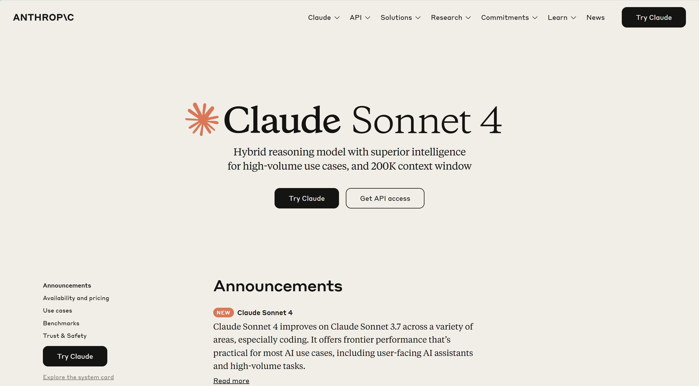

# 🤩AI工具推荐（日常向）

> Author/Editor：S4kana

::: warning **😡观前提醒**

本篇文章聚焦AI工具的实用性/趣味性进行推荐，即便是不完全以AI为主体的软件我们也会进行推荐。

作为推荐，我不会详细介绍该工具的用法，只会大致介绍工具的功能，剩下的交给你自己探索。

注意，本篇仅为综合各大评测网站的介绍，并且个人性质极强的推荐，很大程度上取决于我的个人习惯。

所以，请大家不要轻信本篇的评分，在体验过之后再进行自主选择，只有适合自己的才是最好的！
:::

## 一、大语言模型

> 参考内容：[模型横评](https://github.com/jeinlee1991/chinese-llm-benchmark?tab=readme-ov-file#1%E7%BB%BC%E5%90%88%E8%83%BD%E5%8A%9B%E6%8E%92%E8%A1%8C%E6%A6%9C)

笔者很早之前就想写一篇有关于大语言模型的横评报告了，特别是对国内一部分大语言模型的总结。但是我自己使用大模型的频率也不高，又鉴于不同的大模型擅长的领域各不相同，而笔者又一直只在一些日常生活中会偶尔使用大模型，也没钱去体验什么会员模型，推荐均为免费产品，所以评分结果多少失真，多多担待。

### 国内大模型

先说结论，在专业评测环境（中文环境）下，智谱清言的**GLM-4**与**文心一言4.0**位于国内顶尖水平，第二梯队由**通义千问2.5**和**讯飞星火v3.5**组成。

而在实际使用环境下，**通义千问**手感最佳，总体来说属于**大杯偏上**，智谱清言和讯飞星火时常犯蠢所以归于**中杯偏上**，文心一言属于**中杯偏下**。

#### 1. 通义千问

> **记忆能力**：⭐⭐⭐⭐  |  **日常使用**：⭐⭐⭐⭐  |  **美观程度**：⭐⭐⭐  
>
> **推荐度**：⭐⭐⭐⭐  

虽然通义的模型能力在排行中中规中矩，但我用完一圈下来还是坚定的选择了通义千问。

页面干净，分类完整，作为对话的主体框最大，没有很多余的功能键，也没有经常一闪一闪的会员弹窗。

而作为一个大模型，它的多模态能力绝对是我用过的国内模型中最好的。同样是识别一张图片，它能很清晰的提取出一张图片中的文字并整理好格式输出。而其他大部分模型就很难做到，要么就是格式烂成一坨，要么就是根本看不出我到底想干什么，开始答非所问。

对于日常生活学习中的一些简单问题也都能比较完善的解决！它的上下文能力实在是值得信赖，其他的大模型经常是我话讲到一半就听不懂我在说啥，在那里自说自话了，至少通义能在十轮以内的对话中记得我最开始交给它的要求！

通义本身自带的功能也比较多，大家可以根据兴趣自行体验。

总而言之，你要是还没有很趁手的国内大模型，就选它吧，至少不会让你失望。

#### 2. 智谱清言

> **记忆能力**：⭐⭐  |  **日常使用**：⭐⭐⭐  |  **美观程度**：⭐⭐⭐⭐
>
> **推荐度**：⭐⭐⭐

智谱清言，总体来说还算是不错的大模型平台。页面也很干净，蓝白色的配色也很朴素好看。

但我们的推荐程度并不高。在之前的使用中，我能很明显的感觉到：它的记性好像不太好，上一秒说的话下一秒就忘了，而且时常会犯蠢。

#### 3. 文心一言

> **记忆能力**：⭐⭐  |  **日常使用**：⭐⭐  |  **美观程度**：⭐⭐
>
> **推荐度**：⭐⭐  

我个人总是不太喜欢百度的产品，特别是百度网盘，铺天盖地的会员广告往你脸上怼，文心的界面似乎也继承了一些这样的特性，感觉有点不舒服。

而且虽然你家4.0性能强，但是要会员啊！登陆后免费使用的目前只有3.5的版本，性能直接滑了一个档。日常使用方面，大家的一致评价是——蠢的不行，这里不太推荐。

#### 4. 讯飞星火

> **记忆能力**：⭐⭐  |  **日常使用**：⭐⭐⭐  |  **美观程度**：⭐⭐⭐
>
> **推荐度**：⭐⭐⭐

页面有种一板一眼的感觉，聊天框也有点挤挤的，不过总体来说还算不错吧。

也是时常会犯蠢，和智谱的感受差不太多，不过星火有免费的**几百万token的api**送，实在是无比慷慨！感兴趣的同学可以试一下。

### 国外大模型

#### ChatGPT

**ChatGPT**毫无疑问是最成熟的大模型平台，推荐所有可以使用GPT的同学。

**Bing AI**，在我还没有GPT账号的日子里陪伴了我很长一段时光，它的优势在于可以借助浏览器搜索，提取其中的重要信息，不过缺点就是——它的地区判定条件很迷，经常要反复更换Edge地区或是反复登录Microsoft账号。

听说**Google Gemini**的风评也还不错，我没有实际使用过，感兴趣的同学可以去试试。

::: tip **🤔这些大模型应该如何使用？**

在大模型应用愈加完善的今天，大模型能实现的功能大多不再局限于语言，也包括图片、语音等多个方面。对于多模态的附加功能，我建议大家自己去进行探索；而对于基础的大模型对话教程，在下一篇文章中就会介绍。

:::

## 二、编程

有关于编程方面的AI插件，基本是基于编辑器的插件，他们的功能如下：

1. 在你编写代码的过程中，编程AI会猜测你的下一步代码可能是什么，并在你需要时帮你补齐。
2. 在编辑器中内置一个可以交流的编程特化的Chat AI，你可以询问他一些有关于编程方面的问题。
3. 内置一些特殊功能，例如：编写测试函数，新增注释，修改格式，根据需求修改部分代码等等。

国外比较热门的AI编程插件：Github Copilot，功能齐全，性能也更好；

国内的通义灵码/CodeGeex效果也还不错，不过对于稍长一些的复杂代码补全效果有些不尽人意，加注释或是问题的回复还是可以轻松应付的。

::: tip **🤔我在什么情况下使用这些插件比较好？**

如果你还在学习代码的过程中，不要使用这些插件，这和你写作业的时候直接把答案抄上去没有任何区别。

如果你再做一个很复杂，很庞大的项目，不要使用这些插件，你会明白的。

最好在你对代码已经比较熟悉的情况下，做一个中小型的项目，将AI编程插件作为一个辅助，绝对是极好的选择，不过这些插件的代码预测也时常不尽人意，是否使用它全都取决于你。

:::

以下是推荐的模型：

### Claude Code

ai编程的第一梯队，拥有上下文功能，支持多种数据输入

缺点：token很贵（可以使用trae白嫖，但是排队要很久）模型链接<https://claude.ai>

ai并不是代替你编程，而是助力想法变为现实。有句话说得很好：

**人类负责思考和决策，ai负责执行和试错**

下指令->ai编码->运行->报告错误->ai修复 的循环，是进行的主轴。一位开发者Indragie使用Claude Code完成近95%的“Context”APP开发工作，详情可看链接[I Shipped a macOS App Built Entirely by Claude Code | Indragie Karunaratne](https://www.indragie.com/blog/i-shipped-a-macos-app-built-entirely-by-claude-code)

ai日益强大的编程能力让我们不禁发问：

**ai会代替码农吗？**

对此，笔者借用Kent Beck的观点

> "90% of my skills just went to zero dollars and 10% of my skills went up 1000x.`[...]`Having a vision, being able to set milestones towards that vision, keep track of a design to maintain levels or control the levels of complexity as you go forward; those are hugely leveraged skills now compared to 'I know where to put the ampersands and the stars and the brackets in Rust'".- Kent Beck
>
> “我 90%的技能变得一文不值，而10%的技能提升了1000倍。拥有远见，能够为这个远见设定里程碑，跟踪设计以保持水平或控制复杂性；这些技能现在被极大地杠杆化了，相比名下的是‘我知道如何在Rust中放置与号、星号和括号'"。—肯特·贝克

程序员的价值正在从“如何写（how）”，转移到“写什么（what）”和“为何写（why）”。

所以，真正的问题不是“AI 会替代我吗？”，也不是“我该去学哪门新语言？”

而是：你那 10% 不可替代的价值，究竟是什么？你将如何使用 AI，将它放大 1000 倍？

## 三、PPT制作

### [Gamma](https://gamma.app/)

> **推荐度**：⭐⭐⭐⭐  

算是目前知名度最高的PPT制作AI产品，使用需要花费积分，不过积分有免费获取的渠道，算是半免费吧。

Gamma的主要功能是利用AI帮助用户快速创建和设计演示文稿，也就是说——制作出来的成果很大程度上是不能拿来直接使用的（如果你的要求真的很低），但是能有一个基础的框架，PPT的打磨也能轻松许多。

#### 🤔AI-PPT的制作流程（以Gamma为例）

**1. 拟定大纲目录**

- 一般来说，你不可能直接把一个宽泛的主题喂给Gamma，并期望它给你吐出什么好东西来。在使用AI插件之前，你至少需要明确PPT的主题，并写好一份有关主题的大纲，告诉Gamma你想要放哪些重点在PPT中，再让Gamma为你生成一个大致的框架。

- 当然了，Gamma也支持一行提示生成PPT，你可以在对于要做什么完全没主意的时候使用这个功能，一切取决于你！

**2. 大致调整**

点击生成后，一套基础的PPT很快就能生成出来。Gamma右侧准备了大量功能键供你挑选，具体的使用就自己去体验吧。

**3. 本地打磨页面**

如果你认为Gamma生成的页面已经满足了自己的需求，这一步就可以直接跳过了。

将PPT导出到本地，再对其进行修改。通过使用Gamma，制作PPT绝对比你从头开始手搓要轻松得多！

### MindShow/讯飞智文

> **推荐度**：未知  

国内的PPT制作都是需要会员的，只能看不能下载，所以笔者都没没试过。

讯飞智文看起来便宜一些，可以按单次计费，效果也好一些，感兴趣可以去看一看哦。

### 通义千问

**推荐度**：⭐⭐⭐⭐

可免费生成ppt，自主选择合适的模板，但ppt的文字大小和素材分布仍需手动调整

## 四、翻译/总结

### [Trancy](https://trancy.org?referrer=660769f1657525505b3b1f71)

> **推荐度**：⭐⭐⭐⭐⭐  

我非常喜欢的一款网页翻译插件！因为它不仅仅是“帮助你翻译”，而是真的可以“教会你翻译”。

**Trancy**的**本体完全免费**。网页支持**对照翻译/替换翻译**。我最喜欢的是Trancy对于**英文视频的翻译处理**，分多个场景功能自由切换，遇到不会的生词点击就可以查询，一键收入单词库，简直不要太爽！

唯一的缺点是，有的时候一部分内嵌的英文翻译不到，不过也是瑕不掩瑜了。

### [bibigpt](https://bibigpt.co/r/wzAvzv)

> **推荐度**：⭐⭐⭐  

支持b站，抖音，油管视频总结，初始赠送免费时长。偶尔还是能有点用的，主要还是图一乐。

### Kimi

> **推荐度**：⭐⭐⭐  

我是从Kimi铺天盖地的广告认识到它的，整体使用效果其实一般，长文本论文的总结能力确实还行，但是总是卡我询问次数，当时读论文那段时间的使用让我无比难受；并且并不总是能抓到我想要的重点，导致我需要反复一遍遍的修改我的诉求。

UI做的挺好看的，我打四分，总体来说还是一款可以使用的产品。

### 论文相关

#### [ReadPaper](https://readpaper.com/new)

> **推荐度**：⭐⭐⭐⭐⭐  

论文知识图谱，pdf一键翻译，划词笔记，读论文的不二之选！

#### [秘塔](https://metaso.cn/)

> **推荐度**：⭐⭐⭐  

论文特化的AI搜索产品，时常会有奇效，但又时常不尽人意，不过点一点搜索一下又不亏，对吧？

## 五、ai音乐

### 1.Suno 4.5

真神登场，无需专业知识，任何人都可以使用Suno创作歌曲，在B站曾掀起一阵AI音乐的热潮。

因为它真的太方便了，只需要给它想要模仿的歌曲类型和大致歌词，或是用简单的自然语言描述，它就能唱出任何你想要的歌曲。

具体的使用方法铺天盖地都是教程，这里便不再赘述。

### 2.Mureka v7

个人使用感觉，人声方面除了高音有电流声，失真不太明显。粤语无法做到协音（ai音乐的通病了）**下载需要会员**

歌词能力较为逊色，建议使用Gemini写歌词，Mureka出歌。

## 六、ai视频生成（除Veo3，其余均为国内ai）

### Veo3

谷歌首款原生“音画同步”视频模型 Veo3 ，可以根据文字提示词，直接同时生成 视频+人物对话（支持多人）+ 音效的8 秒电影级短片

图生视频可以让照片动起来（成片品质受限于图片质量和其空间表达）~~~~很适合让你的oc动起来~~

获取途径：

1.  **Gemini**（谷歌的 AI 旗舰平台，功能包括对话、文本编辑器，深度研究、图片模型Imagen、视频模型Veo3） 支持中文版提示词   <https://gemini.google.com>

2. **Flow**  只能使用英文，不支持中文 <https://labs.google/fx/tools/flow>

上图为Veo3生成的视频截图

### 即梦

抖音旗下的图片视频工具，可以做各种风格化视频，个人使用频率最高的视频制作ai

网址 <https://jimeng.jianying.com>

### 可灵

高质量运动视频做得蛮不错，ai创意特效很好玩

相较于Veo，可灵的控制效果体验更好(图生视频)，但Veo视频的细节表现更好

网址：(<https://app.klingai.com/cn/>)

- 上述ai对于免费用户，每天都有一定的额度赠送，感兴趣可以注册尝试一下：）

## 七、ai绘图

### Canva

一款线上设计工具，内涵众多ppt、海报、profile等设计素材·，支持文生图，可以选择不同风格，但需要点数（初始注册会赠点数）

在一个**统一的对话式 AI 界面**中起草社交媒体帖子、演示文稿、文档和原型。AI 可以帮你完成 80% 的工作，而剩下的“最后一英里”——比如调整文本、更改颜色、上传特定图片等——则可以依靠 Canva 的其他强大功能来精准完善。

### 即梦

详见板块六，强推海报生成功能！

### Flux

一款开源模型，目前最新版本为**FLUX.1 Krea [dev]**（截至25.8.1）

模型地址： <https://huggingface.co/black-forest-labs/FLUX.1-Krea-dev>

支持在ComfyUI上使用，也可以在huggingface上体验 <https://huggingface.co/spaces/black-forest-labs/FLUX.1-Krea-dev>

适合生成照片级写实，like

也可以在网站上体验

获取地址： <https://flux-ai.io/cn/>

网站： <https://flux-ai.io/cn/>

你可以在[WaytoAGI](https://www.waytoagi.com/)中获得更多AI相关产品的详细推荐！
