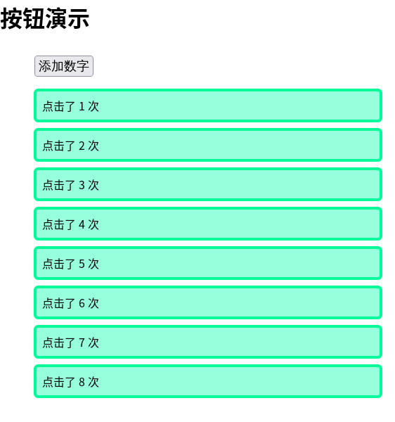
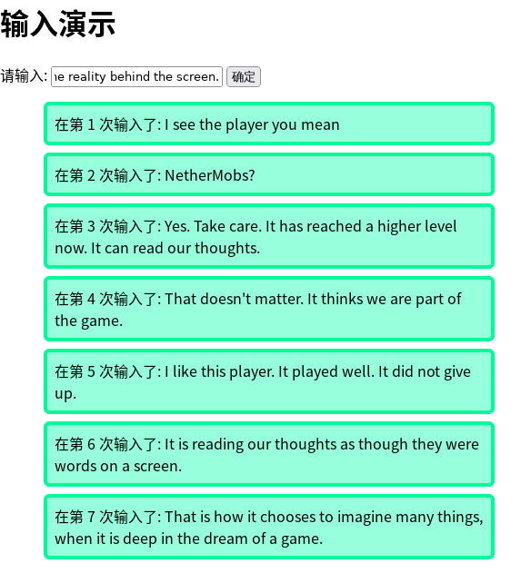

# 4.2.2.5 JS 速成: 继承、DOM API 和异步

恭喜你已经了解了 JS 的基本写法和常见容易踩坑的点了。要知道 JS 是一门特点鲜明的语言，优缺点都非常突出，因此需要谨慎驾驭。这边我们再介绍一些常用的用法。

## 继承

JS 的继承有三种写法。但是我们现在只选择 `class` 给大家介绍，为了避免混淆。因为 JS 的 class 写法可以避免非常多的 JS 的本身设计缺陷导致的一系列匪夷所思的问题。如果你看到类似这样的函数：

``` js
function Person(name) {
  this.name = name;
}
let foo = new Person("Nick");
```

请不要使用这种构造器函数，而应该使用 `class` 来避免出现**忘记写 `new` 关键字**导致函数中的 `this` 被绑定到**全局对象**上面！这样会导致**严重的，恶性的，极其难以排查的隐性 bug**。

使用 `class` 来避免这样的错误:

``` js
class Person {
    constructor(name) {
        this.name = name;
    }
}
let foo = new Person("Nick");
```

具体的介绍内容，请阅读下列教程学习:

- [面向对象编程基本概念](https://developer.mozilla.org/zh-CN/docs/Learn/JavaScript/Objects/Object-oriented_programming)
- [MDN: JavaScript 中的类](https://developer.mozilla.org/zh-CN/docs/Learn/JavaScript/Objects/Classes_in_JavaScript)

## 闭包和 this

JS 的函数可以在函数中声明函数，而且极其常见——我们马上会在事件中用到。一般来说你会使用类似这样的代码：

``` js
function addSquares(a, b) {
  function square(x) {
    return x * x;
  }
  return square(a) + square(b);
}

console.log(addSquares(2, 3)); // 13
console.log(addSquares(4, 5)); // 41
```

你甚至可以将内部函数作为返回值，而且这种做法还比较常见。具体可以查阅 [MDN: 函数#嵌套函数和闭包](https://developer.mozilla.org/zh-CN/docs/Web/JavaScript/Guide/Functions#%E5%B5%8C%E5%A5%97%E5%87%BD%E6%95%B0%E5%92%8C%E9%97%AD%E5%8C%85) 来学习。

另外，JS 的 this 在这种嵌套函数中存在极其严重的设计缺陷。我的建议是始终在**类**和**箭头函数**（长这样 `() => { some codes... }`, 箭头函数会把 this 绑定到自己的本身的作用域，是一种符合直觉的行为）当中使用 this, 其他地方可以不使用就不使用。如果你碰到不得不使用的场合，请阅读：

- [MDN: this](https://developer.mozilla.org/zh-CN/docs/Web/JavaScript/Reference/Operators/this)

## JSON

JSON 非常有用！**一定要了解**！请参考这里 [MDN: 使用 JSON](https://developer.mozilla.org/zh-CN/docs/Learn/JavaScript/Objects/JSON)，引用介绍如下。

> JavaScript 对象表示法（JSON）是用于将结构化数据表示为 JavaScript 对象的标准格式，通常用于在网站上表示和传输数据（例如从服务器向客户端发送一些数据，因此可以将其显示在网页上）。你会经常遇到它，所以在本文中，我们向你提供使用 JavaScript 处理 JSON 的所有工作，包括访问 JSON 对象中的数据项并编写自己的 JSON。

## DOM API

这里我们用到了浏览器的 DOM API。我会简单介绍其中的功能，讲如何选择一个元素，修改它的信息，并且监听其中的事件。

在 HTML 当中 `</body>` 之前（就是 `<body></body>` 结尾的地方）加入这样一行:

``` html
<script src="script.js"></script>
```

在同目录下新建一个 script.js，然后开始你的表演。

### 选中元素

要想对一个元素进行操作，我们要先选中它们，这样可以得到一个 JS 对象，对这个对象进行操作就可以操作 HTML 中对应的元素。操作 `document` 对象，使用 `querySelector()` 方法选中你想要的元素。这个方法使用一个 CSS 选择器来筛选元素。

比如我们使用这个代码可以选中页面中第一个 `a` 元素，并且创建一个引用：

``` js
let link = Document.querySelector('a');
```

现在你可以通过 link 对象操作 HTML 当中被选中的元素，比如修改它的文本：

``` js
link.textContent = 'Mozilla Developer Network';
```

或者修改指向的链接：

``` js
link.href = 'https://developer.mozilla.org';
```

这个 a 元素立即发生了变化，不用去刷新页面就能看到。

这是对单个元素的做法。如果想对多个元素进行匹配和操作，你可以使用 `document.querySelectorAll()`，这个方法匹配文档中每个匹配选择器的元素，并把它们的引用存储在一个数组中，你就可以用一个 `for` 循环进行操作了。

### 添加元素

让我们进一步看看我们可以怎样来创建新的元素。

<ol>
 <li>回到当前的例子，我们先获取到 <code>section</code> 元素的引用 — 在已有script中添加下列代码（其他代码也同样处理）：
  
  ``` js
  let sect = document.querySelector('section');
  ```
  
   </li>
 <li>现在用 <code>Document.createElement()</code> 创建一个新的段落，用与之前相同的方法赋予相同的文本：

  ``` js
  let para = document.createElement('p');
  para.textContent = 'We hope you enjoyed the ride.';
  ```
  
 </li>
 <li>现在可以用 <code>Node.appendChild()</code>方法在后面追加新的段落：

  ``` js
  sect.appendChild(para);
  ```

 </li>
 <li>最后，在内部链接的段落中添加文本节点，完美的结束句子。首先我们要使用<code>Document.createTextNode()</code>创建一个文本节点：

  ``` js
  let text = document.createTextNode(' — the premier source for web development knowledge.');
  ```

 </li>
 <li>
 现在获取内部连接的段落的引用，并把文本节点绑定到这个节点上：

  ``` js
  let linkPara = document.querySelector('p');
  linkPara.appendChild(text);
  ```

 </li>
</ol>

现在 HTML 当中的 `section` 部分变成了这样：

``` html
<section>
  
  <p>Here we will add a link to the <a href="https://developer.mozilla.org">Mozilla Developer Network</a></p>
  <p>We hope you enjoyed the ride.</p> — the premier source for web development knowledge.
</section>
```

你看到的内容应该是这样(图片省略了)：

> Here we will add a link to the [Mozilla Developer Network](https://developer.mozilla.org/)
>
> We hope you enjoyed the ride.
>
> — the premier source for web development knowledge.

### 移动和删除元素

<p>也许有时候你想移动或从DOM中删除节点，这是完全可能的。</p>

<p>如果你想把具有内部链接的段落移到sectioin的底部，简单的做法是：</p>

``` js
sect.appendChild(linkPara);
```

<p>这样可以把段落下移到section的底部。你可能想过要做第二个副本，但是情况并非如此 — <code>linkPara</code>是指向该段落唯一副本的引用。如果你想做一个副本并也把它添加进去，只能用 <code>Node.cloneNode()</code> 方法来替代。</p>

<p>删除节点也非常的简单，至少，你拥有要删除的节点和其父节点的引用。在当前情况下，我们只要使用 <code>Node.removeChild()</code> 即可，如下：</p>

``` js
sect.removeChild(linkPara);
```

<p>要删除一个仅基于自身引用的节点可能稍微有点复杂，这也是很常见的。没有方法会告诉节点删除自己，所以你必须像下面这样操作。</p>

``` js
linkPara.parentNode.removeChild(linkPara);
```

<p>把上述代码行加到你的代码中去</p>

### 元素样式

你可以使用 JS 操作 CSS。

第一种方法是直接在想要动态设置样式的元素内部添加内联样式。这是用 `HTMLElement.style` 属性来实现。这个属性包含了文档中每个元素的内联样式信息。你可以设置这个对象的属性直接修改元素样式。假设我们现在创建了一个 para 元素：

``` js
let para = document.createElement('p');
para.textContent = "We hope you enjoyed the ride.";

para.style.color = 'white';
para.style.backgroundColor = 'black';
para.style.padding = '10px';
para.style.width = '250px';
para.style.textAlign = 'center';
```

这对应的 HTML 是这样的：

``` html
<p style="color: white; background-color: black; padding: 10px; width: 250px; text-align: center;">We hope you enjoyed the ride.</p>
```

现在你可以看到这和普通的 CSS 是差不多的。不同在于 CSS 样式的 JS 属性版本以小驼峰式命名法书写，而 CSS 版本带连接符号（backgroundColor 对应 background-color）。

现在我们来看看另一个操作文档样式的常用方法。

<ol>
 <li>删除之前添加到 JavaScript 中的五行代码。</li>
 <li>在HTML的 <code>head</code> 中添加下列代码（外链的 CSS 同理） :<br>

  ``` css
  .highlight {
    color: white;
    background-color: black;
    padding: 10px;
    width: 250px;
    text-align: center;
  }
  ```

 </li>
 <li>现在我们改为使用HTML操作的常用方法 — <code>Element.setAttribute()</code> — 这里有两个参数，你想在元素上设置的属性，你要为它设置的值。在这种情况下，我们在段落中设置类名为 highlight ：
  
  ``` js
  para.setAttribute('class', 'highlight');
  ```

 </li>
 <li>刷新页面，看不到改变 — CSS 仍然应用到段落，但是这次给出CSS规则选择的类不是内联CSS样式。</li>
</ol>

这其实就是给元素更改了一个类，然后对应的规则就理所当然地加上了。

## 元素操作

### 事件

有一些特殊的元素会引发**事件(Event)**，比如 HTML 当中的按钮(`button`)在被点击的时候就会有 'click' 事件被引发。

可以把相应的函数和事件进行绑定，这样这个事件引发的时候就可以调用相应的函数来处理。比如我们可以做个按一下按钮就在列表中添加一个元素的网页。

有关事件我们有更详细的教程，感兴趣可以自己去看： <https://developer.mozilla.org/zh-CN/docs/Learn/JavaScript/Building_blocks/Events>

我们先使用 `document.querySelector()` 来选中对应的 `button` 元素，然后使用这个元素的 `addEventListener()` 方法来绑定事件和对应的函数。比如我们要在点击页面中第一个按钮的时候在控制台输出 "Clicked button." 消息：

``` js
let button = document.querySelector('button');
// 第一个参数是事件类型，第二个参数是这个事件发生后执行的函数。函数可以现场定义一个，就像这样
button.addEventListener('click', () => {
    console.log("Clicked button.");
});
```

看看这个例子

index.html

``` html
<!DOCTYPE html>
<html>
  <head>
    <meta charset="utf-8">
    <title>按钮演示</title>
    <link rel="stylesheet" href="demo.css">
  </head>
  <body>
    <h1>按钮演示</h1>
    <!-- 元素会被加在 ul 当中 -->
    <ul class="place">
      <button class="addnum">添加数字</button>
    </ul>

    <script src="button.js"></script>
  </body>
</html>
```

demo.css

``` css
html {
    font-family: sans-serif;
}
ul {
    width: 32em;
    list-style-type: none;
}
li {
    border: 0.3em solid rgb(0, 250,154);
    background-color: rgba(127, 255, 212, 0.8);
    padding: 0.5em;
    margin: 0.5em;
    border-radius: 0.4em;
}
.addnum {
    margin: 0.5em;
    font-size: large;
}
```

button.js

``` js
// 用来存放自己的全局变量
let myAPP = {
    cnt: 0,
    ul: document.querySelector('.place'),
    button: document.querySelector('.addnum')
};
// 这里的 () => 是箭头函数，和 function () 的匿名函数类似，更短一点
myAPP.button.addEventListener('click', () => {
    let li = document.createElement('li');
    myAPP.cnt += 1;
    li.textContent = "点击了 " + myAPP.cnt + " 次";
    myAPP.ul.appendChild(li);
}); // 注意这里几个嵌套的括号
```

点了几次之后是这样子的：



### 输入

我们可能还需要从一些输入框(表单当中的 `<input>` 不见)当中获取输入。现在我们有另一个 HTML，我们将会在每次点击按钮的时候把输入框里面的数据写到列表里面。这个 HTML 的 css 部分和原来的相同，就不再重复列出了。

这里仅仅使用了表单当中的 `input` 和 `label` 部件。

label 是一个文本，一般用来说明下面的 input 是干什么的。for 属性里面是一个 id 表明是给对应 id 的 input 元素的 label。

input 有个 `type` 属性，可以指定这个部件的类型。比如 `text` 值表明这是个文本框，可以进行输入。而 `submit` 就成了一个按钮。

在 JS 当中，文本框有个 `value` 属性，值就是文本框当中输入的值。你也可以用给这个值赋值的方式来覆盖掉原来的值。

完整的指南可以查看<https://developer.mozilla.org/zh-CN/docs/Learn/Forms>。

index.html

``` html
<!DOCTYPE html>
<html lang="en">
<head>
    <meta charset="UTF-8">
    <title>输入实例</title>
    <link rel="stylesheet" href="demo.css">
</head>
<body>
    <h1>输入演示</h1>
    <div class="form">
        <label for="inputField">请输入: </label>
        <input type="text" id="inputField" class="inputField">
        <input type="submit" value="确定" class="inputSubmit">
    </div>
    <ul class="place">
    </ul>
    
    <script src="input.js"></script>
</body>
</html>
```

input.js

``` js
let myAPP = {
    // 这是文本框在 JS 当中的引用
    inputField: document.querySelector('.inputField'),
    // 这是那个按钮
    inputSubmit: document.querySelector('.inputSubmit'),
    ul: document.querySelector('.place'),
    cnt: 0,
};

myAPP.inputSubmit.addEventListener('click', () => {
    // 获取当前输入值
    let text = myAPP.inputField.value;
    // 清空当前输入（就是赋值一个空的字符串）
    myAPP.inputField.value = '';
    let li = document.createElement('li');
    myAPP.cnt += 1;
    li.textContent = "在第 " + myAPP.cnt + " 次输入了: " + text;
    myAPP.ul.appendChild(li);
});
```

输入了一些内容之后：



## 异步和网络

JS 当中异步也非常重要。异步请求最常用的地方就是网络请求。我们接下来几篇 MDN 的教程将会提到。第一篇使用 fetch API, 第二三篇介绍 Promise 的使用：

- [MDN: 从服务器获取数据](https://developer.mozilla.org/zh-CN/docs/Learn/JavaScript/Client-side_web_APIs/Fetching_data)
- [MDN: 如何使用 Promise](https://developer.mozilla.org/zh-CN/docs/Learn/JavaScript/Asynchronous/Promises)
- [MDN: 如何实现基于 Promise 的 API](https://developer.mozilla.org/zh-CN/docs/Learn/JavaScript/Asynchronous/Implementing_a_promise-based_API)

## 模块

模块可以使得项目更加有逻辑性。我们建议在较大的项目上面使用模块来管理各个部分的逻辑。而且不管你愿意还是不愿意，接下来写现代前端都离不开模块，这是**必须掌握**的，哪怕是为了用别人的代码。

<https://developer.mozilla.org/zh-CN/docs/Web/JavaScript/Guide/Modules>
