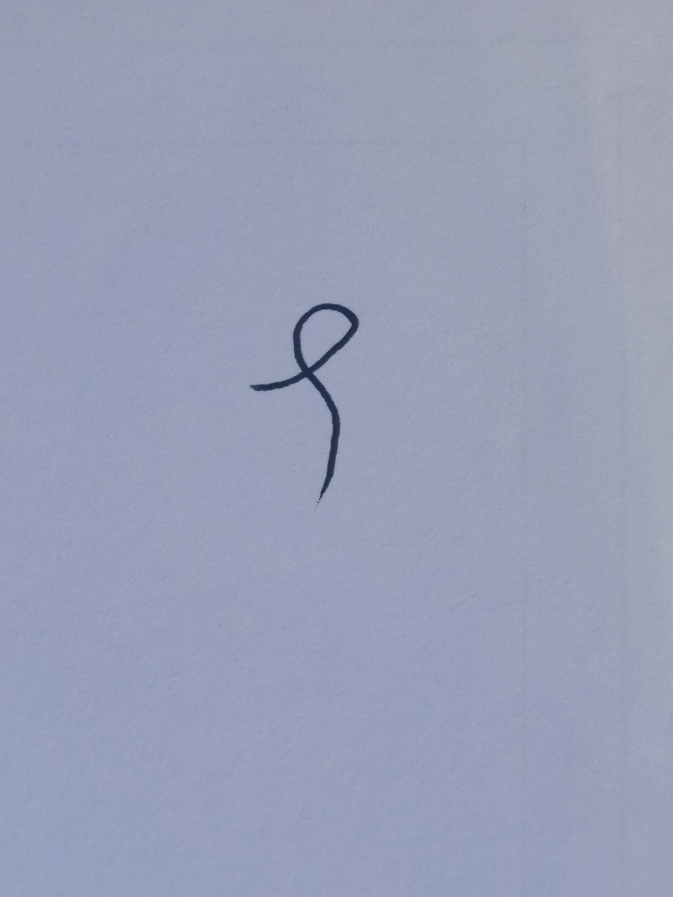
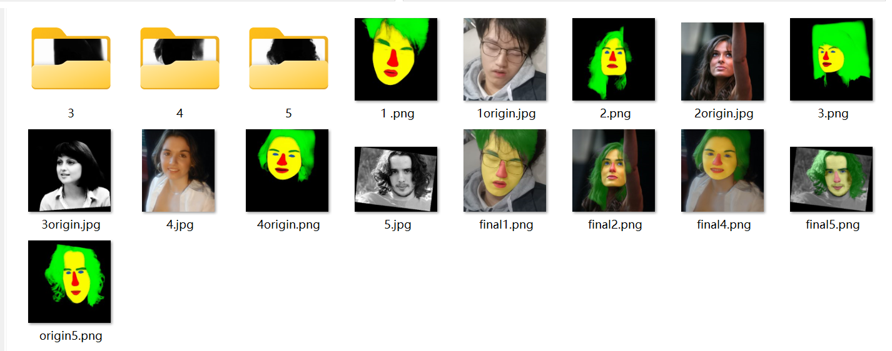

# 还要学更多？

# Try it yourself！

你已经基本了解现代 CV 的理论架构了，你可以尝试写一些自己的网络来锻炼你的 coding 能力并且切身体会这些技术的效果

- 你可以先行尝试一下怎么把在 MNIST 上训练的网络真正投入应用，比如识别一张你自己用黑笔写的数字~

- 比如你可以尝试训练一个网络来实现人体五官分割（笔者之前就玩过这个）数据集采用 [helen 数据集](https://pages.cs.wisc.edu/~lizhang/projects/face-parsing/)，关于数据集的架构你可以搜一搜，自己设计一个 Dataloader 和 YourModle 来实现前言中的五官分割效果（真的很有乐子 hhh）

- 当然你也可以尝试一些自己感兴趣的小任务来锻炼工程能力~

# Reading more！

我会在这里列举一些时间较近的优秀工作：

首先必然是 [Transformer](https://gw9u39xwqi.feishu.cn/wiki/wikcnPNyq3BTIYKT6LFlViyTzNe) 和它的改进工作，其次你最好找到自己最感兴趣的小方向：就比如 NeRF~。具体的小方向你可以自己寻找相关论文，如果找不到，也欢迎你与 SRT 社团交流~
