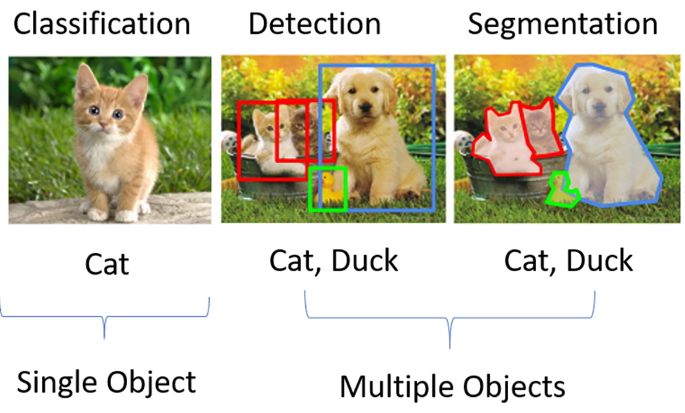
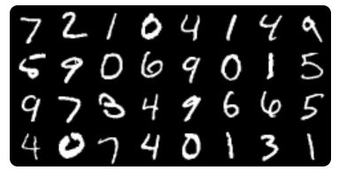
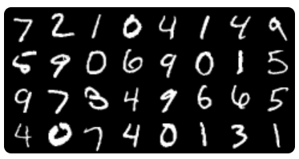

# 其他功能

Torchvision 除了帮我们封装好了常用的数据集，还为我们提供了深度学习中各种经典的网络结构以及训练好的模型，只要直接将这些经典模型的类实例化出来，就可以进行训练或使用了。我们可以利用这些训练好的模型来实现图片分类、物体检测、视频分类等一系列应用。

# 常见网络模型

Torchvision 中的各种经典网络结构以及训练好的模型，都放在了 torchvision.models 模块中，下面我们来看一看 torchvision.models 具体为我们提供了什么支持，以及这些功能如何使用。

## torchvision.models 模块

torchvision.models 模块中包含了常见网络模型结构的定义，这些网络模型可以解决以下四大类问题：图像分类、图像分割、物体检测和视频分类。图像分类、物体检测与图像分割的示意图如下图所示。



图像分类，指的是单纯把一张图片判断为某一类，例如将上图左侧第一张判断为 cat。目标检测则是说，首先检测出物体的位置，还要识别出对应物体的类别。如上图中间的那张图，不仅仅要找到猫、鸭子、狗的位置，还有给出给定物体的类别信息。图里最右侧的例子表示的是分割。分割即是对图像中每一个像素点进行分类，确定每个点的类别，从而进行区域划分。

在早期的 Torchvision 版本中，torchvision.models 模块中只包含了图片分类中的一部分网络，例如 AlexNet、VGG 系列、ResNet 系列、Inception 系列等。到了现在，随着深度学习技术的不断发展，人工智能应用更为广泛，torchvision.models 模块中所封装的网络模型也在不断丰富。比如在当前版本（v0.10.0）的 Torchvision 中，新增了图像语义分割、物体检测和视频分类的相关网络，并且在图像分类中也新增了 GoogLeNet、ShuffleNet 以及可以使用于移动端的 MobileNet 系列。这些新模型，都能让我们站在巨人的肩膀上看世界。

### 实例化一个 GoogLeNet 网络

如果我们直接把一个网络模型的类实例化，就会得到一个网络模型。而这个网络模型的类可以是我们自己定义的结构，也可以是按照经典模型的论文设计出来的结构。其实你自己按照经典模型的论文写一个类，然后实例化一下，这和从 Torchvision 中直接实例化一个网络效果是相同的。

下面我们就以 GoogLeNet 网络为例，来说说如何使用 torchvision.models 模块实例化一个网络。

GoogLeNet 是 Google 推出的基于 Inception 模块的深度神经网络模型。GoogLeNet 获得了 2014 年的 ImageNet 竞赛的冠军，并且相比之前的 AlexNet、VGG 等结构能更高效地利用计算资源。GoogLeNet 也被称为 Inception V1，在随后的两年中它一直在改进，形成了 Inception V2、Inception V3 等多个版本。

我们可以使用随机初始化的权重，创建一个 GoogLeNet 模型，具体代码如下：

```
import torchvision.models as models
googlenet = models.googlenet()
```

这时候的 GoogLeNet 模型，相当于只有一个实例化好的网络结构，里面的参数都是随机初始化的，需要经过训练之后才能使用，并不能直接用于预测。

torchvision.models 模块除了包含了定义好的网络结构，还为我们提供了预训练好的模型，我们可以直接导入训练好的模型来使用。导入预训练好的模型的代码如下：

```
import torchvision.models as models
googlenet = models.googlenet(pretrained=True)
```

可以看出，我们只是在实例化的时候，引入了一个参数“pretrained=True”，即可获得预训练好的模型，因为所有的工作 torchvision.models 模块都已经帮我们封装好了，用起来很方便。torchvision.models 模块中所有预训练好的模型，都是在 ImageNet 数据集上训练的，它们都是由 PyTorch 的 torch.utils.model_zoo 模块所提供的，并且我们可以通过参数  pretrained=True  来构造这些预训练模型。

如果之前没有加载过带预训练参数的网络，在实例化一个预训练好的模型时，模型的参数会被下载至缓存目录中，下载一次后不需要重复下载。这个缓存目录可以通过环境变量 TORCH_MODEL_ZOO 来指定。当然，你也可以把自己下载好的模型复制到指定路径中。

在实例化时，只需要修改网络的类名，即可做到举一反三。torchvision.models 模块中可实例化的全部模型详见这个[网页](https://pytorch.org/vision/stable/models.html)。

### 模型微调

完成了刚才的工作，你可能会疑惑，实例化了带预训练参数的网络有什么用呢？其实它除了可以直接用来做预测使用，还可以基于它做网络模型的微调，也就是“fine-tuning”。

那什么是“fine-tuning”呢？举个例子，假设你的老板给布置了一个有关于图片分类的任务，数据集是关于狗狗的图片，让你区分图片中狗的种类，例如金毛、柯基、边牧等等。

问题是数据集中狗的类别很多，但数据却不多。你发现从零开始训练一个图片分类模型，但这样模型效果很差，并且很容易过拟合。这种问题该如何解决呢？于是你想到了使用迁移学习(自行了解，这里不再赘述)，可以用已经在 ImageNet 数据集上训练好的模型来达成你的目的。

例如上面我们已经实例化的 GoogLeNet 模型，只需要使用我们自己的数据集，重新训练网络最后的分类层，即可得到区分狗种类的图片分类模型。这就是所谓的“fine-tuning”方法。模型微调，简单来说就是先在一个比较通用、宽泛的数据集上进行大量训练得出了一套参数，然后再使用这套预训练好的网络和参数，在自己的任务和数据集上进行训练。使用经过预训练的模型，要比使用随机初始化的模型训练<strong>效果更好，更容易收敛，并且训练速度更快</strong>，在小数据集上也能取得比较理想的效果。

那新的问题又来了，为什么模型微调如此有效呢？因为我们相信同样是处理图片分类任务的两个模型，网络的参数也具有某种相似性。因此，把一个已经训练得很好的模型参数迁移到另一个模型上，同样有效。即使两个模型的工作不完全相同，我们也可以在这套预训练参数的基础上，经过微调性质的训练，同样能取得不错的效果。

ImageNet 数据集共有 1000 个类别，而狗的种类远远达不到 1000 类。因此，加载了预训练好的模型之后，还需要根据你的具体问题对模型或数据进行一些调整，通常来说是调整输出类别的数量。

假设狗的种类一共为 10 类，那么我们自然需要将 GoogLeNet 模型的输出分类数也调整为 10。对预训练模型进行调整对代码如下：

```
import torch
import torchvision.models as models

# 加载预训练模型
googlenet = models.googlenet(pretrained=True)

# 提取分类层的输入参数
fc_in_features = googlenet.fc.in_features
print("fc_in_features:", fc_in_features)

# 查看分类层的输出参数
fc_out_features = googlenet.fc.out_features
print("fc_out_features:", fc_out_features)

# 修改预训练模型的输出分类数，输入层保持不变，将输出层调整为10
googlenet.fc = torch.nn.Linear(fc_in_features, 10)
'''
输出：
fc_in_features: 1024
fc_out_features: 1000
'
```

首先，你需要加载预训练模型，然后提取预训练模型的分类层固定参数，最后修改预训练模型的输出分类数为 10。根据输出结果，我们可以看到预训练模型的原始输出分类数是 1000。

## 其他常用函数

之前在 torchvision.transforms 中，我们学习了很多有关于图像处理的函数，Torchvision 还提供了几个常用的函数，make_grid 和 save_img，让我们依次来看一看它们又能实现哪些有趣的功能。

### make_grid

make_grid 的作用是将若干幅图像拼成在一个网格中，它的定义如下。

```
torchvision.utils.make_grid(tensor, nrow=8, padding=2)
```

定义中对应的几个参数含义如下：

- tensor：类型是 Tensor 或列表，如果输入类型是 Tensor，其形状应是 (B x C x H x W)；如果输入类型是列表，列表中元素应为相同大小的图片。
- nrow：表示一行放入的图片数量，默认为 8。
- padding：子图像与子图像之间的边框宽度，默认为 2 像素。

make_grid 函数主要用于展示数据集或模型输出的图像结果。我们以 MNIST 数据集为例，整合之前学习过的读取数据集以及图像变换的内容，来看一看 make_grid 函数的效果。

下面的程序利用 make_grid 函数，展示了 MNIST 的测试集中的 32 张图片：

```
import torchvision
from torchvision import datasets
from torchvision import transforms
from torch.utils.data import DataLoader

# 加载MNIST数据集
mnist_dataset = datasets.MNIST(root='./data',
                               train=False,
                               transform=transforms.ToTensor(),
                               target_transform=None,
                               download=True)
# 取32张图片的tensor
tensor_dataloader = DataLoader(dataset=mnist_dataset,
                               batch_size=32)
data_iter = iter(tensor_dataloader)
img_tensor, label_tensor = data_iter.next()
print(img_tensor.shape)
'''
输出：torch.Size([32, 1, 28, 28])
'''
# 将32张图片拼接在一个网格中
grid_tensor = torchvision.utils.make_grid(img_tensor, nrow=8, padding=2)
grid_img = transforms.ToPILImage()(grid_tensor)
display(grid_img)
```

结合代码我们可以看到，程序首先利用 torchvision.datasets 加载 MNIST 的测试集，然后利用 DataLoader 类的迭代器一次获取到 32 张图片的 Tensor，最后利用 make_grid 函数将 32 张图片拼接在了一幅图片中。



MNIST 的测试集中的 32 张图片，如下图所示，这里我要特别说明一下，因为 MNIST 的尺寸为 28x28，所以测试集里的手写数字图片像素都比较低，但这并不影响动手实践。

### save_img

一般来说，在保存模型输出的图片时，需要将 Tensor 类型的数据转化为图片类型才能进行保存，过程比较繁琐。Torchvision 提供了 save_image 函数，能够直接将 Tensor 保存为图片，即使 Tensor 数据在 CUDA 上，也会自动移到 CPU 中进行保存。

save_image 函数的定义如下：

```
torchvision.utils.save_image(tensor, fp, **kwargs)
```

这些参数也很好理解：

- tensor：类型是 Tensor 或列表，如果输入类型是 Tensor，直接将 Tensor 保存；如果输入类型是列表，则先调用 make_grid 函数生成一张图片的 Tensor，然后再保存。
- fp：保存图片的文件名；
- **kwargs：make_grid 函数中的 nrow 和 padding 两个参数。

我们接着上面的小例子，将 32 张图片的拼接图直接保存，代码如下：

```
# 输入为一张图片的tensor 直接保存
torchvision.utils.save_image(grid_tensor, 'grid.jpg')

# 输入为List 调用grid_img函数后保存
torchvision.utils.save_image(img_tensor, 'grid2.jpg', nrow=5, padding=2)
```

当输入为一张图片的 Tensor 时，直接保存，保存的图片如下所示。



当输入为 List 时，则会先调用 make_grid 函数，make_grid 函数的参数直接加在后面即可，代码中令 nrow=5，保存的图片如下所示。这时我们可以看到图片中，每行中有 5 个数字，最后一行不足的数字，已经自动填充了空图像。


torchvision.models 模块为我们提供了深度学习中各种经典的网络结构以及训练好的模型，我们不仅可以实例化一个随机初始化的网络模型，还可以实例化一个预训练好的网络模型。

模型微调可以让我们在自己的小数据集上快速训练模型，并取得比较理想的效果。但是我们需要根据具体问题对预训练模型或数据进行一些修改，你可以灵活调整输出类别的数量，或者调整输入图像的大小。

小任务：

请使用 torchvision.models 模块实例化一个 VGG 16 网络。

极客时间版权所有: [https://time.geekbang.org/column/article/431420](https://time.geekbang.org/column/article/431420)

(有删改)
