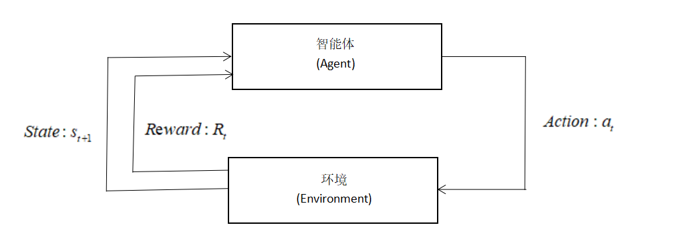

# 基本概念介绍
前面已经介绍过，强化学习难入坑的的原因之一就在于概念繁多。下面将进行基本概念的介绍，本章节最好能够理解，不理解也没有关系，但是建议作为参考章节常看常新。后续章节不理解某个概念时，便回来看看，相信一定能够做到常看常新、从而加深你对于概念的理解。下面将进行三个部分的介绍，分别为强化学习的基本过程、强化学习的基本要素、强化学习的目标。

## 强化学习的基本过程
前面已经介绍过强化学习的核心过程，在于智能体与环境进行交互，通过给出的奖励反馈作为信号学习的过程。简单地用图片表示如下：

正是在这个与环境的交互过程中，智能体不断得到反馈，目标就是尽可能地让环境反馈的奖励足够大。

## 强化学习的基本要素
为了便于理解，我们引入任天堂经典游戏——[新超级马里奥兄弟U](https://www.nintendoswitch.com.cn/new_super_mario_bros_u_deluxe/pc/index.html)，作为辅助理解的帮手。作为一个2D横向的闯关游戏，它的状态空间和动作空间无疑是简单的。

1.智能体(Agent):它与环境交互，可以观察到环境并且做出决策，然后反馈给环境。在马里奥游戏中，能操控的这个马里奥本体就是智能体。

2.环境(Environment):智能体存在并且与其交互的世界。新超级马里奥兄弟U本身，就是一个环境。

3.状态(State)：对环境当前所处环境的全部描述，记为 $S$。在马里奥游戏中，上面的这张图片就是在本时刻的状态。

4.动作(Action):智能体可以采取的行为，记为 $a$。在马里奥游戏中，马里奥能采取的动作只有：上、左、右三个。这属于**离散动作**，动作数量是有限的。而在机器人控制中，机器人能采取的动作是无限的，这属于**连续动作**。

5.策略(Policy):智能体采取动作的规则，分为**确定性策略**与**随机性策略**。确定性策略代表在相同的状态下，智能体所输出的动作是唯一的。而随机性策略哪怕是在相同的状态下，输出的动作也有可能不一样。这么说有点过于抽象了，那么请思考这个问题：在下面这张图的环境中，如果执行确定性策略会发生什么？(提示：着重关注两个灰色的格子)

因此，在强化学习中我们一般使用随机性策略。随机性策略通过引入一定的随机性，使环境能够被更好地探索。同时，如果策略固定——你的对手很容易能预测你的下一步动作并予以反击，这在博弈中是致命的。
随机性策略$\pi$定义如下：

$\pi(\mathrm{a} \mid \mathrm{s})=P(A=a \mid S=s)$

这代表着在给定状态s下，作出动作$a$的概率密度。举个例子，在马里奥游戏中，定义动作 $a_{1}$="left",$a_{2}$="right",$a_{3}$="down",动作空间 $a$={$a_{1}$,$a_{2}$,$a_{3}$}。 
其中，假设$\pi(\mathrm{a_{1}} \mid \mathrm{s})=0.7$，$\pi(\mathrm{a_{2}} \mid \mathrm{s})=0.2$，$\pi(\mathrm{a_{3}} \mid \mathrm{s})=0.1$。这就代表着，在给定状态s下，执行动作$a_{1}$的概率为0.7，执行动作$a_{2}$的概率为0.2，执行动作$a_{3}$的概率为0.1，智能体随机抽样，依据概率执行动作。也就是说，马里奥左、右、上三个动作都有可能被执行，无非是执行几率大不大的问题。很显然，在知道策略$\pi$的情况下，就可以指导智能体“打游戏”了，学习策略$\pi$是强化学习的最终目标之一，这种方法被称为**基于策略的强化学习**。

6.奖励(Reward):这是一种反馈信号，用于表现智能体与环境交互后"表现"如何。在不同的环境中，我们需要设置不同的奖励。比如，在围棋游戏中，最后赢得游戏才会获得一个奖励。比如在量化交易中，可以直接拿收益亏损作为奖励。拿我们的马里奥游戏举例，吃到金币可以获得较小的奖励，最终通关游戏会获得一个极大的奖励，这样使得智能体以通关为目标、以吃金币为锦上添花。当然了，如果碰到怪物或者是死亡，需要设置一个极大的负奖励，因为这将直接导致游戏结束。

7.状态转移(State transition):环境可不会在原地等你。在你操控马里奥执行一个动作后，比如"left"，那屏幕上显示的画面肯定会改变，这就发生了一个状态转移。状态转移函数记作

$p\left(s^{\prime} \mid s, a\right)=P\left(S^{\prime}=s^{\prime} \mid S=s, A=a\right)$

状态转移可以是固定的，也可以是随机的，我们通常讨论的是随机的情况。从公式的形式上也可以看出来，这还是一个概率密度函数。这代表着在观测到当前的状态$s$以及动作$a$后，状态转移函数输出新状态$s'$的概率，这个转移函数是只有环境、也就是游戏本身才知道的。比如在超级马里奥兄弟中，操控马里奥执行动作"left"后，敌人"板栗仔"可能向左也可能向右，比如说向左概率为0.8，向右概率为0.2，但是要注意这个概率只有游戏程序本身才知道。敌人动作的不确定性也就导致了环境的不确定性。

知道了上述几个概念，构建强化学习的基本过程就尽在掌握之中了。我们可以构建一个(state,action,reward)轨迹，即： 
i.观察到状态$s_{1}$ 
ii.执行动作$a_{1}$，发生状态转移 
iii.观察新状态$s_{2}$与得到奖励$r_{1}$ 
iv.执行动作$a_{2}$，发生状态转移 
v.不断迭代......

该序列轨迹写作：$\langle s_{1},a_{1},r_{1},s_{2},a_{2},r_{2},\ldots,s_{T},a_{T},r_{T} \rangle$
