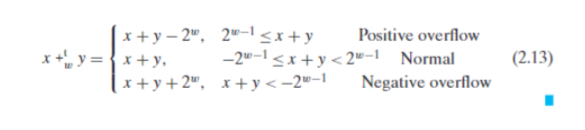

# Chapter 2：Representing and Manipulat

对于大多数人而言，十进制是最熟悉最常见的数制表示。然而，当科学步入了电气时代，无论是对于最早的纸袋介质再到现代的固态硬盘，有无打孔、高低电压，都天然的适合二进制表示，对新的数学体系的需求油然而生。

然而，出于寄存器大小的限制，计算机能表示的数是有限的，当你的运算结果超过运算上限时，会出现一些出人意料的结果，虽然很多结果时可以通过其体系下的规则解释的（具有一致性），但也会出现没有被定义的行为，简称 UB（Undefined Behavior）（不具有一致性）


一般而言，计算机并不能单独地访问某一位，所以一般以八位大小块字节（byts）作为最小寻址单位，即八位二进制数或两位十六进制数（开头带有 0x 来表示）学过 C 语言指针的同学应该知道，指针指向的是计算机中的虚拟地址。（不知道的话，你现在知道了）显然，虚拟地址也是用二进制表示的。不同类型的计算机有着不同的字（wod）的大小，虚拟地址是由字来表示的，也就是说字的大小决定了虚拟地址的范围。

::: tip 💡 思考题

- 对于 32 位系统与 64 位系统而言，求系统虚拟地址的范围。

:::

大多数 64 位计算机还可以运行编译用于 32 位计算机的程序，这是一种向后兼容性。在实际运用中这是相当好的性质，然而在之后的学习，这会为我们带来阻碍以及一些难以理喻的历史遗留因素。


已知 byts 是最小的寻址单元，一个数据可能占有多个 byts 组成的连续空间，那么在储存或访问这个数据时，我们有两种类型的方法一一大端序与小端序


大部分机器现在都采用小端序的方法，这种方法虽然较反直觉（实际上在之后针对数位的编程中，你需要注意小端序的存在）但是在效率上有着极大的优势，例如在处理大量小数据时，我们能节省许多时间。以及在小端序的方法下，64 位系统可以更方便地对 32 位系统向下兼容。在之后学习了寄存器相关知识后，你可以更好地理解这几点。

对同一数据以不同类型进行表示也有不同的结果，例如十进制数`12345`以 int 与 floa t 的编码方式表示


不难发现（我觉得其实挺难发现的）两种表示方式间存在一个很长的公共子串，这并不是巧合，我们将在之后的学习中探究原因。

C 语言中的字符串由一系列字符串组成，也就是连续分布的 ASCII 码,以`0x00(NULL)`结尾，也就是说，当你以调用字符串的形式访问错误的区域，会得到长度不定的乱码，如果字符串结尾的`0x00`没有得到正确的存放（越界了）也会导致对该字符串错误的访问，这可以解释很多对内存不当操作引发的“神秘现象”

上述这些例子都是对一些现象的描述，接下来让我们迈入数学的领域，基于二进制数的代数运算——布尔代数


早在现代计算机诞生之前，就有人在研究布尔代数，证实其能为各类电路服务，这段历史相当有趣，读者可以自行了解。
这些布尔运算同样适用于多位二进制数，例如


同时 C 语言提供了逻辑布尔运算，其结果只有 0 或 1（所有非 0 的结果皆为 1）


- `!`即逻辑运算中的`NOT`，运算数为 0 则 1，为非 0 则 0
- `&&`即逻辑运算中的`AND`，对运算数进行`&&`运算，为 0 则 0，非 0 则 1
- `||`即逻辑运算中的`OR`，对运算数进行`|`运算，为 0 则 0，非 0 则 1

同时 C 语言中的逻辑运算具有提前中断的性质，如第一个参数已经可以确定结果，则忽略第二个参数。例如：第一个参数为 0 时，`&&`的结果一定为 0；第一个参数为非 0 时，`||`的结果一定为 1。

通过该性质我们写出许多优美的代码，例如：

```c
int *p;
p = f_getptr();
(p != NULL && (*p) == 12345 );
(p == NULL || (*p) == 12345 );
```

这段代码永远不会因为解引用空指针而出错。

当然，忽视这个性质会带来灾难性的后果，例如被跳过的参数时一个函数，该函数具有不应该被跳过的功能性。

::: warning ⚠️ 注意

此处介绍的仅是 C 语言中的逻辑运算，不同语言的逻辑运算有着不同的逻辑与返回值，请勿想当然

:::

C 语言中的位移操作可谓十分操蛋，可谓是 UB 之父，万恶之源。在介绍其罪恶之前，我们先以数学的角度认识他们：

- 左移 k：去除 k 个高位，填充 k 个 0 到低位

- 逻辑右移 k：去除 k 个低位，填充 k 个 0 到高位

- 算数右移 k：去除 k 个低位，若原最高位为 1，填充 k 个 1 到高位，否则等同逻辑右移

抛开算数右移这奇怪的规则不谈，对于两种截然不同的位移方式，C 标准只给出了一种运算符号`>>`。

C 标准并没有明确规定什么类型对应什么样的右移，虽然对于大部分现代编译器而言，对有符号数使用算数右移，对无符号数使用逻辑右移。

在学习补码之后，我们会意识到算数右移的重要性。

在大量铺垫后，接下来才是本章核心内容的开始，这样的学习节奏贯穿全书，只能多计算机科学相关知识太多太杂了。


无符号数的表示很显然也很好理解，并且这样的数字表示方式是双射的，即每个表示范围内的数和以该表示方法能表示的所有数一一对应。

接下来让我们考虑有符号数字的表示，一个显而易见的方式是扣出一个位用于表示正负号，然而这种方法会为计算带来极大的不便。
为此，我们给出如下定义


即最高位代表的值取反，以此来表示负数


同样，有符号数的表示方法也满足双射的性质。

让我们从短小一点的例子开始发现有符号数和无符号数间的一些区别，以四位二进制数为例

对于无符号数而言 `[1111]=15` 是其能表示的最大数

然而对于无符号数而言 `[1111]=-1`

而 `[0111]=7` 才是其能表示的最大数

对于二者而言 `[0000]` 都是 0，但是 0 是无符号数能表示的最小数

对于有符号数 `[1000]=-8` 是其能表示的最小数

也就是说，有符号数的最大值与最小值的绝对值并不相同

因为二者都满足双射的性质，能表示的数字的个数是相同的

具体而言


::: tip 💡 思考题

假设符号位代表的是正号与负号，请以此为基础设计一套编码体系，为其设计加减乘的数学运算方式，你发现了什么，这说明了补码体系的哪些优点。

:::

像 C 语言这样的静态类型语言，强制类型转换及其带来的错误是不得不品尝的一环。

在 C 语言中无符号数转有符号数的过程中，位值并不会发生变化，只是解释值的方式发生了变化

`unsigned[1010]=10`

`signed[1010]=-6`

同样，在有符号数转无符号数的过程中，位值并不会发生变化，只是解释值的方式发生了变化

这意味着，数据类型只是解释二进制位值的一种方式，我们会在之后学习指针与结构体的本质中深入了解这一点

学完了相同大小的数字间的转换，下面则是不同大小间数字的转换方式

对于无符号数而言，这依旧是一个简单的问题

低位扩展至高位，只要添加相应数量前导零即可

高位截断至低位，只要舍去冗余部分的位值即可，从数学上来说，低位数的数值等于对高位数的数值取模


对于有符号数而言，情况变得有些复杂。

低位扩展至高位，添加前导 0 或者前导 1 取决于原数字符号位是否为，若是，则填前导 1

举例而言

`[1101]=-3`

`[00001101]=13`

`[11111101]=-3`

高位截断至低位时，仍然只要舍去冗余部分的位值即可，从数学上来说，则具有更复杂的性质

低位数的数值不一定等于对高位数的数值取模，但二者满足同余的关系

到这里，补码的麻烦可见一斑了，好处还没怎么看到，麻烦倒是一堆，C 语言中显式或隐式的类型转换常常带来灾难性的后果，例如：

```c{2,5}
//正确
(strlen(str1)<strlen(str2));

//错误，无符号数与有符号数比较，隐式地将有符号数转换为无符号数，该表达式永远不会取真
(strlen(str1)-strlen(str2)<0);
```

接下来我们来看计算机中的整数算数

相信许多人都会惊讶于计算机中，两个正数相加得到负数，认为这是一种不可预测的结果

实际上这并不是 UB，是可以简单得到解释的

假设我们的加法没有数域大小的限制，他的结果就像


然而，在计算机中数字的大小是有限的，对于无符号整数而言，加法中产生进位时，若超过了位数上限则忽略。
造就的结果就像上图被切了一刀


众所周知，减去一个数可以看作加上那个数的负数，那么我们只要给出无符号整数取反的定义就可以同样计算减法了，也就是说求$x+(-x)=0$ ,这样的数可以叫加法操作的逆元，俗称负数，具体而言


不难发现，这样的操作也就是各位全部取反

对于有符号数而言，我们的规则依旧不变，加法中产生进位时，若超过了位数上限则忽略，但是从数学的角度看，产生了复杂的性质



用图像来表示则


补码取负的规则为，各位取反后，再加一即为结果，举例而言

`[1011]=-5`

`[0100]+[0001]=[0101]=5`

但是存在一个特例

`[1000]=-8`

`[0111]+[0001]=[1000]=-8`

这样的数是有符号数能表示的最小数，我们称为 Tmin，具体而言


这个特例常常会带来许多困扰，需要多加注意

虽然有符号数似乎看着有诸多不便，然而在进行加法运算时，在处理器看来，他和无符号数加法并没有区别，这对处理器的设计带来了极大的便利，它不需要为此设计新的硬件，可以在同一个加法器硬件上进行不同类型的数据的运算。

这种效率至上的思维体现在计算机底层的方方面面，例如整数的乘法操作，在某个乘数位数很少的时候，编译器会选择将其拆分成位移和加法的结合运算，加法运算所需的 CPU 周期比乘法少得多。

在除法上更甚，现代 CPU 并没有很好的方法为除法加速，对于除数为 2 次幂的除法，编译器会将其解释为位移操作

总的来说，虽然从结果上具有许多不同的性质，但是不同数据类型在相同运算中表现出相似的位级行为逻辑，这对处理器而言是大有裨益的。

作为程序员，我们需要注意到这些性质所带来的细微差异，避免灾难性的后果。

讲完整数，接下来让我们来了解一下小数

我们知道，二进制整数中每一位的大小是对应的二的幂次，那么如果我们将幂指数改为负数，是不是就可以自然的去表示小数了。具体而言，补素的小数表示法——二进制分数表示法有


例如：

`[1.101]=1.625`

但这种表示法存在问题，首先是对表示的数的范围十分有限，如果想表示更精确的小数，留给整数的位数就会变少，反之同理。同时在精度上这种方法也不尽如人意，书中练习题 2.46 给出了一个值得探究的例子，这个例子相当的精妙且具体（以至于被扒拉到杭电“自编”教材里）

::: warning ⚠️ 定点浮点数的致命误差

在海湾战争中，美国爱国者导弹系统未能拦截来袭的伊拉克飞毛腿导弹，造成了士兵的伤亡。

事后调查，这是由于爱国者系统内部的浮点数误差导致的。

在系统内部存在一个时钟，使用定点浮点数表示，每 0.1 秒递增 1/10 的二进制近似值：

`0.000110011[0011]`

最终，时钟计数将与一个 24 位二进制量做计算（例如距离=时间 × 速度）

对于该定点浮点数，仅考虑小数点后 23 位，即

`1/10≈0.00011001100110011001100`，记该二进制小数值为 x

首先我们考虑实际值与近似值的差异，即$1/10-x$

`0.00011001100110011001100[1100]`

`-0.00011001100110011001100[0000]`

`=0.0000000000000000000001100[1100]`

这个数可以看作对 1/10 实际值的位移操作的结果

也就是$1/10/(2^{20})\approx9.54\mathrm{e}-8$

看起来很小，但是考虑到这是一个在当前体系下无法被弥补累计值

在该系统运行$100$小时后，误差达到了约$0.343$（秒）

从二进制的角度看，最终运算时，时钟计数需要与$24$位小数做运算，误差是极大的

那么在该情况下，假设飞毛腿的秒速$2000$米（假设樱花下落的速度是秒速五厘米。。。）

误差高达约$686$米

由此可见定点浮点数带来的浮点数精度误差对精密系统而言是无法接受的
:::

于是 IEEE 小数表示法诞生了

相信大家都知道科学计数法，也知道有效小数的定义，我们将这个思路延伸到二进制小数的表示上，得到了如下编码形式


单精度小数占 32bit，双精度小数占 64bit

位值被分为三个部分：符号位（s）、阶码（exp）、尾数（frac）

设这三个部分的位值以有符号整数表示的值为：S、m

设 f=0.frac，即[0.f_w-1 f_w-2 f_w-3...f_0]

例如 frac=[101000...000]时

f=[0.101000...000]=0.625

令阶码位数为 w，则设 bias=2^w-1

设有符号整数 E

当 e=0 时 E=1-bias

否则 E=e-bias

设有符号整数 M

当 e=0 时 M=e

否则 M=1+e

这样的分类讨论对处理器而言似乎效率低下、对程序员而言也十分麻烦，但这为非规格化小数到规格化小数间提供了平滑的过渡

则表达的小数的值 V 为


接下来我们以单精度小数为例，介绍这种数制表示下的一些情况


1. **规格化小数**

最常见的情况，大部分小数都以该形式表示，简单的数学直觉告诉我们，任何数都可以对 2 的幂次做乘法使其结果在$[1,2)$间，也就是说只要在一定范围内的小数都能被表示（虽然会存在精度误差），这个范围取决于阶码的位数，我们会在之后详细了解。

2. **非规格化小数**

在这种情况下我们得到了特殊的$M$与$E$的计算方式，前者的目的是使非规格化小数到规格化小数之间平滑变化，我们会在之后浮点数的运算中认识到这一点，而后者的目的则是因为先前的计算规则使得我们不能表达 0（$1 \leq E < 2$）。这里我们会发现一个有趣的事实，当$f=0$时，非规格化小数可以取到两种 0 值——$s=0$与$s=1$，我们称这两种为$+0$与$-0$，他们在数值上是几乎可以被认为是相同的，但是在计算中他们存在一些特殊的差异。

3. **无穷**

这种情况表明需要表达的数据过了阶码可表示的上限，根据符号位可分为正无穷与负无穷，这种情况代表我需要表示的仍然是一个实数，只是超过了我能表示的上限，例如两个很大的正数相加得到正无穷，两个很大的负数相加得到负无穷。

4. **NaN（Not a Number）**

这种情况表示我所想要表达的数据至少不是一个实数，例如一个数除以 0 的结果、无穷与无穷之间的运算、$\sqrt{-1}$的值。

将单精度小数所能表示的数均匀采样后的分布以下图形式展现


::: tip 💡 思考题

规格化小数在数轴上的间隔似乎每隔几个数便乘以二

非规格化小数之间的间隔似乎是均匀的

这是否正确的吗，你能解释这是为什么吗

:::

以 4 位阶码 3 位尾数的 IEEE 小数举例（事实上，面对抽象的新事物，举出一些小例子总是利于你的学习），得到下表


除上述思考题给出的关于间隔的神奇性质，非规格化小数与规格化小数之间的平滑的过渡带来一个优美的性质 ——在比较浮点数时，对符号位分类讨论后将其位值以无符号数的规则排序，其结果与按照浮点数实际大小排序的 结果一致（符号位为 l 时相反）

在前面的学习中我们已经意识到，浮点数能表示的精度是有限的，在计算结果存在无法表示的小数位或阶码长度不 同的浮点数做类型转化时，我们都需要对浮点数做舍入。 在对计算机中的浮点数做舍入时，我们采用 Round-to-even 原则，也就是说，当一个浮点数在两个满足最终精度要 求的两个浮点数之间时，选择舍入到有效位末尾为 0 的小数。

与传统四舍五入不同，向上或向下舍入与超出精度范围的数值大小无关，只要非 0，就向有效位末尾为 0 的小数舍入。

从数据分布上，这个规则仍然保证我们在统计数据偏差时、舍入带来的偏差是平均分布的。同时，有效位末尾为 0 的小数在之后的运算中具有更高的精度，例如尾数右移 1 位，原有效位末尾为 1，则会产生精度损失。

::: tip 🎉 再战"海湾战争"

那么，在我们学会 IEEE 浮点数表示且知道十进制小数转二进制小数后，我们再次回到这个问题：

$1/10$如何用二进制表示?

根据舍入规则，我们得到：

$X=0.00011001100110011001101$

这个数比实际上的$1/10$更大

做差得到

`0.0000000000000000000000000[1100]`

这个数约为$2.38\mathrm{e}-8$

在连续运行$100$小时后

累计误差约为$0.086$秒

约为原误差的$1/4$

当然，在实际的系统中，我们还需要使用很多方法（例如改进算法）来避免这样的误差

同时根据 IEEE 浮点数的舍入性质，我们运算中发生精度误差时，向下和向上舍入在统计上分布是平均的，也在一定程度上减小了误差
:::

浮点数运算中存在着诸多特殊规则，例如$1/+0=+{\infty}$，$1/-0=-{\infty}$

浮点数加法满足寻常加法的交换律，但由于精度误差的存在，不满足运算的结合律

例如：

$$ (1\mathrm{e}^{20}*1\mathrm{e}^{20})*1\mathrm{e}^{-20}=+{\infty}$$
$$ 1\mathrm{e}^{20}*(1\mathrm{e}^{20}*1\mathrm{e}^{-20})=1\mathrm{e}^{20}$$

这使得我们的编译器处理我们的浮点运算语句时会更加谨慎，不会随意调整运算顺序以进行优化。

但反过来我们也可以通过改变浮点数的运算顺序，让我们的精度误差更小。

与杭电的教材不同，本书并不着重展开浮点数运算的细节，而是其性质。

了解运算的性质让我们在编程中写出更具有鲁棒性的代码。

至于细节，大抵是用来考试用的（笑）
