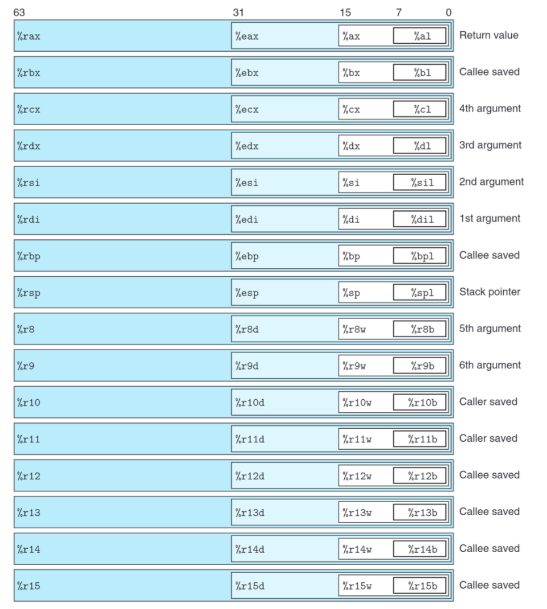
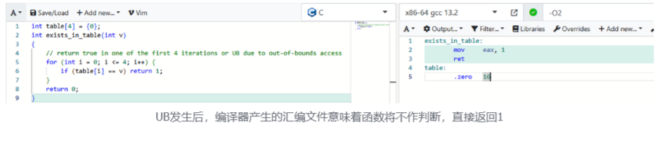
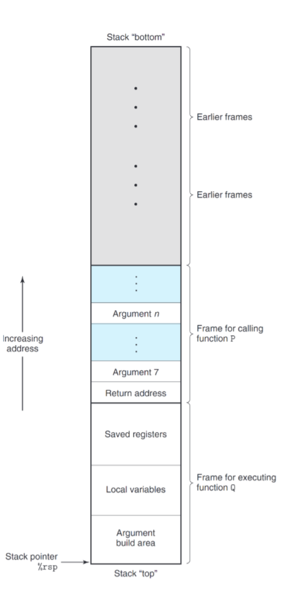
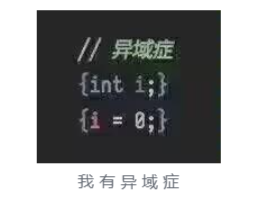

# Chapter 3:Machine-Level Representation of Programs

在第一章中，我们认识到，一段高级编程语言的代码在运行的过程中需要经过重重转换，才能变成机器代码。在本章中我们将要学习程序的机器码表示。

先来思考，为什么机器码要存在。

现在世界上大概有上千种高级编程语言，如果希望一步到位让硬件直接运行这些语言，作为硬件的设计者而言这是一个不可能完成的任务，并且假如高级编程语言发生了迭代，硬件也不可能随时修改。

那么，如果让硬件提供一个能满足一切运算需求的基本操作集合，将所有高级编程语言中的操作拆解为几个CPU周期的基本操作，这些问题就解决了。

就像计算机科学中大名鼎鼎的计算模型图灵机，它只靠一个表头和一个可以记录状态的无限长纸带，通过移动表头与写入纸带两个操作，便能满足一切计算需求。不同的CPU也提供了自己的基本操作集合，称为指令集。指令在机器中的表示便是机器码。

现在我们知道了，高级编程语言到运行的过程中间，存在一个转换为机器码的工作，而这项任务便是由编译器完成的。了解机器码的性质，以及编译器在“翻译”的过程中发生了什么，能避免一些隐晦的错误以及让我们编写更有利于编译器的高效代码。

接下来的课程我们在x86-64架构下的C语言环境下展开，如果你还不了解C语言的话，或者还不会用gcc的话，为什么不（晓阳的C语言教程）

::: warning ⚠️ x86-64的向下兼容性

对于初学者而言，x86-64是一个令人感到迷惑冗长复杂的一个架构，主要原因便来自其“向下兼容”这-策略。所谓向下兼容就是在更新CPU架构后，仍然可以执行旧版本的指令，运行旧版本的程序。从实际运用上来说，这是一个绝佳的特性（想想刚取消软盘办公的日本公务员吧）

但是对于开发者而言，这个特性带来了许多开放门槛，我们会在之后接触这些门槛，不从向下兼容的角度来看简直不可理喻。

:::

C语言是极其接近硬件的编程语言，其操作权限之宽泛令人咋舌。然而过于放纵自由的操作对初学者而言就像一把没上保险的枪械一样危险。我们将学习C语言中各类基本操作对应的机器码，以及流程控制语句（if、while、switch），是如何实现的。同时，作为计算机系统中的重要区域一栈，是如何被操作利用的，如何安全的使用栈防止越界污染数据以及防范被恶意攻击。

就像图灵机模型只有两个简单的操作，也需要介质来辅助。现代CPU也需要寄存器这一数据存储媒介来实现各种操作。其中有对操作者可直接写入的：整数寄存器，浮点数寄存器；也有对操作者不可直接写入的的：条件寄存器。



上图便是x86-64的16个整数寄存器，初看他们的名字会感觉像古神降临下的胡言乱语，这里我作出一些个人的解释（**仅供参考**）。

::: tip ⚠️ x86-64中的“word”

在之前的学习中我们了解到，word（字）的大小是与操作系统位数相关的
然而，x86-64出于向下兼容，word的含义依旧是16位操作系统下的16b

32b被称为双字（double word）

64b被称为四字（quad word）

:::

对于r8-r15：

- 中间的数字仅仅就是编号，与功能无关
- 结尾无字符则为四字寄存器，因为设计时已经是64位系统了，不用额外说明
- 结尾为d，代表双字（double word）
- 结尾为w，代表字（word）
- 结尾为b，代表字节（byte）

对于rax-rsp：

- 开头为r代表这是64位下的通用寄存器（register）
- 开头为e代表extend（想象对于一个从16位扩展到32位的系统，32位相当于16位的extend）
- 开头为空为16bit，因为这些寄存器在16位系统中就存在了
- 结尾为l代表low，是16位操作系统中的低（low）
- 向下兼容性很好说明了为什么寄存器不使用同一的命名方式体现其位数

对于rax：

- a代表累加器（Accumulator）在过去rax被用于存储算术运算的结果，现在rax可以用于用于多种用途，常见的用法是作为默认的返回值
- ~~为什么rax要保留作为累加器的历史，原因其实并不复杂...~~

对于rbx：

- b代表基址（base），通常指向某一段连续空间的开头（如数组、结构体），辅助我们去访问这些数据，当然rbx也可以用于别的用途。

对于rcx：

- c代表计数器（counter），常用于循环计数。
- 在x86-64中，它代表函数的第四个参数。

对于rdx：

- d代表数据（data），当我们需要存储数据时，常会优先用它，如存储函数的返回值或计算结果等。
- 在x86-64中，它代表函数的第三个参数。

上述四个寄存器中，还有个不明所以的“x”没有解释，我的理解是x是一个占位符号，因为接下来的rsi、rdi、rbp、
rsp的含义都需要两个字符，虽然后面四个寄存器的含义只需要一个字符表示，但是为了名称长度上的对齐，所以用x作为占位符（所以8-15这段长度不一的是英特尔工程师摆烂了对吗，果取名字是个跨文化的究极难题😅）

对于rsi：

- si表示源地址（source index）（源，根源，源头，~~不是原神~~），常存储指令中读取数据需要的源地址。
- 在x86-64中，rsi作为函数的第二个参数

对于rdi：

- di表示目标地址（destination index）与源地址相对应，表示指令中数据存储到的地址
- 在x86-64中，rdi作为函数的第一个参数

对于rbp：

- bp表示基址指针（base pointer），多数时候指当前栈的起始区域，也就是当前程序段所处的栈空间开始处

对于rsp：

- sp表示栈指针（stack pointer），指向当前栈的顶部

相信大家对这张图及其内容依旧深感疑惑，对于一个存续依旧且不断迭代且还要向下兼容的系统的学习注定不容易，就让我们带着疑问去学习：

- caller与callee是什么，供这二者使用的寄存器有什么区别？
- 为什么函数参数寄存器只有六个，多余的参数会放在哪里？
- 栈指针有什么作用，程序是如何利用栈空间的？

接下来，让我们重新回到第一章中所介绍过的程序生命周期，观察这其中具体发生了什么
对于代码文件mstore.c

```c
long mult2(long, long);
void multstore(long x, long y, long* dest) {
    long t = mult2(x, y);
    *dest = t;
}
```

在linux终端中执行

```bash
gcc -Og -S mstore.c
```

这将生成一个汇编文件`mstore.s`

相同的代码会因为不同的编译器版本和编译选项生成不同的结果

大部分情况下，这些汇编的结果都是等价的

但是在遇到UB的情况下，会产生非常逆天的结果，因为UB是没有被定义的行为，编译器怎么解释都是"对"的



回到书中的实例，我们得到

```asm
multstore:
        pushq   %rbx
        movq    %rdx, %rbx
        call    mult2
        movq    %rax, (%rbx)
        popq    %rbx
        ret
```

这一文件位于人与机器的分界处，对于人而言依旧是"可读"的

让我们将这段程序编译成更底层的形式，执行

```bash
gcc -Og -c mstore.c
```

我们将得到一个二进制格式的目标代码文件`mstore.o`

这个文件相对于之前生成的`mstore.s`体积大了很多，并且我们不能直接查看（正常用文本编辑器打开后是一片乱码）

::: tip 💡思考题

已知一切文件都是一串二进制位值

在之前我们也学习了字符串在计算机底层中的表示

那么你能解释为什么给机器看的二进制位值以文本编辑器（UTF-8）打开是一片"乱码"吗

:::

在这其中包含了我们`.s`中机器指令的机器码格式，一串16进制表示的14字节序列

```txt
53 48 89 d3 e8 00 00 00 00 48 89 03 5b c3
```

这对人类而言是难以理解的，让我们运行反汇编程序，让它来帮我们”解释”这段二进制位值

```asm
Offset Bytes          Equivalent assembly language
0: 53                 push %rbx
1: 48 89 d3           mov %rdx,%rbx
4: e8 00 00 00 00     callq 9 <multstore+0x9>
9: 48 89 03           mov %rax,(%rbx)
c: 5b                 pop %rbx
d: c3                 retq
```

可以发现，表示不同的指令需要的字节数并不相同，在x86-64架构下，指令长度的范围为1到15字节，这取决于：

- 指令类型

  - 越常用的类型，标志这个指令所需的字节数越少

- 指令参数数量

  - 参数越多，参数越复杂，需要的字节越多

为了保证机器能成功解读出`.o`文件需要执行的指令，我们需要保证每个`.o`文件都只有唯一的解读方式

已知字节是计算机系统中可以独立寻址的最小内存单元，出于效率考虑，所有指令长度上都是对字节对齐的，浪费的空间比起不对齐带来的解读成本无关紧要（事实上也没浪费多少）

那么这意味着，两条不同的指令，以字节为单元，不能存在有公共前缀

证明很简单，假设两条指令存在公共前缀`53`，指令`A：53` 指令`B：53 53`

那么当`.o`文件某一段为：`53 53 53` 时，我们存在三种解读方法：`AAA,AB,BA`

~~这个性质也作为杭电考试的考点存在着，算起来并不复杂~~

本书接下来的部分围绕各类指令详细展开，书里写的很详细，包括指令名称缩写与全称的对应，在打下概念的基础后学起来很轻松

众所周知，C语言是面向过程的编程语言，然而对于很多第一个学习的语言可能甚至是python的初学者而言，可能无法意识到”过程”二字所带来的强大功能以及其所需的代价。

理论上在学习这门课程前，你已经完成了C语言的学习（相当必要）已经CS61A的学习（可选）

在学习CS61A的过程中，我们接触了一门名为Scala的Lisp方言,和C一样，二者都有”变量”这个概念，并且都有"函数”作为编程的工具。

但是，在Scala中，变量在与值绑定后，就不能修改，例如对于某一个元函数参数从1到n的结果求和这一简单的要求，两种语言模式有着截然不同的实现方式。

```c
int g(int x);
int f(int n, int (*g)(int)) {
    int fin = 0, i;
    for (i = 1; i <= n; i++) {
        fin += g(i);
    }
    return fin;
}
```

在上面这段代码中，我们完成了两件函数式编程语言无法完成的事情：

- 使用变量完成了循环

- 使用了变量fin记录了结果

对于函数式编程语言而言，变量被声明时便与值绑定，不能再被修改，变量的作用域仅仅只是声明这组名称与值的绑定在什么范围内生效。

于是，函数式编程语言给出了它的实现：

```c
//仅仅只是对函数式编程思维的表达，在函数式编程中不存在指针，传递函数也不以这种形式传递
int g(int x);
int f(int n, int (*g)(int)){
    if(n == 1) return g(1);
    return g(n) + f(n-1, g);
}
```

这似乎十分麻烦，然而，假设我们是一台机器，只能用上本章节中之前学习的知识去实现这两段代码，我们会发现后者对机器是更友好的。因为对于前面这段代码，在对寄存器的调用中，我们存在诸多限制。

我们称上述代码中函数f与g是Caller（调用者）与Callee（被调用者）的关系

对于二者所引用的寄存器，我们有如下要求：

- Caller引用的寄存器在调用Callee前与后的值需要保持一致

- Callee引用的寄存器在Callee开始前与结束时的值需要保持一致

让我们与机器换位思考，函数的局部变量存储在寄存器中，若寄存器满足上述两点性质，似乎每段程序都拥有了自己的专属寄存器。

但是为了维护上述两个性质，我们需要一个介质为我们存储寄存器中在之后需要还原的值，而且机器还要知道这些值在什么时候被还原。脑测一下，我们发现后使用的寄存器需要最先被还原，也就是后入先出。需要的数据结构已经呼之欲出——栈。

虽然寄存器是有限的，但是对于过程函数而言，依旧存在寄存器是独属的假象，同样，每个程序都接受自己拥有独属的栈的假象，拥有了栈这一强力结构，我们可以解释超过六个的函数参数被存储在哪里，栈指针又起到了怎样的作用。

栈的具体结构如下图：



初看这图会感到倒反天罡，为什么栈”底“在上，栈”顶”在下，这里由于在x86-64中，栈总是从大地址往小地址扩展。（x86-64大人这么做一定有他的深意吧）

程序运行使用的栈分为了若干段帧（Frame），每段帧可以包含保存的寄存器值，局部变量、参数等信息。同时，寄存器%rsp指向了当前堆栈的堆顶。理论上你想塞多少东西进栈里都可以，但是事实上每个程序所分配的栈的空间是有限的。（在一个递归层数很深的函数中定义一个大数组be like）

就好像控制语句对于机器而言，只是PC在做跳转，机器需要做的只是执行当前PC指向的语句就行。函数的调用(Call)与返回（Ret）除了对PC进行了跳转，还对指向堆顶的指针%rsp进行了转移。

Call：将当前PC的地址保存到栈中（作为被调用者的返回地址）

Ret：将栈中保存的地址取出，更新PC

于是，机器就爽飞了，它不在乎现在执行的语句是高级语言程序中的哪一段，哪个作用域，是谁的Caller、又是谁的Callee，它只要执行这些简单的机器指令就好了。

一句话总结一下本章到目前为止我们所学的东西：编译器按照一定的“规则”将你的高级编程语言“翻译”成机器语言

我们学习了左右这些“规则”的抽象概念，学习了这些规则的细节，理解了这些规则存在的原因（有限的寄存器，有限的运行空间），学习了机器语言的格式与功能。了解程序运行到底发生了什么，有助于我们优化程序空间局部性与时间局部性。就这节而言，如果我们用更少的局部变量，更集中更高频的使用其局部变量，我们调用堆栈的次数就会变少，程序效率也就变高了（虽然强大的现代编译器常常会自动帮你优化达到高效利用寄存器的目的）

完成到这部分的学习，你便可以开始你的第一个CSAPP Lab——Bomb Lab。在这个Lab中，你需要学会使用gdb，并理解机器码和汇编语言的含义（熟记一些常用寄存器的常用功能会使这个实验简单许多）

经过一些小小的思考，我们发现，所谓的“局部”变量，只是在规范的代码在被编译器正确解读后从结果上而言满足“局部”性质的变量。对于许多更为先进的编程语言而言，它们在抽象间设置了障碍（Barry），使得用户的行为基本上是规范的、安全的。然而，C语言提供了对用户而言强大无比的工具——指针。

在第二章中我们意识到，一切皆位值。指针与大部分面向对象编程语言中的引用不同，指针是允许做算数运算的，当然，也是允许你随便赋值的。也就是说，如果你知道某个变量在线上的地址，你可以直接捏造一个指向这个地址的指针，然后直接在你想要的代码段落越界修改这个变量的值（异域症并非不可战胜）



当然了，指针乱指产生的错误大部分时候都是写代码的人自己造成的，想要一口气把指针指到攻击者想要的位置可以说是相当困难，而且如果攻击者已经做到这一步，想必攻破这个程序的方法一抓一大把了，下面，我们将介绍隐藏在C语言`gets()`这一方法中的致命漏洞——缓冲区溢出。

`gets()`,作为一种实现字符串整行输入的方法函数，十分的简单好用，只要将字符串（字符数组）的标识符扔进去，就能完成对一整行的字符串输入。

然而，这么“好用”的函数，在我们大名鼎鼎的高校程序设计课程刷题平台PTA上，是不允许使用的。这又是为什么呢。

事实上，`gets()`在C99中被废弃，在C11标准中被彻底移除，因为其存在着巨大的安全隐患。

`gets()`的底层实现非常简单，传入一个字符串指针类型（事实上，函数并不会检查你的传入类型，但是错误的类型带来的结果是UB），然后从指针指向的地址开始写入数据，直到这一行结束（读取到换行符号或EOF）。

然而，我们知道，变量存储在线上，根据变量的大小划分了其应得的栈空间，但是，对于gets而言，它不会因为读入的数据达到字符数组容纳的上限而中止，这意味着这个函数会写入到不属于字符数组的栈区域，也就是缓冲区溢出。

也就是说，程序中只要调用了`gets()`,程序使用者就可以整许多花活，无论是修改函数的返回地址，或者是在没有被使用的区域埋藏恶意代码，还是修改一些变量的值。这些操作我们都会在之后的Attack Lab中实现。

当然，除了避免使用`gets()`这样不安全的函数避免被攻击，计算机系统工作者也给出了诸多方法来防范**缓冲区溢出**
攻击，书中简要介绍了三种：

- 在每次程序启动时，随机化堆栈底部的位置

- 在每个frame的顶部分设置金丝雀值（取名来自早期矿工使用金丝雀检测气体泄漏的传统），在函数进行ret操作时检查，如果金丝雀值发生变化，说明缓冲区一定发生了溢出。除非你把金丝雀值全部猜中了，这个概率微乎其微（原理类似哈希碰撞）

- 为堆栈区域设置访问权限，如果访问了没用权限访问的区域则中止程序

然而，内部的攻击总是比外部攻击难以防范，例如在Attack Lab的实验文档中介绍了一种名为ROP（Return-Oriented Programming）的方法，以上三种防护措施全部木大大。这样的例子近年层出不穷，许多开源项目，被某些坏端恶意的“维护者”在一些push中慢慢插入一些恶意代码，最后受到大规模攻击。

本书末尾还有对浮点数运算的机器描述、但是不关键，可以仅作了解。
