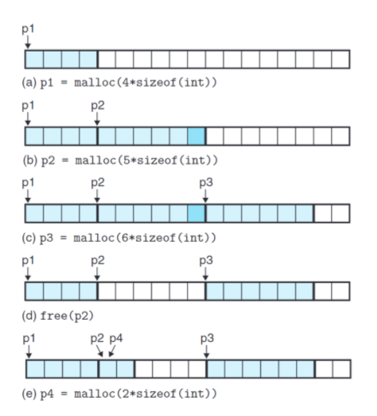

# Chapter 9:Virtual Memory

本文讨论了计算机内存空间管理中虚拟内存和内存分配器的相关内容，包括虚拟内存的空间分布、不同类型的分配器及其…

通过前面的学习我们意识到，内存空间在计算机中是十分宝贵的资源。

然而对于编程初学者而言，尤其是到目前为止所有程序的正确性都是由 OJ（Online Judge），如大名鼎鼎的 PTA，来决定的。做题第一步看到数据范围，然后看一眼空间限制，框框把自己需要的最大数组先定义好。

但在实际的工作中，同一时间不可能只有你一个程序在运行，一个程序也不可能只处理一组输入输出。同时，你所遇到的需求大概率是多多多多多多多组小数据，直接申请一片大而连续的空间极度浪费空间资源。为此，很多时候，对手不确定会容纳多少数据的数组，或者更常见的，节点个数不定的链表等结构，会采用动态内存分配来实现高效的空间分配。

在开始学习之前，我们再次回顾虚拟内存的空间分布。


从高地址向低地址扩展，这是我们熟悉的栈，用于存储局部变量、函数参数、返回地址等。

而自低地址向高地址扩展的，则是堆，用于分配连续空间给程序使用，如全局数组。

这里的“堆”与数据结构中的“堆”并不相同，前者是虚拟内存中一片区域的称呼，后者是一种树状树形结构。

因为前者与“栈”同属于一片区域，且在功能上有一定相似性，常被人们合称为堆栈，但是我并不喜欢这个词汇，大多数时候只会带来歧义与误解，除了。。。


笑点解析：这张牌英文原版名称就是 Stack

除了编译时就已经确定的空间大小（静态初始化），对于剩余的堆空间以及程序随机运行给出的不同需求，我们需要一个分配器，大致分为两种：显式分配器与隐式分配器。这二者都需要显式地去分配块，但对分配内存这一事情的行为主体有所区别。

显式分配器的典型便是 C 语言中用于申请空间的 malloc 和用于释放空间的 free。这一行为的主体是用户，因为申请的空间的大小是用户决定的，申请来的空间如何使用也是由用户决定的（malloc 的返回值是 void\*，这意味着用户可以将这片连续的空间转换为想要的类型），最后这片空间什么时候消亡也是用户决定的，如果你一直不使用 free 释放空间，那么在程序结束之前，这片空间将一直处于占用状态，哪怕实际上已经没有任何存在使用它。如果这是一个长期运行的程序，这将带来严重的内存泄露问题，将大大降低机器的效率（可用的空间越来越少，能够同时运行的程序也越来越少）

```c
#include <stdio.h>
#include <stdlib.h>
int main() {
    // 1. 整型数组
    int* intArray;
    int size = 5;
    intArray = (int*)malloc(size * sizeof(int));  // 分配5个整数组大小的内存空间
    free(intArray);                               // 释放整型数组内存空间

    // 2. 字符串数组（字符串指针数组）
    char** stringArray;
    size = 3;
    stringArray = (char**)malloc(
        size * sizeof(char*));  // 分配3个字符串指针大小的内存空间
    free(stringArray);          // 释放字符串指针数组空间
    // 3. 结构体数组
    struct Student {
        char name[20];
        int age;
    };
    struct Student* studentArray;
    size = 2;
    studentArray = (struct Student*)malloc(
        size * sizeof(struct Student));  // 分配2个结构体大小的内
    free(studentArray);                  // 释放结构体数组空间
    return 0;
}
/*
可以发现, malloc的空间大小是用户根据所需大小手动申请，最终的类型也是用户强类型转换得到的。
*/
```

隐式分配器的典型便是 Java，他将内存分配的行为主体交给了程序，用户只要描述自己的需求，便能得到一片动态申请的空间（当然出于静态类型语言的要求，你依旧要指定指向这片内存区域的指针类型，出于面向对象的特性，你往往会比 C 拥有更多的选择类型），并且 Java 中的数组如果是通过 new 关键字来申请，其大小随时可以改变。程序会自动侦测不再被使用的内存块，并将其回收，这一过程被称作垃圾回收。

```java
public class ArrayDemo {
    public static void main(String[] args) {
        // 动态分配：使用 new 关键字创建数组，在堆内存中分配空间
        int[] arr1 = new int[5]; // 初始化大小为 5 的数组
        // 大小可变：使用 Arrays.copyOf() 方法将数组扩容到 10
        arr1 = Arrays.copyOf(arr1, 10);
    }
}
```

在不同的系统上，对分配器有看不同的要求，下文中，我们假设内存分配器需要对双字对齐。字大小采用 x86-64 定义，为 16bit。

- 申请四字空间，p1 指向这片空间
- 申请五字空间，p2 指向这片空间，但是分配器最终分配了六字(因为五字不行)(保证内存空间对齐)
- 申请六字空间，p3 指向这片空间
- 释放 p2 所指的块，注意此时并没有清空指针 p2 的值，p2 依旧指向一片处于未利用状态的空间区域
- 申请二字空间，p4 指向这片空间，此时 p2 与 p4 指向同一个位置



注意到，分配器要做的事情非常简单，只需要返回满足大小需求的未占用空间的地址即可。理论上你可以写一个天底下最烂的内存分配器——每次都返回最靠近尾部的空闲地址，放不下就向系统申请内存空间。

因此，我们要对好的分配器下定义，学习分配器设计的限制与好的分配器的要求。

标准通用的分配器存在诸多限制，分配器不仅要为不同程序服务，还要对多个程序服务.

- 不能对操作的顺序做任何假设，不能假设这个块之后会被 free 所以先 malloc 给某个程序
- 不能离线处理操作，必须在线立即处理操作。意思是，你不能积攒你收到的请求然后按最适合你分配器实现的方式排序，然后再执行
- 保证你的块按照对齐标准对齐
- 不能修改已分配的块，也就是说不能移动已分配的块

在这些约束条件下，分配器的设计者追求在两个相互冲突的指标之间寻求平衡：吞吐量与内存利用率。二者所代表的分别是时间效率与空间效率。

吞吐量指单位时间内完成的分配请求（malloc 与 free）数量。单独提高这个指标并不难，例如上述那个“天底下最烂的内存分配器”在这个指标上大概能薄纱所有主流分配器。

而内存利用率则是指在你的分配器整个运行过程中，所有时刻中已分配块的合计大小的最大值与运行结束后堆大小的比。也就是你越充分利用了整个堆空间，这项指标越高。理论上比值也无法到达 1，因为存在

对齐的要求，一定会有空间无法被利用。

那么究竟是什么原因造成这—结果呢，答案是碎片（Fragmentation）

碎片分为内部碎片（Internal fragmentation）与外部碎片（External fragmentation）

内部碎片是指堆栈实际剩余空间加起来也无法满足空间申请需求，因此被迫扩展堆大小，这是可以量化且显而易见的，如果你能够减少外部碎片，一般而言内部碎片也会随之减少。

而外部碎片则是因为你的分配器给出的分配方案不够理想造成的，例如现在需求一块八字空间，但是只有两块空闲的四字空间，虽然从内部碎片的角度来看并没有产生内部碎片，但是由于无法分配八字空间，堆空间依旧被迫扩大造成浪费。

针对外部碎片，大多数分配器选择少而大的空闲空间，而不是多而小的空闲空间。这是一种启发式的思路，也就是给算法定义出什么是“优先”的情况，并让算法以达成这种情况为目的运行。

对于所有分配器，都面临着两个基本问题：

- 如何找到可分配的空闲块？
- 在释放区块后如何将区块合并，并保持算法原有性质？
