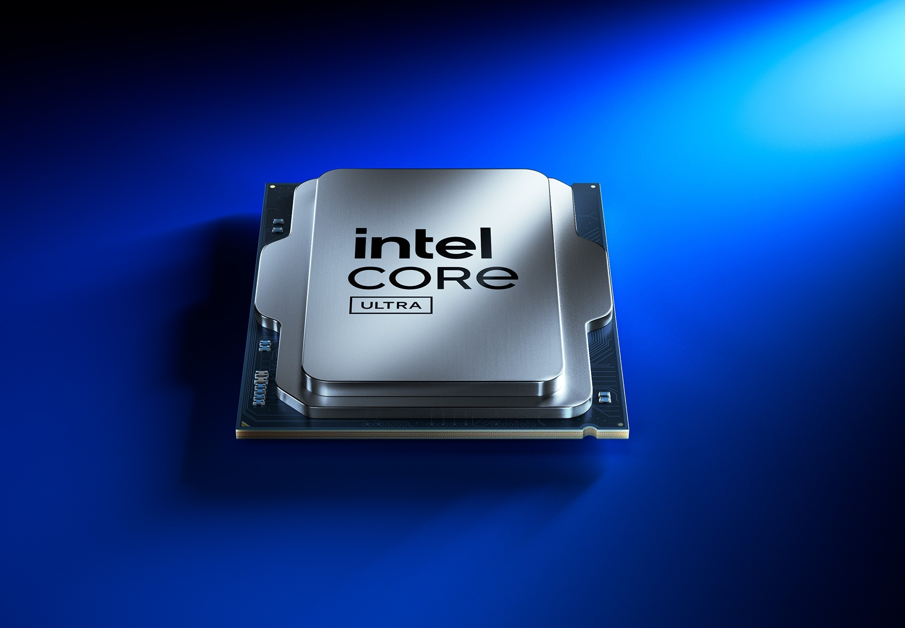
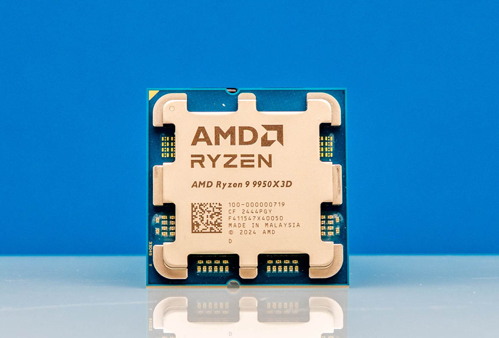
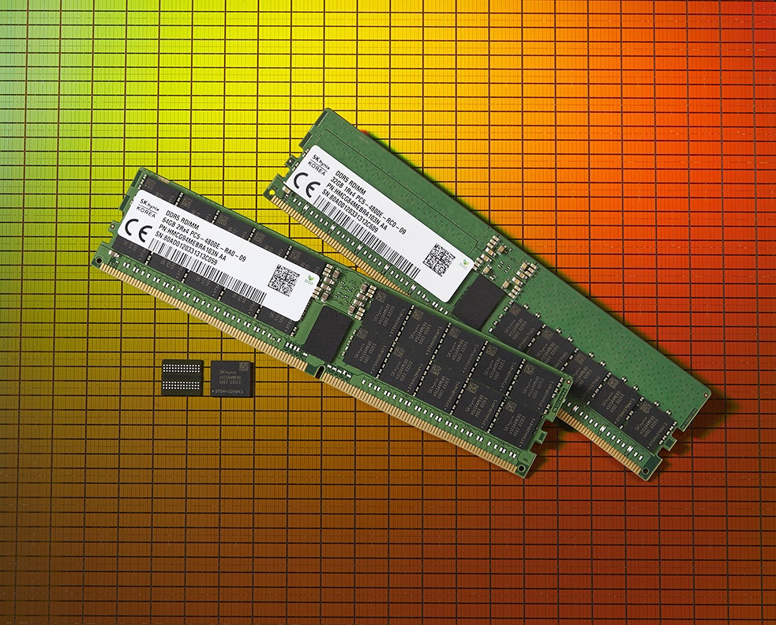

# 计算机系统基础入门

你是否好奇，你写的代码是如何在电脑上跑起来的？从运行最简单的HelloWorld程序到字符出现在屏幕上，这之间发生了什么？

## 计算机的组成

CPU是计算机最重要的部件之一，它就像计算机的大脑，负责执行指令和处理数据，接收各种设备的输入，并将运算完成的数据输出给其他部件。

CPU从内存中取出指令，不断执行。

例如我们需要电脑计算`1 + 1`时，就是CPU来得出结果是`2`的。

我们笔记本电脑上表明的Intel CORE或者AMD RYZEN等字样，就是CPU的品牌和型号。Intel和AMD是目前市场上主流的个人电脑CPU制造商。除了个人电脑，我们手机上等移动设备上也有CPU，常见的品牌有高通、苹果等。

CPU长这样：





#### 多核CPU

通常，一个CPU核心只能执行一项我们指定的任务，而多个核心的CPU就可以同时并行地运行多个任务。

### 内存

内存是一种存储器，它就像一个巨大的抽屉柜子。每个抽屉都有一个独一无二的数字，也就是这个抽屉的地址、需要的时候，可以把地址给内存，内存就会返回对应的抽屉里面存放的数据。我们也可以通过地址把我们新的数据存放进入抽屉来代替旧的数据。

内存是计算机中临时存储信息的地方，CPU从内存中加载数据，并把运算结果存储回内存。内存的速度和CPU的速度相差很大，内存的访问速度显著慢于CPU。所以CPU往往添加了缓存，缓存内存中读取的数据，来加速自己指令的执行。

我们常用的内存是SDRAM，这是易失存储器，意味着一旦断电，存储的数据就会丢失。

内存的大小通常在几个到十几个GB之间，一些服务器可能会有更大的内存配置，比如几百GB甚至上TB的内存。

内存长这样：



### 外存

外存包括了硬盘、U盘等等，之前说到内存在断电后会丢失所有数据，而外存则是用来长期保存数据的，在断电之后仍旧可以保存所有的数据。

外存的读写速度通常比内存慢，但容量更大，适合存放大量数据。运行的时候，CPU会把数据从外存设备中加载到内存里进行处理。

### GPU

GPU是图形处理单元，专门用于处理图形和图像相关的计算任务。它擅长并行处理大量数据，因此在图形渲染、视频处理以及机器学习等领域有广泛应用。

一些CPU自身继承了图像处理单元，不需要独立的GPU就能进行基本的图形处理和渲染。

常见的显卡如NVDIA的RTX50系列的游戏显卡等，而专业的AI训练等工作则应该使用专门的AI训练卡。

### 总线

总线用于CPU和各个设备交互，CPU将信号发送给总线，总线再将信号分发给各个对应的设备。设备也通过总线将响应的数据返还给CPU。

## 不停计算的机器

### 不停计算的机器

上面我们提到了，CPU可以从内存中取出一条指令运行，那么运行这条指令之后，应该做什么呢？我们很容易想到，可以运行下一条指令。我们约定`pc`来标注当前运行的指令的地址。每一次运行的时候，CPU就从内存中`pc`的地方取出一条指令，然后执行，并根据指令的结果更新`pc`，再重复执行这个流程。用代码表示：

```rust
let pc
loop {
    let inst = read_from_memory(pc); // 从PC指示的存储器位置取出指令
    let new_pc = exec_inst(inst); // 执行指令
    pc = new_pc; // 更新PC
}
```

这样, 我们就有了一个足够简单的计算机了。 我们只要将一段指令序列放置在存储器中，然后让PC指向第一条指令, 计算机就会自动执行这一段指令序列，永不停止。

我们来看一个简单的指令序列

```
00: set sum = 0       // sum = 0
01: set i = 0         // i = 0
02: set i = i + 1     // i += 1
03: set sum = sum + i // sum = sum + i
04: bne x2, 20, 02    // if i != 20, jump to 02
05: print sum         // print sum
```

这段指令序列计算了`1`加到`20`的和。从地址`00`开始，下一条指令是`01`，在下一条是`02`，直到`04`这一条比较跳转指令，如果`i`不等于`20`，就跳转到`02`地址，也就是`set pc = 02`。

### 冯诺依曼体系结构

在上面我们已经了解了CPU不停运行的逻辑，但是在计算机组成中提到的外存、GPU等等设备我们却没有提及。

冯诺依曼体系结构由5个部件组成: 运算器, 控制器, 存储器, 输入设备和输出设备。

| 核心部件 | 主要功能 | 类比理解 | 举例 |
|---------|---------|---------|-----|
| 运算器（Arithmetic and Logic Unit, ALU） | 执行所有算术运算（如加减乘除）和逻辑运算（如与、或、非），是计算机的 "计算核心"。 | 类似工厂的 "生产车间"，负责实际的加工计算。 | 计算 2+3=5，判断 5>3 为真 |
| 控制器（Control Unit, CU） | 按照程序指令的顺序，协调控制其他所有部件的工作（如指挥运算器计算、存储器读写、设备输入输出），是计算机的 "指挥中心"。 | 类似工厂的 "调度室"，把控整个生产流程的节奏。 | 解释指令 "ADD R1, R2"，控制 ALU 执行加法 |
| 存储器（Memory） | 统一存储程序指令和数据（二进制形式），分为 "内存储器（内存）" 和 "外存储器（硬盘、SSD 等）"，前者速度快但断电易失，后者速度慢但持久存储。 | 类似工厂的 "仓库"，既存放待加工的原材料（数据），也存放加工步骤手册（程序）。 | 内存：DDR4/DDR5 RAM；外存：机械硬盘、SSD |
| 输入设备（Input Device） | 将外部信息（如文字、图像、指令）转换为计算机能识别的二进制信号，传入系统。 | 类似工厂的 "原材料搬运车"，将外部物资送入车间。 | 键盘、鼠标、摄像头、麦克风、触摸屏 |
| 输出设备（Output Device） | 将计算机处理后的二进制结果转换为人类可理解的形式（如文字、图像、声音）。 | 类似工厂的 "成品包装线"，将加工好的产品呈现给用户。 | 显示器、音箱、打印机、投影仪 |

### 真实世界的CPU

#### 寄存器

真实世界的CPU并不像我们上面列举的程序，有像`sum`和`i`之类的变量，取而代之的是一些叫做寄存器的存储单元，CPU在工作的时候，会将内存中的数据加载到寄存器中，或者将寄存器的内容写回到内存。**CPU只能直接运算寄存器中的数据。**


#### 指令集

CPU只能够执行一些特定的基础的指令，一个程序就是由这些基础指令构成的，对这些指令格式的规定就是指令集。指令集有很多，常见的有x86_64和ARM等。一个CPU被设计出来只能够运行特定的一种指令集的代码。

我们一般的个人电脑使用的是x86_64指令集，手机则使用的是ARM指令集，因而电脑上能够运行的程序放到手机上就无法运行了，因为电脑上的程序是x86_64指令集的程序，而手机只能运行ARM指令集的程序。

什么，你问我为什么你M芯片的Macbook上的程序不能在手机上运行？这也许就是学习计算机系统基础的意义吧。

#### 汇编语言

存储在存储器，如内存的程序都是二进制的，CPU也只能够理解这些二进制的数据，但是编写二进制对于我们来说太困难了，所以我们发明了汇编语言，也就是一些助记符文本，再由编译器将这些文本代码翻译为机器指令。

下面我们来实际看一下程序的指令。

一个简单的C语言HelloWorld：

```c
int main() {
    printf("Hello World!");
    return 0;
}
```

使用gcc编译，并使用objdump工具查看这个程序中的指令：

```bash
gcc main.c -o main
objdump -d main
```

截取一部分输出，这是`main`函数的指令：

```
0000000000001149 <main>:
    1149:       f3 0f 1e fa             endbr64
    114d:       55                      push   %rbp
    114e:       48 89 e5                mov    %rsp,%rbp
    1151:       48 8d 05 ac 0e 00 00    lea    0xeac(%rip),%rax        # 2004 <_IO_stdin_used+0x4>
    1158:       48 89 c7                mov    %rax,%rdi
    115b:       b8 00 00 00 00          mov    $0x0,%eax
    1160:       e8 eb fe ff ff          call   1050 <printf@plt>
    1165:       b8 00 00 00 00          mov    $0x0,%eax
    116a:       5d                      pop    %rbp
    116b:       c3                      ret
```

其中第一列是指令的地址，第二列是指令的机器代码，也就是CPU可以直接执行的代码，第三列就是我们所说的汇编语言，也就是机器指令的助记文本。我们在编写汇编语言代码的时候，只用编写如`push %rbp`之类的代码，编译器会把它编译为二进制的`f3 0f 1e fa`。

在上面的指令中，`%rbp`、`%rax`等等就是CPU(x86_64指令集)中的寄存器名称。

## 操作系统 Operating System

### 什么是操作系统

操作系统像是一个班主任，而运行在操作系统上的程序就像班里的孩子。操作系统既要保证这些孩子每个人都在合理的范围内做自己的事情，也要服务于这些孩子。比如一个程序告诉操作系统，我要读一个文件了，那么操作系统就会将文件的内容送还给程序；另一个程序说，我要退出了，操作系统就会回收它的资源。同时，操作系统负责与硬件交互，管理硬件。

常见的操作系统有用于个人电脑的Windows、Linux、macOS等等，用于手机的Android、iOS等等。

我们的用户程序都运行在操作系统之下，使用操作系统提供的功能，例如我们的音乐软件需要播放音乐，就需要操作系统支持，音乐软件告诉操作系统我需要播放这段音频，操作系统就会将需求翻译给硬件，把数据传输给声卡音响，于是音响就开始播放音乐软件要播放的音频了。

### 系统调用 System Call

系统调用是用户程序和操作系统交流的窗口。用户程序可以通过特定的指令(也就是我们前面提到的一条汇编代码或者说机器指令)，请求操作系统帮助我们完成某项功能。在用户程序请求了一个系统调用之后，就会开始运行操作系统的代码，操作系统处理完成之后，会切换回到用户程序代码继续运行。

### 虚拟化 Virtualization

操作系统的虚拟化功能，简单说就是让程序以为自己独占了整个计算机，感受不到别的在运行的程序。

现代操作系统上，我们的用户代码总是认为自己独占了整个内存和CPU，但实际上，我们的内存中存放着多个程序的代码和数据。在A程序和B程序中，如果我们访问同一个内存地址，会看到不同的数据，这就是虚拟化。为每个程序提供了一整个独占的**虚拟**的内存。

### 并发 Concurrency

操作系统的并发功能，简单说就是让电脑能 “看似同时干多件事”。

比如你一边用浏览器刷网页，一边听音乐、还能后台传文件 —— 其实 CPU 等硬件资源是在这些任务间快速切换（快到你没感觉），同时给重要任务（比如你正在看的网页）优先分配资源，既不耽误你当下用，也不浪费硬件能力，避免了 “干一件事就得停掉另一件” 的麻烦。

### 持久化 Persistence

操作系统的持久化功能，简单说就是让数据 “存得住”—— 即使电脑关机、断电，你保存的文件、设置等数据也不会丢失。

它主要通过硬盘、U 盘等存储设备实现：当你保存文档、下载文件时，系统会把这些数据从临时存放的内存 “挪” 到持久存储设备里，并做好管理，维护文件系统，确保下次开机后还能找到并使用这些数据。没有它，电脑一关机，所有工作内容就会全部消失。

## 为什么要学习计算机系统基础？

[为什么要学习计算机系统基础？](https://nju-projectn.github.io/ics-pa-gitbook/ics2024/why.html)

也许编写一个简单的HelloWorld程序很简单，但是想要知道运行一个Hello World程序的时候, 计算机究竟做了些什么却很难。

学习计算机系统基础，你可以更加深入地理解计算机中的运行细节，学习计算机系统基础，不是要了解掌握计算机操作系统、CPU、编译器、数据库这些软件的各种复杂的设计逻辑和技术细节，而是要通过这些基础知识，提升自己对计算机程序运行的理解，理解为什么代码不能够这么写，为什么代码在链接的时候会出现错误，为什么代码的运行结果不符合预期，同时提升自己的甄别能力，更可以知道计算机能够做什么和计算机为什么能够做这些事情。

**学习计算机系统基础最重要的永远是动手实践，动手将理论和设计变为实际可以运行的代码！哪怕它全是bug**

## 计算机系统基础学习路线

1. Computer System: A Programer's Perspective 《深入理解计算机系统》(CSAPP) 阅读所有章节，完成[官网上配套的Lab实验](https://csapp.cs.cmu.edu/3e/labs.html)(其中Architecture Lab可以跳过)，每个Lab的Writeup是实验指导，Self-Study Handout是需要的Lab代码。

2. [NJU PA](https://nju-projectn.github.io/ics-pa-gitbook)：南京大学计算机系统基础课程实验，通过编写一个简单的模拟器和在上面编写裸机代码理解计算机的运行原理。

3. [CS61C](https://cs61c.org/)：Great Ideas in Computer Architecture，伯克利的课程，学习RISC-V汇编和简单的CPU设计，以及更多的底层开发细节，如缓存、流水线和并发。

4. (计算机体系结构、CPU方向) [一生一芯计划](https://ysyx.oscc.cc)：国科大引导的riscv CPU设计课程，每个同学都可以获得免费流片的机会，你将有机会拿到自己设计的CPU。

5. (操作系统方向) 开源操作系统训练营：清华大学领导的课程，学习使用Rust构建操作系统。

6. (操作系统方向) [操作系统：设计与实现 (2024 春季学期)](https://jyywiki.cn/OS/2024/) 南京大学蒋炎岩老师的优质操作系统课程

7. (操作系统方向) [MIT 6.1810: Operating System Enginerring](https://pdos.csail.mit.edu/6.828/2024/index.html) MIT的xv6操作系统实验

## 我们想要运行的项目

1. [KXemu](https://github.com/HD-CSKX/KXemu): 一个类似Qemu的体系结构模拟器

2. [KernelX](https://github.com/HD-CSKX/KernelX): 一个类Linux操作系统内核

3. KXCore: 一个超标量处理器内核

More... Maybe 编译器和数据库
