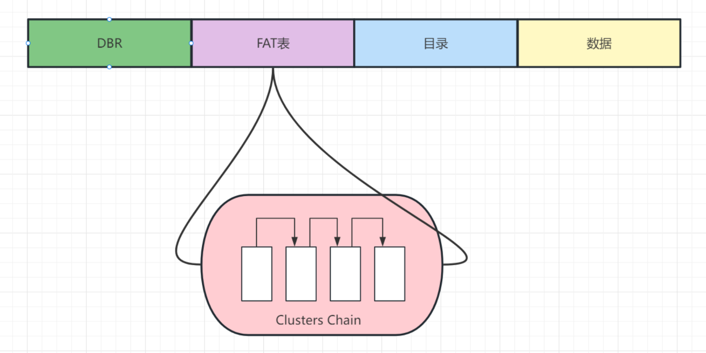

# 2.3 文件系统

>对于嵌入式操作系统而言，引入文件系统的核心目的在于 **抽象** 和 **组织**。它允许我们用`config.txt`这样有意义的名称来代替`0x0801F800`这种冰冷的物理地址，将开发者从繁琐的底层存储细节中解放出来。当系统需要处理的配置、日志、数据越来越多时，一个结构化的文件系统就从“可选项”变成了“必需品”，它让数据管理变得可维护、可扩展。

## 从裸机到系统：为什么需要文件系统？

### 单片机上的“原始”数据存储

在很多简单的单片机（如STM32）裸机或使用轻量级调度器的项目中，确实**没有文件系统**。开发者通常是直接操作Flash内存：

1.  在代码中定义一个结构体来保存配置参数。
2.  在Flash的地址空间中手动规划出一块区域（例如，STM32F4的`0x080E0000`之后）。
3.  通过特定的库函数，将整个结构体的数据按字节写入该物理地址，或从该地址读出。

这种方式直接、开销小，但缺点明显：需要程序员手动管理所有地址，容易出错；难以存储大小可变的数据；无法直观地组织和分类数据。

### RTOS引入文件系统的意义——管理嵌入式设备的“数字档案”

当项目规模扩大，一个带文件系统的RTOS就显示出优势。它在底层存储驱动和上层应用程序之间提供了一个标准化的接口。应用程序只需调用`fopen()`, `fwrite()`等标准API，而无需关心数据具体被写到了闪存的哪个物理块、是否需要擦除、如何保证写入安全等。

## 闪存的挑战：与PC硬盘不同的介质

嵌入式文件系统的设计，很大程度上是为了应对其主要存储介质——**闪存 (Flash Memory)** 的物理特性。这与我们熟悉的台式机硬盘（无论是机械硬盘HDD还是固态硬盘SSD）有很大区别。

* **擦除前置（Erase-before-Write）**：与可以随意覆盖写入的硬盘不同，NAND闪存的一个基本法则是：在写入一个“页”（Page）之前，必须先擦除其所在的整个“块”（Block）。一个块通常包含数十个页。这意味着即便只想修改1个字节，也可能需要将几十KB的数据备份、擦除整个块、再把修改后的数据连同备份的数据全部写回。

* **有限的擦写寿命**：闪存的每个块都有寿命上限，即可被擦除和编程的次数是有限的（从数千次到数十万次不等）。如果总是在同一个位置更新数据（比如，反复保存同一个日志文件），这个块会比其他块提前“阵亡”，导致存储芯片的有效寿命缩短。

* **掉电的脆弱性**：台式机的电源（PSU）和固态硬盘（SSD）内部通常有电容，可以在突然断电的瞬间提供几毫秒的电力，让控制器有时间将缓存中的数据紧急写入非易失性闪存中。而许多嵌入式设备，特别是低成本的MCU系统，为了控制成本和功耗，不具备这种完善的掉电保护电路。如果在擦除或写入操作的途中突然断电，闪存块可能会处于不确定的损坏状态。

PC上的SSD有SSD主控芯片 (SSD Controller)，内置一套复杂的固件算法，被称为“闪存转换层” (Flash Translation Layer, FTL)可以实现**损耗均衡**、**垃圾回收**、**地址映射**、与**坏块管理**、**超额预留**等功能，因此对文件系统的要求较小。嵌入式因为可能使用裸闪存即根本没有主控芯片的闪存，所以需要软件实现上述功能。

为了解决这三大挑战，专门的嵌入式文件系统应运而生。

## 核心功能：应对闪存的特殊设计

* **损耗均衡 (Wear Leveling)**
    这是一种核心算法，旨在延长闪存的整体寿命。它通过一个映射表，将逻辑上的文件地址动态地映射到不同的物理块上。当上层应用要更新一个文件时，文件系统不会在原地修改，而是找到一个已擦除的新物理块来写入新数据，并更新映射表。这确保了写操作能均匀地“雨露均沾”到所有物理块上，避免局部区块的过早老化。

* **掉电安全 (Power-fail Safety)**
    这是保证数据可靠性的关键。文件系统必须确保任何写操作被意外中断时，不会破坏已有的数据，并能恢复到一个逻辑上一致的状态。实现这一点的两种主流技术是：
    * **日志 (Journaling)**：在正式写入数据前，先把“要做什么”这个计划记录到一块专门的日志区域。即使在执行计划中途断电，重启后系统也能通过检查日志来完成未竟的操作或回滚到操作前的状态，从而保证文件系统的一致性。ext4文件系统就是典型代表。
    * **写时复制 (Copy-on-Write, COW)**：更新数据时，从不直接修改旧数据。而是将要修改的数据连同新内容一起写入新的位置，全部写完并校验成功后，再原子性地更新“指针”指向新数据。如果在写入过程中断电，旧的数据依然完好无损，系统不会出现不一致状态。

---

## 常见的嵌入式文件系统

* **FAT (File Allocation Table)**
    
    历史悠久，兼容性极佳，是SD卡和U盘的“通用语”。但它本身并非为原生闪存设计，不直接提供损耗均衡和掉电安全机制。因此，它更适合用在那些自带FTL（闪存转换层）的存储设备上，如eMMC和SD卡。FTL硬件控制器会为上层的FAT文件系统默默处理好损耗均衡等底层事务。
    

        
戳我深入了解FAT底层原理

    ### 📁 FAT32：简单就是王道

    FAT (File Allocation Table) 文件系统是元老级的存在，它的设计思想朴素而直接，核心在于一张“表”。

    **1. 核心数据结构**

    可以把一块U盘想象成一本带页码的空白笔记本。FAT32如何在这本子上组织文章（文件）呢？它主要依赖三个部分：

    * **目录项 (Directory Entry)**：这就像是书的“目录”。每个文件或文件夹都在其所在的目录里有一个32字节的“目录项”，记录着它的**文件名、大小、创建时间**，以及最关键的——**起始簇号 (Starting Cluster Number)**。簇（Cluster）是文件系统读写数据的最小单位，可以理解为笔记本中的一“页”或多“页”的组合。
    * **文件分配表 (File Allocation Table, FAT)**：这是整个系统的精髓，也是它名字的由来。这张“表”是整个存储空间的一个巨大索引。你可以把它看作一个大数组，数组的每个单元都对应一个数据簇。这个单元里存储的**不是数据，而是一个指针——指向文件下一个数据簇的编号**。
    * **数据区 (Data Area)**：这里是真正存放文件内容的地方，被划分为一个个大小相等的簇。

    **2. 工作原理**

    当你要读取一个文件时，系统会像这样进行一次“寻宝游戏”：

    1.  **查目录**：首先在目录中找到该文件的“目录项”，从中获知文件的起始簇号，比如是第5簇。
    2.  **读数据**：系统直接跳转到第5簇，读取里面的数据。
    3.  **查FAT表**：为了知道文件的下一部分在哪里，系统会去查询FAT表的第5个条目。
    4.  **链式追踪**：如果FAT表第5个条目里写着数字8，就意味着文件的下一部分在第8簇。系统读完第8簇后，再去查FAT表的第8个条目，假如里面写的是12，就接着去读第12簇……这个过程就像一条链表，不断地在FAT表中跳转，直到读到一个特殊的“文件结束”标记。

    
    *
FAT工作原理示意简图
*

    **优点**：结构简单，易于实现，兼容性极强。

    **缺点**：读大文件时，需要在FAT表中反复跳转，效率较低；删除文件容易产生大量碎片；掉电安全机制薄弱。

    

* **ext (Extended File System)**
  
    Linux系统的“标配”文件系统家族。其主流版本ext4通过日志功能提供了优秀的掉电恢复能力。它通常不直接运行在裸闪存上，而是与eMMC或UFS这类带有FTL的托管型闪存设备配合使用，是目前Android、嵌入式Linux等系统中成熟可靠的选择。
    

        
戳我深入了解ext4日志文件系统

    ### inode 与 Journal：ext4的“严谨哲学”

    ext系列是Linux的标准文件系统，它的设计目标是高性能和高可靠性，其核心是`inode`和`Journal`。

    **1. 核心数据结构**

    * **索引节点 (Inode)**：FAT的目录项是“身份证”，而inode则是一份“个人档案”。每个文件/目录都有一个唯一的inode。它记录了文件的**所有元数据**：权限、所有者、大小、时间戳，以及最重要的——**指向存储文件内容的数据块的指针列表**。目录本身其实是一个特殊的文件，其内容就是“文件名”到“inode编号”的映射列表。
    * **日志 (Journal)**：这是ext4可靠性的基石。可以把它想象成一个“操作日志本”。

    **2. 工作原理**

    * **Inode寻址**：当要读取`/path/to/file`时：
        1.  系统先读取根目录`/`的inode，找到其数据块，里面记录着`path`目录的inode编号。
        2.  再读取`path`目录的inode，找到其数据块，里面记录着`to`目录的inode编号。
        3.  最后读取`to`目录的inode，找到其数据块，从中得到`file`文件的inode编号。
        4.  读取`file`文件的inode，根据里面的指针列表，直接找到所有存放文件内容的数据块并读取。这个过程比FAT的链式查找更高效。

    * **日志（Journaling）保障安全**：这是ext4应对突然掉电的关键。
        1.  **写日志**：在对文件系统进行任何实际修改（比如写入新数据、修改inode）之前，系统会先把“**我打算做什么**”这个操作计划详细地写入到Journal这个专用的“日志本”里。
        2.  **提交**：确保日志写成功后，系统才会开始去实际地修改inode和数据块。
        3.  **标记完成**：所有修改都完成后，在日志里标记此事务“已完成”。

        如果第2步执行过程中突然断电，系统重启后会检查Journal。发现一个“已记录但未完成”的操作计划，它就可以根据计划内容，安全地完成该操作或将其回滚，从而保证文件系统不会处于一个“改了一半”的损坏状态。

        <small>（说起来，笔者有次拆老笔记本大意了，别说断电了，连关机都没关机就直接开盖拔了sata硬盘，ext4的，后来p事儿没有啥文件都没丢）</small>

    

* **YAFFS (Yet Another Flash File System)**
    
    专为NAND闪存设计的日志结构文件系统。它在软件层面就集成了损耗均衡和强大的掉电安全能力，非常适合在裸NAND闪存芯片上直接运行，在许多老式的嵌入式Linux设备中很受欢迎。
    

        
戳我深入了解YAFFS

    ### YAFFS：为NAND闪存而生

    YAFFS (Yet Another Flash File System) 的设计完全是为了适配NAND闪存“先擦后写”和有寿命限制的物理特性。它的核心思想是 **日志结构 (Log-structured)**。

    **1. 核心思想**

    YAFFS把整个闪存设备当作一个只能**顺序追加**的日志本。它从不原地修改数据。

    **2. 工作原理**

    * **追加写入**：当一个文件被修改时，YAFFS不会去覆盖旧的数据。它会找到一块干净的、已擦除的闪存空间，将**文件的新版本完整地写入**。写完后，它会更新内存中的文件结构，让文件指向这块新的物理空间，而旧空间里的数据则被标记为“过时(obsolete)”。
    * **元数据与数据同行**：YAFFS在写入每一小块数据（Chunk）时，会利用NAND闪存页的OOB（Out-of-Band，带外）区域，把这块数据的元数据（属于哪个文件、是文件的第几块等信息）和数据本身写在一起。
    * **启动时扫描**：系统启动挂载YAFFS时，它会**扫描整个闪存**，读取所有数据块的OOB信息，然后在内存中重建起整个文件系统的树形结构。它通过版本号或序列号来识别哪些数据块是最新的，哪些是“过时”的。
    * **垃圾回收 (Garbage Collection)**：当干净的闪存块越来越少时，YAFFS的垃圾回收机制就会启动。它会挑选一个包含最多“过时”数据的闪存块，将里面仍然“有效”的数据块（如果有的话）复制到日志的末尾，然后将这个被“榨干”的旧块整个擦除，变为一块可用的干净块。这个过程天然地实现了**损耗均衡**。

    **优点**：专为NAND闪存设计，自带损耗均衡和掉电保护，非常鲁棒。
    **缺点**：启动时需要扫描全盘，对于大容量闪存，挂载速度较慢；会产生较多的写操作（垃圾回收）。
    

总结一下：
| 存储类型 | **损耗均衡实现位置** | **文件系统选择** | **工作模式** |
| :--- | :--- | :--- | :--- |
| **PC SSD, eMMC, SD卡** | **硬件** (自带的主控芯片FTL) | **标准文件系统** (如ext4, FAT32, NTFS) | 硬件FTL处理物理细节，文件系统在逻辑层面组织数据。 |
| **裸NAND/NOR闪存** | **软件** (由文件系统或专用驱动实现) | **专用闪存文件系统** (如YAFFS, JFFS2) | 文件系统本身集成了FTL的功能，直接管理物理闪存。 |

## 主要应用场景

在嵌入式系统中，文件系统最常见的用途包括：

* **存储日志文件**：记录系统运行状态、错误信息或传感器数据，用于后续分析和调试。
* **保存配置文件**：存储设备的网络设置、用户偏好、校准参数等，实现设备的持久化配置。
* **固件更新**：将下载的新固件镜像作为文件存储，供引导加载程序（Bootloader）读取并更新系统。