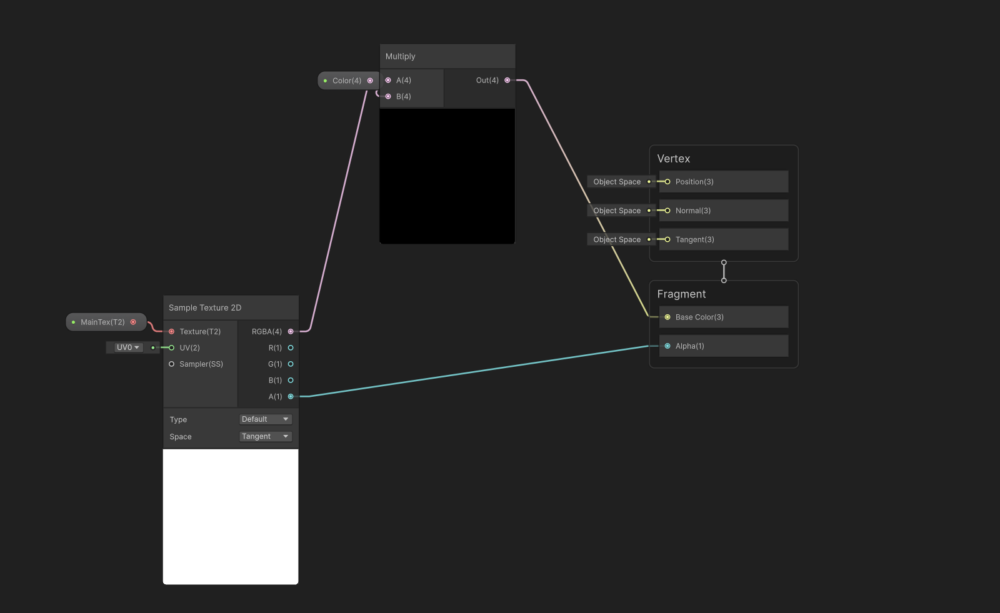

# 实现发光效果

## 实现

### 节点图

### 解析

1. Unity的Sprite Renderer中的图片默认使用MainTex作为主纹理，我们在Shader Graph中可以新建一个名为MainTex的**Texture2D**变量。
2. 将其连到**Sample Texture2D**节点上，再将其输出(RGBA)连到输出节点上，我们就得到了一个基础的，没有任何效果的默认Shader。
3. 我们实现发光效果的原理是**HDR** + **Bloom后处理**，HDR允许我们的颜色超出0~255的范围，而Bloom效果会为超出部分自动生成辉光效果。
4. 我们新建一个Color节点，将其类型改为**HDR**，并在Sample Texture2D输出之前，为原图像的每一个像素点乘上**Color**。只要我们将Color设为一个RGB值较高的颜色，就可以实现辉光效果。

## 名词解析

### HDR 高动态范围

在**标准渲染**中，像素的红色、绿色和蓝色值均使用一个 0 到 1 范围内的 8 位值进行存储，其中 0 表示零强度，1 表示显示设备的最大强度。这一有限的数值范围无法准确反映我们在现实生活中对光的感知方式，并且当存在非常亮或非常暗的元素时，会导致图像不真实。

在 **HDR 渲染**中，像素值使用浮点数进行存储。这种情况下允许更大范围的值，可以更准确地表示人眼感知颜色和亮度的方式。

相关链接：[HDR](https://docs.unity.cn/cn/2020.3/Manual/HDR.html)

### Bloom 泛光
泛光是用于再现真实摄像机成像瑕疵的效果。该效果会产生从图像明亮区域边界向外延伸的光线条纹，给人的感觉是极其明亮的光线压制住了摄像机或是透过眼睛看到该场景。

相关链接：[Bloom](https://docs.unity.cn/cn/2017.4/Manual/PostProcessing-Bloom.html)

