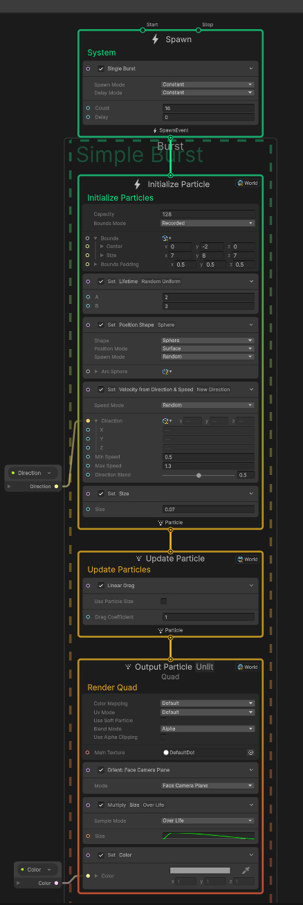

# 实现子弹爆炸效果
施工中，仅提供实现

## 实现

### 节点图

### 解析
1. **Spawn**节点控制粒子生成方式，Single Burst代表只生成一次
2. **Initialize Particle**节点，在每个粒子生成时执行，为其设好了粒子的生命周期，大小，位置，速度，方向等。
3. **Update Particle**在每帧执行，Linear Drag为粒子提供了线性阻力，减慢其速度而不改变其方向，使其越来越慢。
4. **Multiply Size Over Life**表示为粒子的Size乘上一个根据生命周期(0~1)相关曲线采样的值，这个曲线可以自行调整，图中曲线实现了淡入淡出。
5. **Set Color**顾名思义，设置了粒子的颜色。为了方便调整，我们将其设为变量暴露出去，以便根据需求调整。