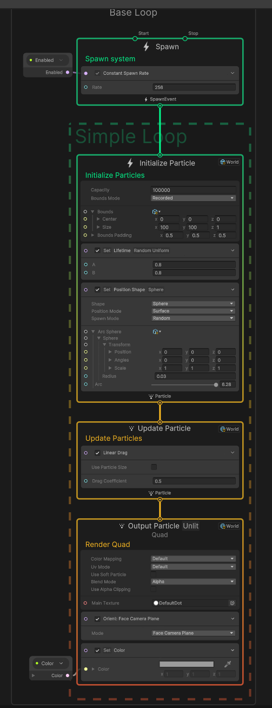

# 实现子弹尾迹效果

## 实现

### 节点图

### 解析

1.需要将**Single Burst**改为**Constant Spawn Rate**，因为尾痕是需要持续产生的。
2. 记得将节点的坐标类型改为**World**，这样可以保证在粒子生成后，其位置不会由于发射器位置改变而改变，这样我们只需要移动发射器，发射器不断在原地留下粒子，即可实现尾痕。
3. **Set Position Shape**实现了在一个球形区域内随机生成粒子的功能，以防尾迹过于呆板，具体可灵活调参。