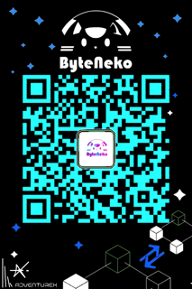

# 这个世界为什么要有Web3

通常介绍 Web3 或是区块链，都会从比特币开始说起：**比特币**（Bitcoin）是一种基于去中心化、点对点网络、开放源代码与区块链技术的加密货币。“比特币”一词最早由一名化名为中本聪（Satoshi Nakamoto）的人在 2008 年提出，2009 年运行……

但是我觉得这对新人并不友好，我并不打算从复杂的概念，底层的数据结构，或行业黑话与生态全景图讲起——对于刚入门的新手而言，这只会制造更多的陌生感和距离感。相反，我会从 其背后的**哲学**、**思维方式的变化**、以及**社会形态的变动**讲起。等你带着这些底层直觉再回头看那些术语，一方面会一通百通；另一方面也更容易揪出那些拙劣的把戏和故弄玄虚的话术。

我第一次听到 “Web3” 这个词时就开始思考：**这个世界为什么要有 Web3？** 接触这一领域一年多后，我逐渐有了自己的答案。

中心化系统确实有更高的吞吐、更低的成本，还有一套成熟完善的治理体系；去中心化技术则需要消耗更多算力和资源，并且在运行效率上有所取舍（例如以太坊的 TPS）。但仍有许多技术开发者希望在Web3技术栈上探索新的可能性，构建更加开放透明的数字基础设施。

**技术视角看**：Web3 是一种分布式技术架构，它通过密码学和共识算法将"信任"构建为**公开可验证的技术基础设施**。从技术创新角度，Web3 为多方协作提供了新的信任机制，使得不同主体可以在透明规则下进行数据交换与协作。

## 一、直面“信任”的成本

**在 21 世纪，世界飞速发展，新技术、新理念层出不穷。**
 然而，人受限于个体的局限性——或者说生物的局限性——不可能对所有领域、尤其是新生事物都有全面深入的了解。于是，**中心化机构**便以中介的形式承担起“替你了解、替你把关”的角色：

- 你不必成为经济学家，只需信任地把钱交给银行，让它帮你管理资金；
- 你不必背下每一个法条，只需信任地把自己委托给律师，让他帮你打官司。

传统系统中存在**技术信任成本**——当我们依赖第三方服务时，在透明度与控制权方面会有一定的技术限制：

- 传统系统的内部逻辑对用户来说往往是黑盒；
- 平台的算法和数据处理规则通常不够透明，用户难以验证。

用科幻作家刘慈欣笔下的“三体人”作对比更直观：

> 在《三体》中，三体人思维透明，没有隐私与谎言，彼此无法欺骗。在这样的世界里，信任是零成本的——不需要合同、不需要中介、不需要验证，因为对方在想什么你直接知道。

而在人类社会，我们并不是三体人，无法直接看透对方的真实意图。
 因此，传统的信任机制需要依赖复杂的制度与中介体系：银行、平台、清算机构等。这些机构在提供信任保障的同时，也带来了相应的技术成本和效率损耗。

- 手续费、技术服务费，是直接的成本；
- 审批流程、系统对接复杂度，是间接的技术成本。

这正是互联网的巨大问题之一：**它解决了信息传递，却没有根本解决信任传递**。
 而 Web3 的技术价值，就是在某些场景下用**代码、密码学与共识算法**，实现类似"思维透明"的技术效果，让不同系统和参与方能够在不需要传统信任背书的情况下，通过技术手段完成数据交换与协作。

## 二、中心化为什么曾经（依然）有效？

别急着把中心化妖魔化。中心化的优势非常真实：

- **极致效率**：一个产品经理拍板、一个 DBA 改表，系统就能升级。
- **用户体验**：忘了密码有客服，转错账能申请回滚。
- **监管接口**：责任主体明确，出了事找得到人。

所以，Web3 并不是为了"替代一切中心化系统"。它更像是给技术生态补上一块**新的组件**：当协作涉及多个独立系统、需要跨平台数据交换、参与方需要技术层面的透明保障时，Web3 技术的优势才会显现出来。

## 三、Web3 到底带来了什么？

说了这么多理论，Web3 究竟解决了什么问题？我觉得可以从四个角度来看：

**第一，让数据"说人话"**。
传统的系统，你不知道里面在干什么。银行说你账户余额1万，你只能信；游戏说你的装备值100块，平台说了算。Web3 把所有操作都记在公开账本上，想质疑的话，自己去算一遍就行。

**第二，像搭积木一样做应用**。
以前做个应用，支付要对接支付宝，身份验证要接微信，每个都要单独谈合作。Web3 的协议是开放的，别人做好的模块你直接拿来用，不用求人。想象一下，一个支付模块 + 一个社交模块 + 一个创作者打赏模块，几天就能搭出个新应用。

**第三，你的东西真的是你的**。
现在的数字资产，说白了都是"租"的。QQ号被封了，里面的QQ币就没了；游戏停服了，几千块买的皮肤就消失了。Web3 里，你有私钥就有控制权，想带到哪个应用都行。

**第四，贡献有回报**。
Web2 时代，你发的内容、提供的数据，都在给平台创造价值，但收益都被平台拿走了。Web3 设计了代币机制：你帮网络存储数据，给你代币；你提供流动性，给你手续费分成。虽然听起来很"币圈"，但本质是让每个贡献者都能分到蛋糕。

## 四、但是，风险并没有消失

听起来很美好，但Web3 也不是万能药。很多人以为"去中心化 = 绝对安全"，这是误解。

**风险只是换了个地方**。以前你担心平台跑路，现在你要担心：

- 智能合约有Bug，黑客一行代码把钱全偷走
- 私钥丢了，比丢钱包还惨，找不回来
- 钓鱼网站越来越逼真，一不小心就把钱转给了骗子
- 代币价格跌得你怀疑人生

更要命的是，Web3 的"自己负责"意味着出了事真的没人管。银行卡被盗刷了还能报警，私钥泄露了只能自认倒霉。

**最现实的问题是**：技术可以去中心化，但人还是要活在现实世界里。DAO 听起来很酷，但最后还是得有人做决定、有人写代码、有人处理法律问题。完全脱离现有制度的"乌托邦"，目前还只存在于白皮书里。

## 五、什么时候值得折腾 Web3？

说了这么多，Web3 到底适合什么场景？我觉得不用背那些高大上的理论，问几个简单问题就行：

**你的项目有没有这些痛点：**

1. **多方博弈，互相不信任**
   比如几个公司要合作做个项目，但谁都担心对方做假账。传统做法是找个大家都信任的第三方来记账，Web3 的做法是用智能合约，规则写死，谁都改不了。

2. **希望生态开放，让别人接着创新**
   你做了个协议，希望其他开发者能基于你的协议开发新功能，但又不想一个个去谈授权。Web3 天然开放，别人可以直接调用你的合约。

3. **数字资产要跨平台流通**
   用户在你的平台买了个NFT头像，希望能在其他社交平台也用。传统方式要各平台签协议，Web3 直接基于标准协议，天然互通。

4. **需要激励大家贡献资源**
   你想做个去中心化存储，需要全世界的人贡献硬盘空间。传统方式很难设计激励机制，Web3 可以用代币直接奖励贡献者。

**但如果你的场景是这样的，就别折腾了：**

- 就你一家公司在用，没有多方协作
- 对性能要求极高，几毫秒延迟都不能忍受  
- 只是想存个数据，普通数据库完全够用
- 纯粹为了蹭热点，想发个币圈钱

## 六、我对 Web3 发展的一些观察

接触Web3 这一年多，我发现一个有趣的现象：最火的往往不是技术最牛的，而是最会讲故事的。

**技术层面**，Web3 确实在进步。以太坊从 PoW 转到 PoS，TPS 问题在各种 Layer2 的努力下逐渐缓解。各种新的共识机制、跨链协议也在不断涌现。但说实话，距离真正的"大规模应用"还有很长的路。

**应用层面**，目前真正有用户的 Web3 应用，大多还是 DeFi（去中心化金融）和 NFT。其他领域的应用，要么还在概念阶段，要么用户体验还不如传统应用。

**最让我感慨的是**，Web3 社区的学习氛围特别好。可能因为都是新技术，大家都在摸索，所以特别愿意分享和讨论。我在这个圈子里学到的，不光是技术，还有对新事物的开放心态。

**但也要警惕一些套路**：

- 动不动就说要"颠覆"什么，多半是噱头
- 白皮书写得天花乱坠，但连个demo都没有的项目，要小心
- 只强调代币升值潜力，不谈技术实现的，基本都是韭菜收割机

总的来说，Web3 还在非常早期的阶段。现在入场的，更多是在参与一个技术实验，而不是使用一个成熟的产品。

## 七、从开发者角度看 Web3

作为一个程序员，我觉得 Web3 最吸引我的不是什么"革命性变革"，而是它带来的一些很实用的技术特性。

**首先是标准化**。传统互联网各家都有自己的API，接入微信支付是一套流程，接入支付宝又是另一套。Web3 的好处是，以太坊上的所有应用都遵循同样的标准（比如 ERC-20、ERC-721），学会一个，其他的都能举一反三。

**然后是可组合性**。这个听起来很抽象，但实际体验过就会上瘾。比如我想做个应用，需要支付功能，传统方式要去对接各种支付接口，还要处理回调、对账等一堆麻烦事。Web3 直接调用已有的支付合约，几行代码就搞定。

**再就是透明性**。传统开发中，你永远不知道第三方服务内部是怎么实现的，出了问题只能等客服回复。Web3 的合约代码都是开源的，有问题可以直接看源码，甚至自己fork一份改改。

**当然也有坑**：

- Gas费会让你的应用变得很贵
- 智能合约一旦部署就很难修改，写bug了就麻烦了
- 用户体验还是不如传统应用，光是钱包连接就能劝退一批用户

但总的来说，作为技术栈，Web3 确实提供了一些新的可能性。虽然现在还不够成熟，但值得持续关注。

## 八、一些常见的坑，别踩

这一年在Web3圈子里摸爬滚打，见过不少坑，分享几个给大家：

**技术层面的误区：**

**"上链就是安全"** - 错！
链只是让作弊的成本变高了，但代码写得有bug，该被黑还是会被黑。我见过不少项目，合约审计都没做就匆忙上线，结果几天后就被黑客攻击了。

**"代币就是股权"** - 也不对！
很多人把买代币当成买股票，以为能分红、有投票权。实际上大部分代币就是个功能token，跟游戏币差不多。真正的治理代币是少数，而且法律地位还很模糊。

**"去中心化就没人管"** - 想太多！
即使是最去中心化的项目，背后也有核心开发团队在维护。而且一旦涉及到法律问题，该负责的人还是得负责。

**项目层面的套路：**

**白皮书写得越宏大越好** - 危险信号！
真正靠谱的项目，会先做个MVP（最小可行产品）证明自己的想法。那些一上来就要"重新定义"什么的，多半是画大饼。

**强调"错过了就再也没机会"** - 经典韭菜话术！
好项目不会催你，垃圾项目才会制造紧迫感。FOMO（害怕错过）是投资的大敌。

我的建议是：保持好奇心，但别丢掉理性。Web3 很有趣，但别把全部身家都压上去。

## Web3 的技术价值

Web3 的技术价值，不在投机炒作，而在于它将"信任"这一技术难题，转化为基于密码学和共识算法的**技术基础设施**。当我们能够用更标准化的协议进行系统间协作、基于开放接口进行技术创新时，新的应用形态和技术生态就有机会发展起来。

## 尾声

### 我是谁

我是Yee，杭电大三计科在读，ByteNeko技术负责人，同时也是杭电计科协的成员，现在web3远程工作中。

以上的内容，是我在接触web3一年以来的一些思考，希望与君共勉。

### ByteNeko是什么

Byteneko是计科协的衍生社区，由协会负责人与web3小组创立。

ByteNeko是一个年轻的web3开源社区，我们积极推动web3技术的普及与发展，提供丰富学习、项目、就业机会，助力学习者从零融入数字世界并成长。

无论是初涉者或专家，无论技术、产品、运营、投资路线

ByteNeko皆欢迎加入👏

## 联系方式

以下是我、ByteNeko负责人DH的微信以及ByteNeko的公众号，欢迎来联系我们🥳

| 我的微信 | ByteNeko负责人DH的微信 | ByteNeko的公众号 |
|---|---|---|
|  |  | |
