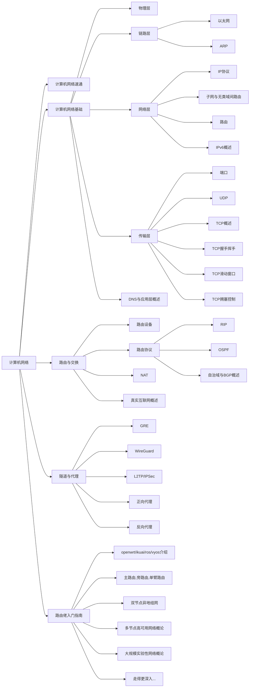

# 9.计算机网络

> 本模块来自 DN11(Decentralized Network 11) 成员倾情奉献，DN11 最初在生活区 11 号楼群中提出，旨在建立一个跨寝室的大内网。经过一年的发展，已经成为了横跨 11 号楼，VidarTeam，杭电助手等群体的中型实验性网络。

计算机网络无非一句话，将所有计算机设备连起来。

但，跨越全球的网络是何其的庞大，能够将他们连起来是一项巨大的工程。我可以说：Internet 是人类这近 50 年来最伟大的工程。

本讲义的计算机网络部分共分为 5 个章节

## 计算机网络速通

虽然名字看起来像是考前抱佛脚的章节，但他速通的并不是计网这一课程，是做简单 Web 开发所必须具备的计网知识。

在这个章节，我们会讨论到计算机网络的应用层和传输层，重点介绍一些应用层协议。对于传输层，我们只讨论他为 Web 开发提供了怎样的接口或者说功能。

上面提到“应用层和传输层”，或许你现在还不知道计算机网络的五层结构（也有其他划分，但是该划分利于学习），这也没关系，在本章节，可以暂时也不需要知道。

计算机网络这一课程其实往往并不太会涉及到这一块内容，或许网络开发一类的选修课程会讲解这一部分内容。

## 计算机网络基础

这里是计算机网络课程的重点内容，并且适当地做出一些拓展，使其更贴近于现行互联网，尽量让大家对计算机网络拥有一个完整且合理自洽的知识图谱。

写这篇讲义的我本人非常注重知识的自洽，就比如说计网的整个体系，他确实很庞大也需要这么庞大来解决全球的网络问题。

我认为如果你的知识并不能够自洽，那么在你的脑海中这其实就是异常的，不自然的，需要拐弯子才能想明白的。反之，在你的脑海中自洽的知识你是很容易理清其中逻辑的而且不容易忘，因为此时你会觉得“他就该这样，不然呢？”。

在这个章节我们会从物理层开始自底向上地介绍计算机网络，直到讲解完传输层，自底向上是符合历史逻辑的，得先有下层的支持才会有上层。

## 路由与交换

路由与交换的理论知识，并不涉及实践主要应付考试，但为了追求知识体系完整，会比考试内容稍多，但都是理解性质的。其实大家一般也没这个需求，除非专门做运维或者类似方向的开发，大伙都不需要了解具体怎么搭建网络，不会做过多的原理性讲解了。

如果你确实有在真实世界中搭建网络的需求，请移步路由佬入门指南或者拿好你的设备并考虑加入 DN11。

这里主要讨论一下路由器，交换机，各种路由协议和他们工作的位置，还有 NAT，最终把这些东西排排好，给大家一个完整的互联网模型（对比真实互联网做了一些简化，但该有的协议类型都会有）

## 隧道和代理

其实到现在一个理想化的互联网全图景已经差不多讲解完了，现在要正式完全脱离计算机网络这一课程的范畴了。

隧道和代理也是计算机网络中重要的一部分，他们工作的比较高的层却提供着更低层次的功能（其实路由协议很多也这样）。

前面讲解到，通过配置路由协议可以进行路由交换完成组网，但这仅仅可用于物理设备，如果两台路由器之间并没有网线的直接连接，那么我们的路由协议根本无法工作。

其实真实互联网上充斥着这样的需求，比如异地组网之类的，隧道便应运而生，我们把原始数据包打包在另一个层次比较高的协议中进行传输，用高层的协议来模拟低层的协议。一条虚假的网线（其实不能和网线等价） —— 隧道便诞生了。

代理部分会讲解正向和反向代理，正向代理其实就是一种“隧道”外加上访问目标主机的网络资源的能力，反向代理更多是 Web 开发带来的需求，比如常见的 nginx 反向代理。

## 路由佬入门指南

很多人不理解，不理解也罢。

互联网不是一个很 cool 的东西吗？

这是一个遍布全球由无数独立个体一个一个连接起来而形成的一张网，这难道不酷吗？

在把网络配通的瞬间，所有的 ping 包返回了正确的响应，这难道不振奋人心吗？

身在此却能设计出方案，访问到无比遥远的地方的资源，是难道没有意思吗？

有这样的一个群体，我们普遍称呼他们为“路由佬”，他们便是这样一群，沉迷于配网的一群人。

本章节存在的意义和前面的章节不同，并非是教学，而是劝人快去配网，非常重实践，上面讨论的都是简化模型，理想模型，学习模型，再往下就是实验性网络和真实互联网了，这其实已经脱离了该讲义的宗旨了，所以只会概述概述概述。

## 画个饼先

