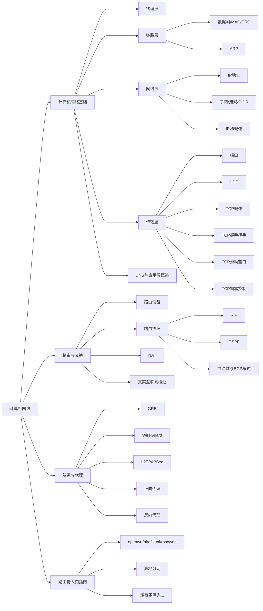

# 9.计算机网络
计算机网络的定义：

    利用通信线路和通信设备，将地理位置不同的、功能独立的多台计算机互连起来，以功能完善的网络软件来实现资源共享和信息传递，就构成了计算机网络系统。

而我们学习计算机网络本质上可以理解为学习这个网络系统中的各种网络协议。

## 我们可能会在本章讲这些东西

```mermaid
    graph LR 
        计算机网络 --> 计算机网络基础
        计算机网络 --> 路由与交换
        计算机网络 --> 隧道与代理
        计算机网络 --> 路由佬入门指南
        计算机网络基础 ---> 物理层
        计算机网络基础 ---> 链路层
        计算机网络基础 ---> 网络层
        计算机网络基础 ---> 传输层
        计算机网络基础 ---> DNS与应用层概述
        路由与交换 ---> 路由设备
        路由与交换 ---> 路由协议
        路由与交换 ---> NAT
        路由与交换 ---> 真实互联网概述
        隧道与代理 ---> GRE
        隧道与代理 ---> WireGuard
        隧道与代理 ---> L2TP/IPSec
        隧道与代理 ---> 正向代理
        隧道与代理 ---> 反向代理
        路由佬入门指南 ---> openwrt/bird/ikuai/ros/vyos
        路由佬入门指南 ---> 异地组网
        路由佬入门指南 ---> 走得更深入...
        链路层 ---> 数据帧/MAC/CRC
        链路层 ---> ARP
        网络层 ---> IP地址
        网络层 ---> 子网/掩码/CIDR
        网络层 ---> IPv6概述
        传输层 ---> 端口
        传输层 ---> UDP
        传输层 ---> TCP概述
        传输层 ---> TCP握手挥手
        传输层 ---> TCP滑动窗口
        传输层 ---> TCP拥塞控制
        路由协议 ---> RIP
        路由协议 ---> OSPF
        路由协议 ---> 自治域与BGP概述

```