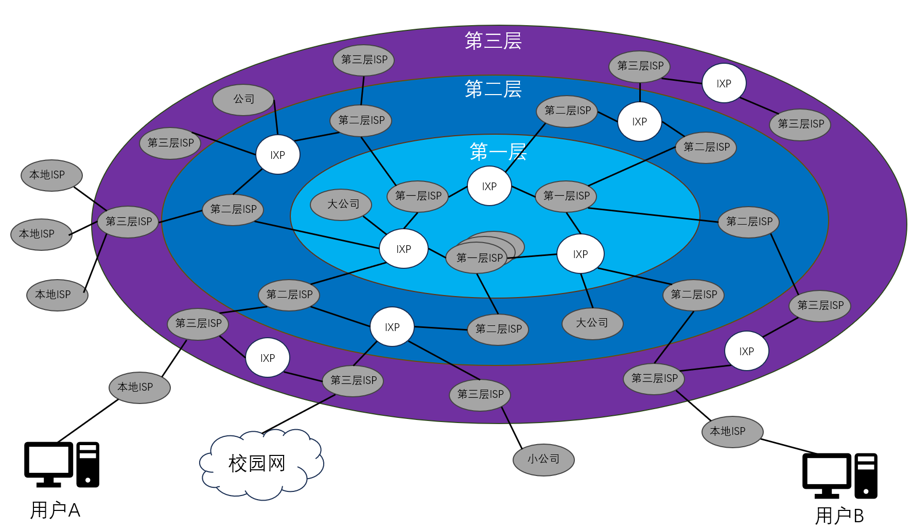
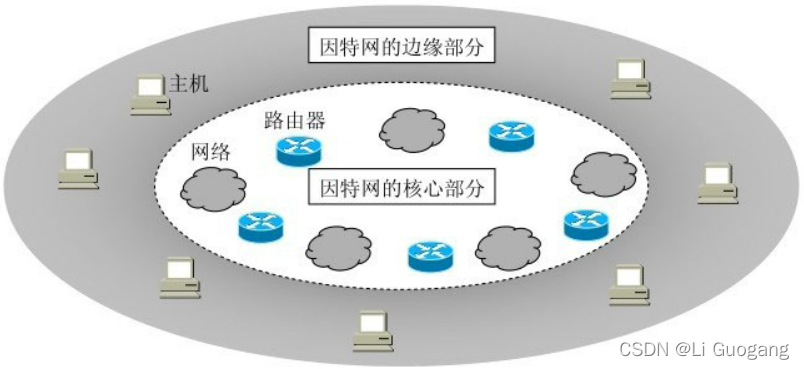
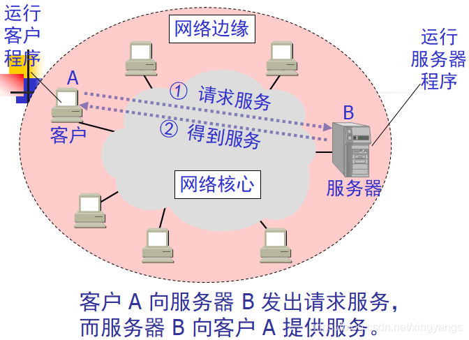
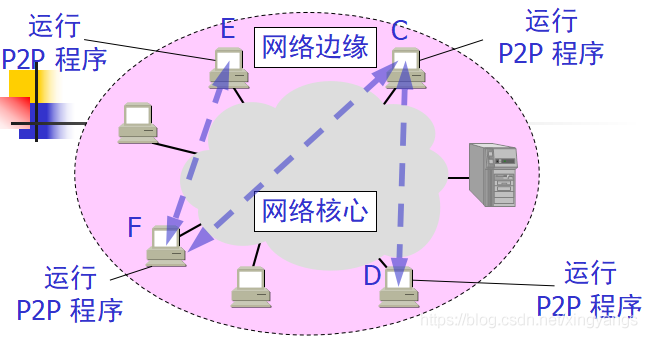
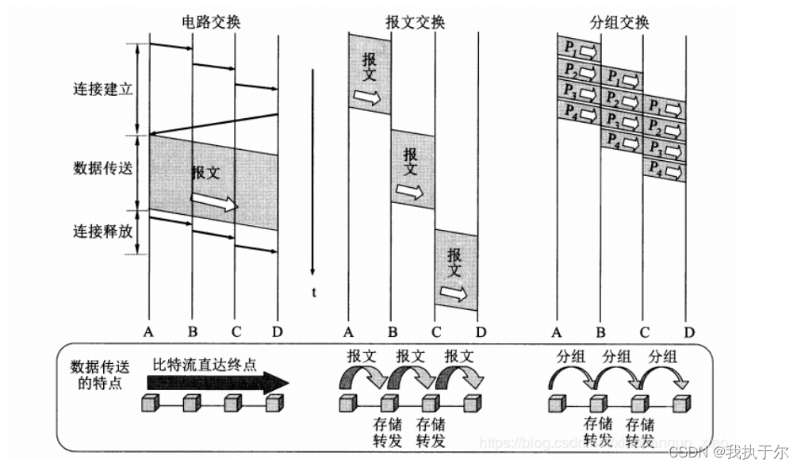

<link rel="stylesheet" type="text/css" href="./src/hm.css">

## 网络、互联网和因特网
- 网络：网络是指将多台计算机连接起来，使之可以互相通信，共享资源的系统。打个比方，陶渊明的《桃花源记》中有个世外桃源，里面的每个家庭可以理解为计算机，道路便可以将这些计算机连接起来，这时这个村庄就构成了一个网络，每个家庭之间可以进行互相通信。
- 互联网：互联网是指将全世界的网络连接起来，使之可以互相通信，共享资源的网络，即网络的网络。比如，渔人通过山中小口可以往返于桃花源与外界世界，这时候，外界网络就与桃花源网络构成了互联网。
- 因特网：因特网是指全球最大的、开放的、由众多网络相互连接而成的特定互联网，它采用TCP/IP协议族作为通信的规则，是一个由众多网络相互连接而成的特定互联网。
 

## 因特网概述

- 因特网的发展
    1. 网络->初代因特网
        - 1969年，美国国防部高级研究计划局（ARPA）在美国建立了第一个分组交换网ARPANET。1983年，ARPANET采用TCP/IP协议。因特网正式诞生
    2. 初代因特网->三级结构的因特网
        - 初代因特网发展成为NSFNET（美国国家科学基金网），它是一个三级计算机网络，分为主干网、地区网和校园网(或者企业网)。主要覆盖美国的大学和研究所。
    3. 三级结构的因特网->多层次ISP结构的因特网
        - 从1990年代中期开始，因特网逐渐向商业化和大众化方向发展。NSFNET逐渐被若干个商用的因特网主干网替代，互联网服务提供商（ISP）开始逐渐出现，使个人用户可以通过拨号或宽带连接上网。此时也涌现出了许多在线服务，如电子邮件、即时消息、网上购物等。这就基本形成了我们目前所熟悉的因特网。

    DNS（域名服务器）和万维网（www）也是在上面的几个时期内出现的

## 多层次ISP结构因特网
    互联网服务提供商（ISP）：是指向个人或组织提供接入互联网的服务的公司或组织。ISP通过各种技术手段，使用户可以接入互联网，从而可以使用互联网上的各种服务。国内ISP主要包括： 中国电信、中国网通、中国铁通、中国移动、中国联通等

- 第1层ISP：第1层ISP是全球性的顶级因特网服务提供商，它们拥有自己的大规模网络基础设施，并且在全球范围内拥有广泛的网络连接。第1层ISP之间通常通过对等互联来交换流量，形成全球性的背骨网络。这些ISP之间交换流量时不需要支付对等费用，因为它们处于相对平等的地位。

- 第2层ISP：第2层ISP是次级因特网服务提供商，它们可能覆盖国家或地区范围，并且通常依赖于与第1层ISP的互联来获取全球互联网接入。第2层ISP之间也可能会有对等互联，同时它们还会购买带宽和互联网接入来满足用户的需求。第2层ISP有时也会与第1层ISP签订对等协议，以降低网络成本。

- 第3层ISP：第三层ISP通常是地区性或本地性的服务提供商，它们提供互联网接入和服务给终端用户或小型企业。第3层ISP通常依赖于与第2层ISP或第1层ISP的互联来连接到全球互联网。它们也可能购买带宽和服务来满足客户需求。

> - 结合这这张图片，其实我们也可以来讲一下一个在国内早期互联网上盛传的一句话：**世界是最遥远的距离不是生与死，而是你在电信，我在网通。**
>  - 以图上的用户A和用户B为例子，他们各自所连接到的二级三级ISP都没有互相连通，只有一级ISP互相连通，因此，导致这两个用户想要进行通信只能绕远路，就导致了电信和网通用户之间通信速度十分缓慢，这就是这段互联网~~佳话~~古话的由来。  
>  - 而如果用户A和用户B所连接的二级甚至三级ISP之间互相连通，那么用户A和用户B之间的通信就不需要绕远路，而是直接走尽可能近的线路，这样就会快很多。 

>  - **而这也促使了两方面的进步：**
>     1. 企业会在多个ISP处搭建服务器(或者直接一个服务器同时接入多个ISP)，使得不同运营商的用户都可以获得更好的访问速度。
>     2. ISP之间也会互相连接，即建立互联网交换点（IXP，允许多个ISP和网络服务提供商通过基于路由的流量交换协议进行互联。），使得用户之间或者用户访问不同的网站时，都可以获得更好的访问速度。

## 因特网的组成

1. 核心部分
    -  **核心部分是由大量网络和连接这些网络的路由器组成的网络。他们就像是高速公路网络。** 核心部分的作用是进行分组交换，它的特点是网状结构、无中心、无层次。核心部分的网络是由各种网络技术连接起来的，这些网络技术包括：光纤、卫星、电缆、路由器、IXP等。
2. 边缘部分
    - **边缘部分是由所有连接在因特网上的主机组成的。** 这些主机通过各种接入网接入到核心部分。边缘部分的作用是进行信息处理和资源共享，它的特点是多样性、层次性。边缘部分的主机是由各种计算机和各种操作系统组成的，这些计算机包括家用主机和商用服务器等。
    
    ### 边缘部分
    主机之间的通讯方式：
    - Clinet/Server方式（C/S，客户端/服务器方式）：客户端向服务器发送请求，服务器向客户端发送响应。例子：QQ、微信、钉钉等。
    
    - Peer-to-Peer（P2P，对等方式）：对等方式是指主机之间的角色是对等的，主机之间可以同时作为客户端和服务器。例子：~~P2P下崽器~~、磁力链接、BT下载等。  
    传说，下载的人越多速度越快
    

    ### 核心部分
    1. 数据交换方式：
        - 电路交换：在通信开始前，通信双方必须先建立一条专用的物理通路，然后再进行通信。通信结束后，双方再释放这条物理通路。其特点是会占线，打电话的时候，如果对方正在通话，那么你这个电话是打不过去的。例如：电话、微信视频等。
        - 报文交换：在通信开始前，通信双方不需要建立连接，直接进行通信。通信结束后，双方也不需要释放通信资源。报文交换是直接将整个数据（完整的数据也称之为报文）一次性完整地发送给对方，当然，在发送前也要现在首部写控制信息。
        - 分组交换：在通信开始前，通信双方不需要建立连接，直接进行通信。通信结束后，双方也不需要释放通信资源。分组交换则要将完整的数据（即，报文）进行拆分，分成多个数据包（或者说，分组），同时每个数据包的首部都要加上包含了诸如目的地址和源地址等重要控制信息。正是由于分组的首部，每一个分组才能在因特网中独立地选择传输路径，并被正确地交付到分组传输的终点。分组交换是目前因特网上使用最为普遍的数据交换方式。
        

    2. 对比：
    
        - 电路交换在一开始需要一定的时间进行专线的建立，但是在通信过程中，数据的传输速率是最高的。适用于对实时性要求高的通信。
        - 报文交换和分组交换在一开始不需要建立专线，但是在通信过程中，数据的传输速率相对较低，但是他们更灵活，适用于对实时性要求不高的通信。特别是分组交换，它极度灵活，可以在传输过程中动态地选择传输路径，从而可以避免某些网络拥塞的情况，非常适用于互联网通讯这种突发性极强的地方。
    

    