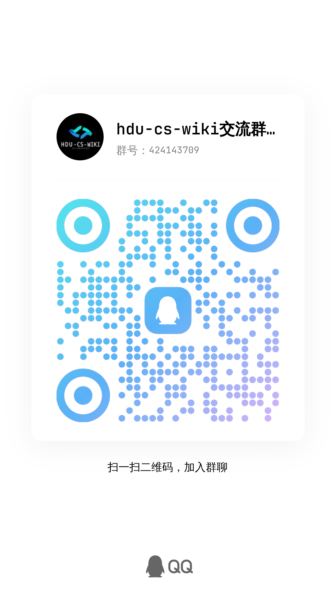

# HDU计算机科学讲义
<Parallax />
## 序言

相信看到这个wiki的同学都对计算机专业有着或多或少的期待，或许有人因小时候某次电视上的黑客操作所振奋，或许有人是被全民编程的时代浪潮席卷而来，渴望着高薪的工作，或者又有人因为渴望着用编程改变世界。

**然而理想很丰满，现实很骨感！多数人往往会在学了一年变成语法后对这个学科心灰意冷**

**我们会面临着各种各样的问题**：编程从哪里学起？如何高效利用大学时间？如何平衡绩点与项目经验？如何正确安排学习配比？如何问大佬问题得到回复的概率更高？

**我们会被信息洪流所淹没**：C语言完全学不懂，python和C先学哪个呢？怎么入门编程语言？GPT以后会取代我吗？计算机行业会不会是下一个土木？

**我们面临各种各样的抉择**：毕业直接工作还是考研？考研怎么让好学校/好老师要我？我该从哪里接触到项目？搞研究的话怎么去联系实验室，又如何入门人工智能？要不要去参加竞赛？竞赛含金量高吗？

学长学姐们深知其中痛楚，并真切地**踩了一个个坑**，我们决定：

**出一份计算机科学领域的讲义，一起做大家的领路人。**

::: danger 寄语

在我增加这块内容的时候，已经2024年了，在我刚开始落笔构建这篇wiki的时候，完全想象不到在未来短短几年的时间里，所谓大模型领域（如GPT）会有如此之快的崛起，就像如果在三年前有人跟我讲，会有一个聊天机器人代码不但写得比我好的多，还能教我写代码，我会觉得他是个骗子。

但非常遗憾的看到，我所接触的多数大学生，他们对这个社会正在发生什么一无所知，最常提到的词汇便是“迷茫”，“焦虑”。**大伙一边渴望着自己的光辉未来（例如考研考上理想的学校，找到好工作，财富自由等等），又对大学的生活感到无所适从，对学习的领域无从下手，也因而让太多本身非常有潜力的学生不断向社会妥协，最终湮灭在尘埃之中，成为一个痛苦的螺丝钉**。

我们作为这个快速变革时代的亲历者，也是参与者，我们希望通过wiki能够帮助自己的学弟学妹们**解决自身的困境，找到一条适合自己的方向，并且能够在向这条路前进的时候学到真正的技术**，而不是盲目的参与到毫无意义的“卷”之中，最终懊悔自己的一无所得。
:::

<a href="https://qm.qq.com/q/e95N3xDZLO" target="_blank" class="image-container">
    <picture>
        <source media="(prefers-color-scheme: dark)" srcset="./2025-hdu-cs-wiki-qqgroup-night.jpg">
        
    </picture>
</a>

欢迎加群与学长交流！我们也可以针对你的喜好为你定制一个方案！

::: tip 🤔

### 为什么我们的wiki中有大量的项目练习？

因为你来大学的主要目的，就是进行学习，而学校的传授的内容往往是不能满足成为一个合格的 CSer 的全部需求的，因此我们**结合了世界top高校的课程，设置了自己的项目内容**。

**（同时完成这些项目也是加入协会的重要评价标准之一）**

再在这里贴上我的偶像蒋老师和 etone 的一段话！

我们都是活生生的人， 从小就被不由自主地教导用最小的付出获得最大的得到， 经常会忘记我们究竟要的是什么。 我承认我完美主义， 但我想每个人心中都有那一份求知的渴望和对真理的向往， "大学"的灵魂也就在于超越世俗， 超越时代的纯真和理想 —— 我们不是要讨好企业的毕业生， 而是要寻找改变世界的力量。 —— jyy

教育除了知识的记忆之外， 更本质的是能力的训练， 即所谓的 training。 而但凡 training 就必须克服一定的难度， 否则你就是在做重复劳动， 能力也不会有改变。 如果遇到难度就选择退缩， 或者让别人来替你克服本该由你自己克服的难度， 等于是自动放弃了获得 training 的机会， 而这其实是大学专业教育最宝贵的部分。 —— etone

:::

## 学习原则

1. 建议保持至少一半时间在实操，一半时间在学理论知识，比例未必正确的，但是强调实操和反馈的重要性，如果你上来就拿一本经典的花书看，只看理论或者上来就整一段开源代码，势必会陷入不同程度的盲目和困苦当中。
2. 切记勿要过度深度遍历知识，知识无尽的，如果深度钻研下去，可能没有尽头，最重要的是框架，以及高频次用的知识。更为准确地说，是你要建立一个自己的知识体系，尝试抓住时代发展的脉络或者某一个知识点的延伸。如果你一个知识点无限迭代下去，可能长时间没有正反馈，一瞬间就放弃了。
3. 对于学到的知识 一定要注重实践 不能只学习理论知识。

    例如学习 Pytorch，应该尽快理解 Pytorch 编程的框架，dataloder，model，train，test 文件。

    例如看书过程中学习到 Linux 命令，不需要把整本 Liunx 书籍全部看完后才可使用。（边学边试，边用边学）

4. 敢于否定，如果对于给出的学习资料看不懂，要尝试自己寻找学习资料，找到适合自己的那份学习资料。并且中文的社区包括我们，都可能会犯各种各样的错误。就连论文也不一定是对的。有些论文就是专门驳斥前人哪怕是巨佬的观点。我非常欢迎你提出异议。

## **如何获得帮助**

在学习和实验的过程中， 你会遇到大量的问题。除了参考我们提供的教程外，你还需要大量自行搜索资料，但是我们参考的教程又多半是英文的或者说中文社区提供的帮助比较少，因此你需要学会对英文资料的查询并尝试适应他！

如果你心态炸了，欢迎联系学长学姐来给你做心理疏导~

如果你感觉实在不会，也欢迎加入我们的群里进行讨论交流。

如何适应查阅英文资料？ 方法是尝试并坚持查阅英文资料。

## **许可协议**

本作品采用 `知识共享 署名-非商业性使用-相同方式共享 3.0 中国大陆` 许可协议进行许可。 要查看该许可协议， 可访问[这里](http://creativecommons.org/licenses/by-nc-sa/3.0/cn/)， 或者写信到 Creative Commons, PO Box 1866, Mountain View, CA 94042, USA.

© 2022. 此文章采用 [**CC BY-NC-SA 3.0 CN**](http://creativecommons.org/licenses/by-nc-sa/3.0/cn/) 许可授权。
